# A Tour of Computer Systems
## Informations is Bits + Context
> Programs are translated by other programs into different forms

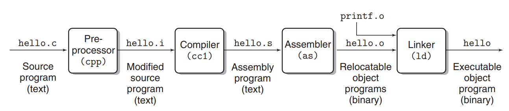

the translation from source file to object file on a Unix system

> It Pays to Understand How Compilation Systems Work

The reasons why programmers need to understand how compilation systems work:
- Optimizing program performance
    - is a switch statement always more efficient than a sequence of if-else statements?
    - How much overhead is incurred by a function call?
    - Is a while loop more efficient than a for loop? 
    - Are pointer references more efficient than array indexes? 
    - Why does our loop run so much faster if we sum into a local variable instead of an argument that is passed by reference?
    - How can a function run faster when we simply rearrange the parentheses in an arithmetic expression?
- Understanding link-time errors
    - What is the difference between a static variable and a global variable? 
    - What happens if you define two global variables in different C files with the same name? 
    - What is the difference between a static library and a dynamic library? 
    - Why does it matter what order we list libraries on the command line? And scariest of all,
    - why do some linker-related errors not appear until run time?
- Avoiding security holes
> Processors Read and Interpret Instructions Stored in Memory

**The shell is a command-line interpreter that prints a prompt, waits for you to type a command line, and then performs the command**. If the first word of the command line does not correspond to a built-in shell command, then the shell assumes that it is the name of an executable file that it should load and run. When the program terminates, The shell then prints a prompt and waits for the next input command line

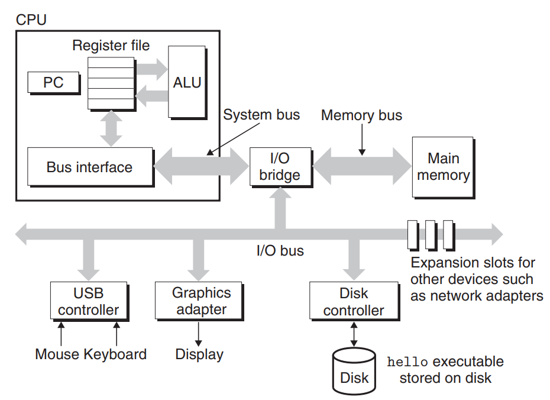

**Bus:**

Running throughout the system is a collection of electrical conduits called buses
that carry bytes of information back and forth between the components. Buses
are typically designed to transfer fixed-size chunks of bytes known as words

----------

**I/O Devices:**

Each I/O device is connected to the I/O bus by either a controller or an adapter
- Controllers are chip sets in the device itself or on the system’s main printed circuit board (often called the motherboard). 
- An adapter is a card that plugs into a slot on the motherboard

------
**Main Memory**

Physically, main memory consists of a collection of dynamic random access memory (DRAM) chips

------
**Processor**

A processor appears to operate according to a very simple instruction execution
model, defined by itsinstruction set architecture

-------
**Running the hello Program**
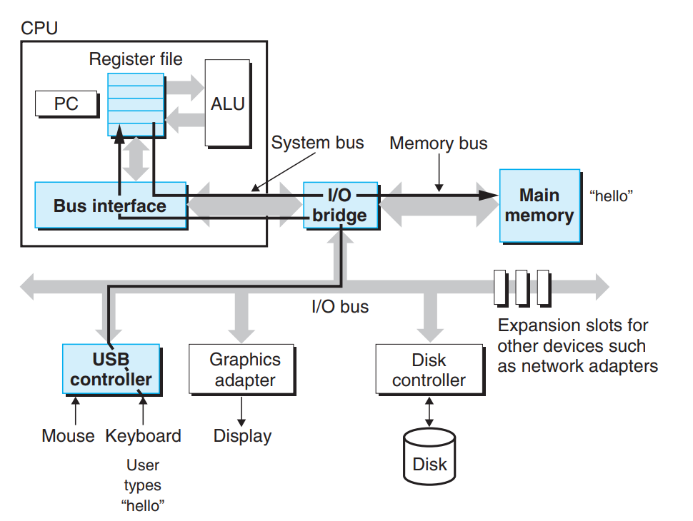
As we type the characters ./hello at the keyboard, the shell program
reads each one into a register and then stores it in memory
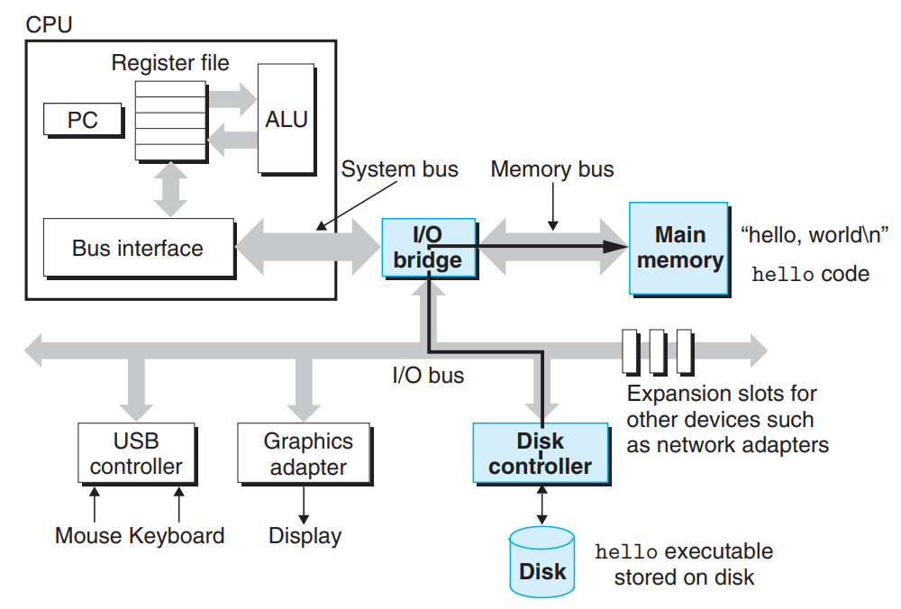
When we hit the enter key on the keyboard, by using a technique known as direct memory access (DMA), the data travel directly from disk to main memory, without passing through
the processor
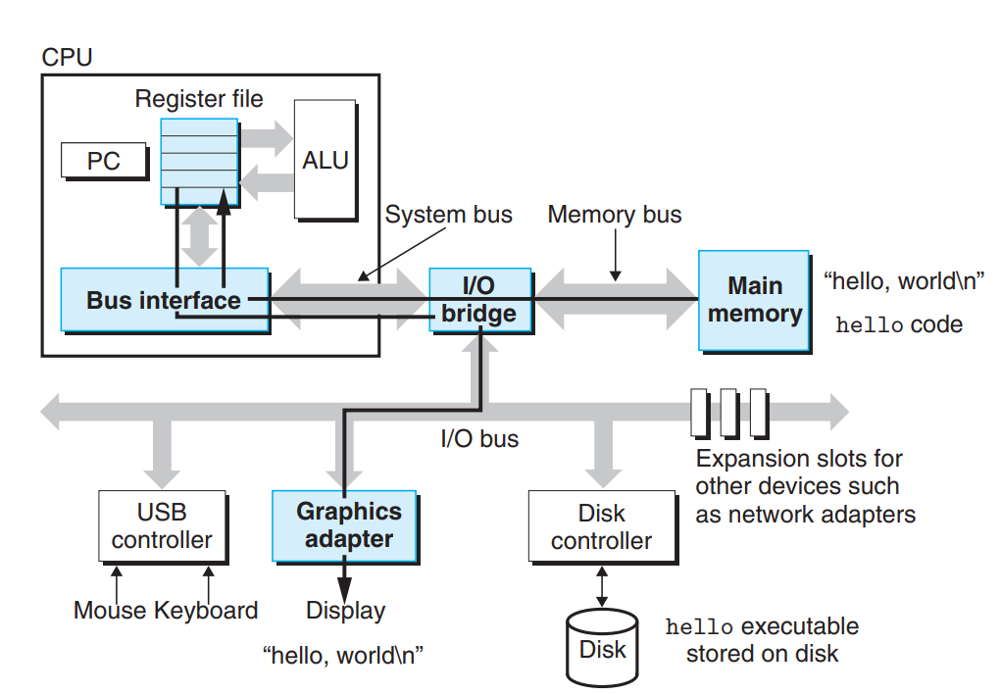
These instructions copy the bytes in the hello, world\n
string from memory to the register file, and from there to the display device, where
they are displayed on the screen
> Cache

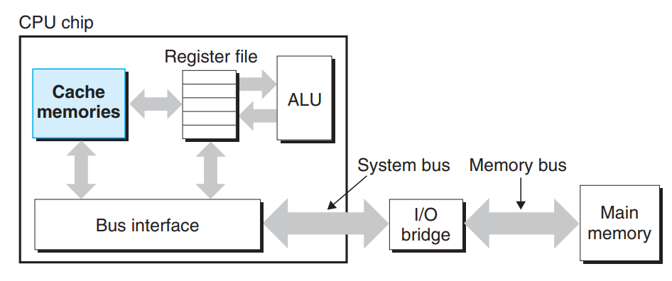

Because of physical laws, larger storage devices are slower than smaller storage devices, For example a typical register file stores only a few hundred bytes of information, as opposed to billions of bytes in the main memory. However, the processor can read data from the register file almost 100 times faster than from memory.

**To deal with the processor–memory gap, system designers include smaller, faster storage devices called cache memories (or simply caches) that serve as temporary staging areas for information that the processor is likely to need in the near future**

There are two kinds of cache. An L1 cache on the processor chip holds tens of thousands of bytes and can be accessed nearly as fast as the register file. A larger L2 cache with hundreds of thousands to millions of bytes is connected to the processor by a special bus. It might take 5 times longer for the processor to access the L2 cache than the L1 cache, but this is still 5 to 10 times faster than accessing the main memory

The L1 and L2 caches are
implemented with a hardware technology known as static random access memory
(SRAM)
> Storage Devices Form a Hierarchy

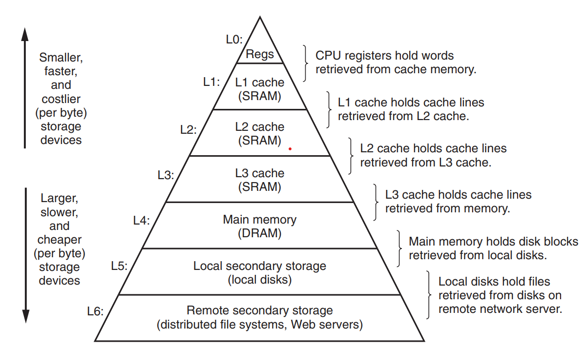

The main idea of a memory hierarchy is that storage at one level serves as a
cache for storage at the next lower level
> The Operating System Manages the Hardware

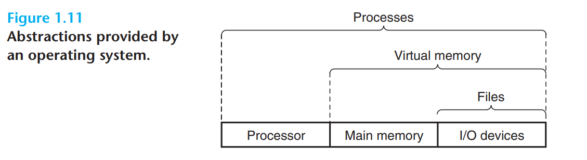

**Processes:**

A **process** is the operating system’s abstraction for a running program

By **concurrently**, we mean that the instructions of one process are interleaved with the instructions of another process. In most systems, there are more processes to run than there are CPUs to run them

Traditional systems could only execute one program at a time, while newer multicore processors can execute several programs simultaneously. In either case, a
single CPU can appear to execute multiple processes concurrently by having the
processor switch among them

**The operating system performs this interleaving with a mechanism known as context switching**

The operating system keeps track of all the state information that the process
needs in order to run. This state, which is known as the context, includes information such as the current values of the PC, the register file, and the contents of main memory

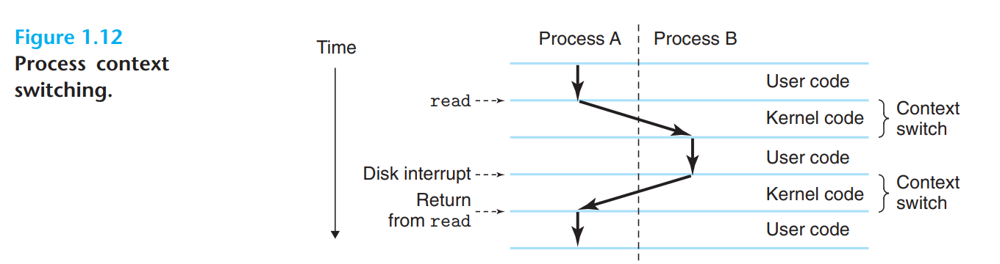

**the transition from one process to another is managed by the operating system kernel.**

**Note that the kernel is not a separate process**. Instead, it is a collection
of code and data structures that the system uses to manage all the processes

------
**Threads**

Although we normally think of a process as having a single control flow, in modern
systems a process can actually consist of multiple execution units, called **threads**,**each running in the context of the process and sharing the same code and global data**

Threads are an increasingly important programming model, because:
- the requirement for concurrency in network servers
- it is easier to share data between multiple threads than between multiple processes,
- threads are typically more efficient than processes
- Multi-threading is also one way to make programs run faster when multiple processors are available
-------
**Virtual Memory**

**Virtual memory is an abstraction that provides each process with the illusion that it
has exclusive use of the main memory**. 

Each process has the same uniform view of memory, which is known as its **virtual address space**

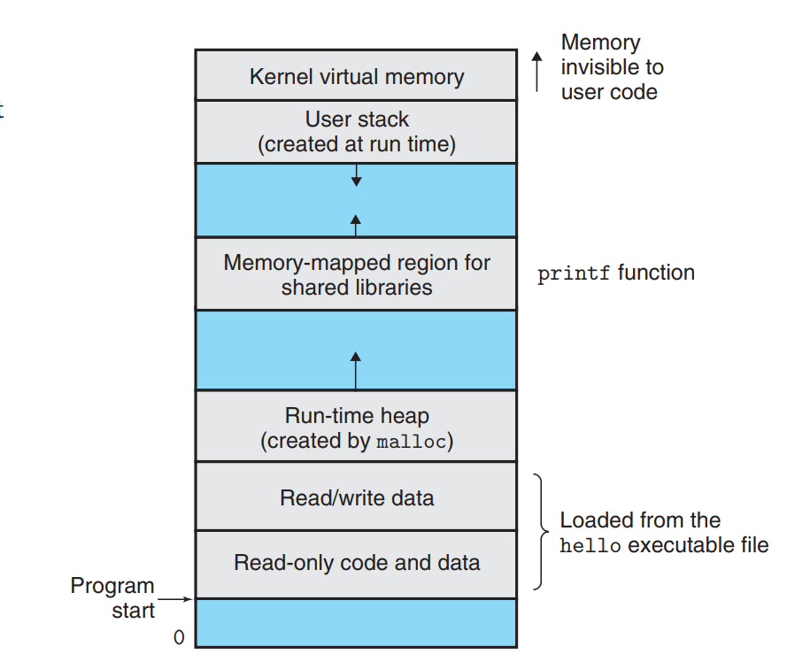

The virtual address space seen by each process consists of a number of well defined areas, each with a specific purpose
- Program code and data

    Code begins **at the same fixed address** for all processes, followed by data locations that correspond to **global C variables**. The code and data areas are **initialized directly from the contents of an executable object file**
- Heap

    the heap **expands and contracts dynamically** at run time as a result of calls to C standard library routines such as malloc and free
- Shared libraries

    Near the middle of the address space is an area that holds the code and data for shared libraries such as the C standard library and the math library
- Stack

    **the compiler uses to implement function calls**. Like the heap, the user stack **expands and contracts dynamically** during the execution of the program.
- Kernel virtual memory

    Application programs must invoke the kernel to perform these operations that involve this area

**For virtual memory to work, the basic idea is to store the contents of a process’s virtual memory on disk and then use the main memory as a cache for the disk**

---
**Files**

**A file is a sequence of bytes, nothing more and nothing less.** Every I/O device, including disks, keyboards, displays, and even networks, is modeled as a file. All input and output in the system is performed by reading and writing files, using a small set of system calls known as Unix I/O.

**This simple and elegant notion of a file is nonetheless very powerful because it provides applications with a uniform view of all the varied I/O devices that might be contained in the system.**

> Systems Communicate with Other Systems Using Networks

**From the point of view of an individual system, the network can be viewed as just another I/O device**

Using telnet to run hello remotely over a network.
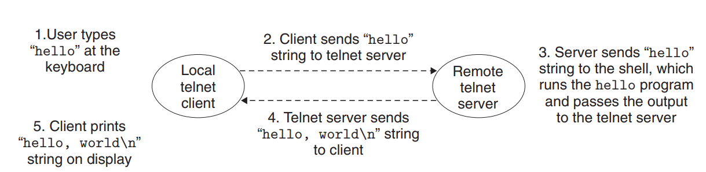
