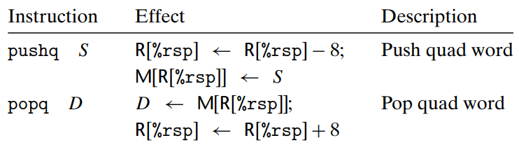

# Machine-Level Representation of Programs
why should we spend our time learning machine code?
- By reading this code, we can understand the optimization capabilities of the compiler and analyze the underlying inefficiencies in the code

- get a sense of how efficiently the program will run

- there are times when the layer of abstraction provided by a high-level language hides information about the run-time behavior of a program that we need to understand

-  many of the ways programs can be attacked, allowing malware to infest a system, involve nuances of the way programs store their run-time control information

the machine language is starting with Intel Corporation’s first 16-bit processor in 1978
## A Historical Perspective

## Program Encodings

`linux> gcc -Og -o p p1.c p2.c`

The command-line option -Og instructs the compiler to apply a level of optimization that yields machine code that follows the overall structure of the original C code

higher levels of optimization (e.g., specified with the option -O1 or -O2) are considered a better choice in terms of the resulting program performance.

### Machine-Level Code

The machine code for x86-64 differs greatly from the original C code. Parts of the processor state are visible that normally are hidden from the C programmer:
- The program counter (commonly referred to as the PC, and called %rip in x86- 64) indicates the address in memory of the next instruction to be executed.


Whereas C provides a model in which objects of different data types can be declared and allocated in memory, machine code views the memory as simply a large byte-addressable array. Aggregate data types in C such as arrays and structures are represented in machine code as contiguous collections of bytes.

The program memory contains the executable machine code for the program, some information required by the operating system, a run-time stack for managing procedure calls and returns, and blocks of memory allocated by the user


As mentioned earlier, the program memory is addressed using virtual addresses. At any given time, only limited subranges of virtual addresses are considered valid. For example, x86-64 virtual addresses are represented by 64-bit words. In current implementations of these machines, the upper 16 bits must be set to zero, and so an address can potentially specify a byte over a range of 248, or 64 terabytes.

### Code Examples
```
linux> gcc -Og -S mstore.c ==> mstore.s

linux> gcc -Og -c mstore.c ==> mstore.o

linux> objdump -d mstore.o ==> mstore.s
```
Several features about machine code and its disassembled representation are worth noting:
- x86-64 instructions can range in length from 1 to 15 bytes
- The instruction format is designed in such a way that from a given starting position, there is a unique decoding of the bytes into machine instructions
- The disassembler determines the assembly code based purely on the byte sequences in the machine-code file
- The disassembler uses a slightly different naming convention for the instructions than does the assembly code generated by gcc


lines 8–9 will have no effect on the program, since they occur after the return instruction (line 7). They have been inserted to grow the code for the function to 16 bytes, enabling a better placement of the next block of code in terms
of memory system performance

###  Notes on Formatting

All of the lines beginning with ‘.’ are directives to guide the assembler and
linker

In our presentation, we show assembly code in ATT format (named after AT&T, the company that operated Bell Laboratories for many years), the default format for gcc

use Inter format
```
linux> gcc -Og -S -masm=intel mstore.c
```

## Data Formats

Pointers (shown here as char *) are stored as 8-byte quad words, as would be expected in a 64-bit machine. 


`Microprocessors in the x86 family historically implemented all floating-point operations with a special 80-bit (10- byte) floating-point format (see Problem 2.86). This format can be specified in C programs using the declaration long double. We recommend against using this format, however. It is not portable to other classes of machines, and it is typically not implemented with the same high-performance hardware as is the case for single- and double-precision arithmetic`

## Accessing Information


When these instructions have registers as destinations, two conventions arise for what happens to the remaining bytes in the register for instructions that generate less than 8 bytes: **Those that generate 1- or 2-byte quantities leave the remaining bytes unchanged. Those that generate 4- byte quantities set the upper 4 bytes of the register to zero. The latter convention was adopted as part of the expansion from IA32 to x86-64**

### Operand Specifiers

immediate, is for constant values: $-577 or $0x1F

The most general form: Imm(rb,ri,s) **has four components: an immediate offset Imm, a base register rb, an index register ri, and a scale factor s, where s must be 1, 2, 4, or 8. Both the base and index must be 64-bit registers.**  The effective address is computed as Imm + R[rb] + R[ri] * s

### Data Movement Instructions


**x86-64 imposes the restriction that a move instruction cannot have both operands refer to memory locations**

**For most cases, the mov instructions will only update the specific register bytes or memory locations indicated by the destination operand. The only exception is that when movl has a register as the destination, it will also set the high-order 4 bytes of the register to 0.**


movq %rax,-12(%rbp):
```
The regular movq instruction can only have immediate source operands that can be represented as 32-bit two’s-complement numbers. This value is then sign extended to produce the 64-bit value for the destination. The movabsq instruction can have an arbitrary 64-bit immediate value as its source operand and can only have a register as a destination
```

--------
Zero-extending data movement instructions


All of these instructions copy data from a source, which can be either a register or stored in memory, to a register destination.

--------------------
Sign-extending data movement instructions


movzlq is not exist, Instead, this type of data movement can be implemented using a movl instruction having a register as the destination.


**Otherwise, for 64-bit destinations, moving with sign extension is supported for all three source types, and moving with zero extension is supported for the two smaller source types.**

### Data Movement Example


A function returns a value by storing it in register %rax, or in one of the
low-order portions of this register

### Pushing and Popping Stack Data




##  Arithmetic and Logical Operations


### Load Effective Address

The load effective address instruction leaq is actually a variant of the movq instruction. It has the form of an instruction that reads from memory to a register. but it does not reference memory at all

**In addition, it can be used to compactly describe common arithmetic operations.** For example, if register %rdx contains value x, then the instruction leaq 7(%rdx,%rdx,4), %rax will set register %rax to 5x + 7

The destination operand must be a register

### Unary and Binary Operations

unary operations's operand can be either a register or a memory location


The third group consists of binary operations, where the second operand is used as both a source and a destination.

The first operand can be either an immediate value, a register, or a memory location. The second can be either a register or a memory location. 

###  Shift Operations
The different shift instructions can specify the shift amount either as an immediate value or with the single-byte register %cl. 

With x86-64, a shift instruction operating on data values that are w bits long determines the shift amount from the low-order m bits of register %cl, where 2m = w. The higher-order bits are ignored. So, for example, when register %cl has hexadecimal value 0xFF, then instruction salb would shift by 7, while salw would shift by 15, sall would shift by 31, and salq would shift by 63.


The destination operand of a shift operation can be either a register or a memory location

### Discussion
**Assembling and disassembling this code, however, we find that the version with xorq requires only 3 bytes, while the version with movq requires 7. Other ways to set %rcx to zero rely on the property that any instruction that updates the lower 4 bytes will cause the high-order bytes to be set to zero. Thus, we could use either xorl %ecx,%ecx (2 bytes) or movl $0,%ecx (5 bytes).**

### Special Arithmetic Operations
Intel refers to a 16-byte quantity as an oct word


For both of these instructions, one argument must be in register %rax, and the other is given as the instruction source operand. **The product is then stored in registers %rdx (high-order 64 bits) and %rax (low-order 64 bits).**


```c
#include <inttypes.h>
typedef unsigned __int128 uint128_t;
void store_uprod(uint128_t *dest, uint64_t x, uint64_t y) {
    *dest=x* (uint128_t) y;
}
//========== 
void store_uprod(uint128_t *dest, uint64_t x, uint64_t y)
dest in %rdi, x in %rsi, y in %rdx
 store_uprod:
 movq %rsi, %rax Copy x to multiplicand
 mulq %rdx Multiply by y
 movq %rax, (%rdi) Store lower 8 bytes at dest
 movq %rdx, 8(%rdi) Store upper 8 bytes at dest+8
 ret
```


Unsigned division makes use of the divq instruction. Typically, register %rdx
is set to zero beforehand

## Control

Machine code provides two basic low-level mechanisms for implementing conditional behavior: it tests data values and then alters either the **control flow** or the **data flow** based on the results of these tests.


**Data-dependent control flow** is the more general and more common approach for implementing conditional behavior

### Condition Codes

the CPU maintains a set of single-bit condition code registers describing attributes of the most recent arithmetic or logical operation.


**The leaq instruction does not alter any condition codes, since it is intended to be used in address computations**

For the logical operations, such as xor, the carry and overflow flags are set to zero. For the shift operations, the carry flag is set to the last bit shifted out, while the overflow flag is set to zero. For reasons that we will not delve into, the inc and dec instructions set the overflow and zero flags, but they leave the carry flag unchanged.


set condition codes without altering any other registers

### Accessing the Condition Codes

- we can set a single byte to 0 or 1 depending on some combination of the condition codes
- we can conditionally jump to some other part of the program
- we can conditionally transfer data


It is important to recognize that the suffixes for these instructions denote different conditions and not different operand sizes

A set instruction has either one of the low-order **single-byte register elements** or a **single-byte memory location** as its destination, setting this byte to either 0 or 1


### Jump Instructions


In generating the object-code file, the assembler determines the addresses of all labeled instructions and encodes the jump targets (the addresses of the destination instructions) as part of the jump instructions.

**indirect jump, where the jump target is read from a register or a memory location**

**Conditional jumps can only be direct.**

### Jump Instruction Encodings
For the most part, we will not concern ourselves with the detailed format of machine code. On the other hand, understanding how the targets of jump instructions are encoded will become important when study linking

- the most commonly used ones are PC relative
    ```
    they encode the difference between the address of the target instruction and the address of the instruction immediately following the jump
    
    These offsets can be encoded using 1, 2, or 4 bytes
    ```
- “absolute” address 
    ```
    using 4 bytes to directly specify the target
    ```


**在执行PC-relative寻址时，程序计数器的值是跳转后指令的地址，而不是跳转本身的地址**


通过使用跳转目标的PC相对编码，指令可以被紧凑地编码（只需要2个字节），并且目标代码可以被转移到内存的不同位置而不被改变 而不被改变。


### Implementing Conditional Branches with Conditional Control


if-else pattern
```
if (test-expr)
    then-statement
else
    else-statement
//==========
t = test-expr;
if (!t)
    goto false;
then-statement
    goto done;
false:
    else-statement
done


t = test-expr;
if (t)
    goto true;
else-statement
goto done;
true:
    then-statement
done
```
### Implementing Conditional Branches with Conditional Moves

conditional transfer of control can be very inefficient on modern processors

An alternate strategy is through a conditional transfer of data

**This approach computes both outcomes of a conditional operation and then selects one based on whether or not the condition holds**

example:
```
(c) Generated assembly code
long absdiff(long x, long y)
x in %rdi, y in %rsi
 absdiff:
 movq %rsi, %rax
 subq %rdi, %rax rval = y-x
 movq %rdi, %rdx
 subq %rsi, %rdx eval = x-y
 cmpq %rsi, %rdi Compare x:y
 cmovge %rdx, %rax If >=, rval = eval
 ret Return tval
```
```
processors achieve high performance through pipelining, where an instruction is processed via a sequence of stages, each performing one small portion of the required operations. This approach achieves high performance by overlapping the steps of th    e successive instructions, such as fetching one instruction while perf    orming the arithmetic operations for a previous instruction. To do thi    s requires being able to determine the sequence of instructions to be     executed well ahead of time in order to keep the pipeline full of inst    ructions to be executed. When the machine encounters a conditional jum    p (referred to as a “branch”), it cannot determine which way the branc    h will go until it has evaluated the branch condition. Processors empl    oy sophisticated branch prediction logic to try to guess whether or no    t each jump instruction will be followed.

As long as it can guess reliably (modern microprocessor designs try to     achieve success rates on the order of 90%), the instruction pipeline     will be kept full of instructions. Mispredicting a jump, on the other     hand, requires that the processor discard much of the work it has alre    ady done on future instructions and then begin filling the pipeline wi    th instructions starting at the correct location. As we will see, such     a misprediction can incur a serious penalty, say, 15–30 clock cycles     of wasted effort, causing a serious degradation of program performance.
```


a source register or memory location S, and a destination register R.

The source and destination values can be 16, 32, or 64 bits long. Singlebyte conditional moves are not supported.


the assembler can infer the operand length of a conditional move instruction from the name of the destination register

nlike conditional jumps, the processor can execute conditional move instructions without having to predict the outcome of the test

**Using conditional moves also does not always improve code efficiency**

**Our experiments with gcc indicate that it only uses conditional moves when the two expressions can be computed very easily**


### Loops

> Do-While Loops

```c
do
    body-statement
while (test-expr);

loop:
    body-statement
    t = test-expr;
if (t)
    goto loop;
```

we can test for overflow by computing x/n and seeing whether it equals (n − 1)!

Reverse engineering loops
```
The C compiler will often rearrange the computations, so that some variables in the C code have no counterpart in the machine code, and new values are introduced into the machine code that do not exist in the source code
```
> While Loops
```c
while (test-expr)
body-statement

//====================
// 1. jump to middle
goto test;
loop:
    body-statement
test:
    t = test-expr;
if (t)
    goto loop;
// 2. guarded do
// Gcc follows this strategy when compiling with higher levels of optimization, for example, with command-line option -O1


t = test-expr;
if (!t)
    goto done;
loop:
    body-statement
    t = test-expr;
    if (t)
        goto loop;
done:
```

> For Loops

```c
for (init-expr; test-expr; update-expr)
    body-statement

// init-expr;
while (test-expr) {
    body-statement
    update-expr;
}
```

also can use jump-to-middle and guarded-do

Executing a continue statement in C causes the program to jump to the end of
the current loop iteration.

### Switch Statements

A jump table is an array where entry i is the address of a code segment implementing the action the program should take when the switch index equals i

The advantage of using a jump table over a long sequence of if-else sgtatements is that the time taken to perform the switch is independentg of the number of switch cases. Gcc selects the method of translating ag switch statement based on the number of cases and the sparsity of theg case values. Jump tables are used when there are a number of cases (eg.g., four or more) and they span a small range of values.

These locations are defined by labels in the code and indicated in theg entries in jt by code pointers, consisting of the labels prefixed byg &&. (Recall that the operator ‘&’ creates a pointer for a data value.g In making this extension, the authors of gcc created a new operator &&g to create a pointer for a code location.)

```c
static void *jt[7] = {
 &&loc_A, &&loc_def, &&loc_B,
 &&loc_C, &&loc_D, &&loc_def,
 &&loc_D
 };

goto *jt[index];
```

```c
jmp *.L4(,%rsi,8) Goto *jg[index]
// where the jmp instruction’s operand is prefixed with ‘*’, indicating an indirect jump
.section .rodata
.align 8 Align address to multiple of 8
.L4:
 .quad .L3 Case 100: loc_A
 .quad .L8 Case 101: loc_def
 .quad .L5 Case 102: loc_B
 .quad .L6 Case 103: loc_C
 .quad .L7 Case 104: loc_D
 .quad .L8 Case 105: loc_def
 .quad .L7 Case 106: loc_D

```
## Procedures

Procedures are a key abstraction in software. They provide a way to pagckage code that implements some functionality with a designated set ofg arguments and an optional return value.

There are many different attributes that must be handled when providing machine-level support for procedures:
- Passing control.
- Passing data.
- Allocating and deallocating memory

### The Run-Time Stack
When an x86-64 procedure requires storage beyond what it can hold in registers, it allocates space on the stack. This region is referred to as the procedure’ **stack frame**.


The stack frames for most procedures are of fixed size, allocated at the beginning of the procedure.

In the interest of space and time efficiency, x86-64 procedures allocate only the portions of stack frames they require. For example, many procedures have six or fewer arguments, and so all of their parameters can be passed in registers


### Control Transfer


This instruction pushes an address A onto the stack and sets the PC to the beginning of Q.

**The pushed address A is referred to as the return address and is computed as the address of the instruction immediately following the call instruction**

The counterpart instruction ret pops an address A off the stack and sets the PC to A

**Like jumps, a call can be either direct or indirect.** In assembly code, the target of a direct call is given as a label, while the target of an indirect call is given by ‘*’ followed by an operand specifier

