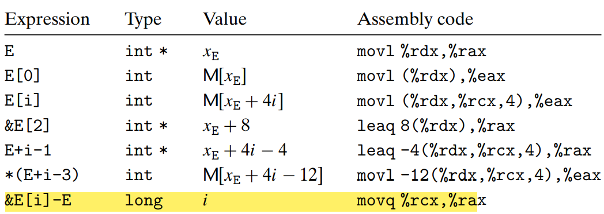

### Data Transfer


When a function has more than six integral arguments, the other ones are
passed on the stack


It copies arguments 1–6 into the appropriate registers, and it puts arguments 7 through n onto the stack, with argument 7 at the top of the stack. When passing parameters on the stack, all data sizes are rounded up to be multiples of eight.

### Local Storage on the Stack

At times, however, local data must be stored in memory. Common cases of this include these:

- There are not enough registers to hold all of the local data. 
- The address operator ‘&’ is applied to a local variable, and hence we must be able to generate an address for it.
- Some of the local variables are arrays or structures and hence must be accessed by array or structure references. We will discuss this possibility when we describe how arrays and structures are allocated


### Local Storage in Registers
we must make sure that when one procedure (the caller) calls another (the callee), the callee does not overwrite some register value that the caller planned to use later.

- callee-saved registers: s %rbx, %rbp, and %r12–%r15
    ```
    Procedure Q can preserve a register value by either not
    changing it at all or by pushing the original value on the stack, altering it, and then
    popping the old value from the stack before returning.
    ```
- caller-saved registers: All other registers, except for the stack pointer %rsp

### Recursive Procedures

```c
(a) C code
long rfact(long n)
{
long result;
if (n <= 1)
result = 1;
else
result=n* rfact(n-1);
return result;
}


(b) Generated assembly code
long rfact(long n)
n in %rdi
1 rfact:
2 pushq %rbx Save %rbx
3 movq %rdi, %rbx Store n in callee-saved register
4 movl $1, %eax Set return value = 1
5 cmpq $1, %rdi Compare n:1
6 jle .L35 If <=, goto done
7 leaq -1(%rdi), %rdi Compute n-1
8 call rfact Call rfact(n-1)
9 imulq %rbx, %rax Multiply result by n
10 .L35: done:
11 popq %rbx Restore %rbx
12 ret Return
```

This method of implementing function calls and returns even works for more complex patterns, including mutual recursion (e.g., when procedure P calls Q, which in turn calls P).
## Array Allocation and Access

Arrays in C are one means of aggregating scalar data into larger data types.
### Basic Principles

For example, suppose E is an array of values of type int and we wish to evaluate E[i], where the address of E is stored in register %rdx and i is stored in register %rcx. Then the instruction
```s
movl (%rdx,%rcx,4),%eax
```

### Pointer Arithmetic

The array reference A[i] is identical to the expression *(A+i)




### Nested Arrays

&D[i][j] = xD + L(C . i + j)

### Fixed-Size Arrays

