# Representing and Manipulating Information
## Information Storage


> Hexadecimal Notation

In C, numeric constants starting with 0x or 0X are interpreted as being in hexadecimal. The characters ‘A’ through ‘F’ may be written in either upper- or lowercase


**For convenience, you only need to remember "A", "C", "F"'s binary value, then you can deduce others by them**

---
tips:


> Data Sizes

**Every computer has a word size, indicating the nominal size of pointer data**

- That is, for a machine with a w-bit word size, the virtual addresses can range from 0 to 2^w − 1, giving the program access to at most 2^w bytes

directive:
```
linux> gcc -m32 prog.c
linux> gcc -m64 prog.c
```

data size:


**ISO C99** introduced a class of data types where the data sizes are fixed regardless of compiler and machine settings. Among these are data types **int32_t** and **int64_t**, having exactly 4 and 8 bytes, respectively


The C language allows a variety of ways to order the keywords and to include or omit optional keywords

> Addressing and Byte Ordering

In virtually all machines, a multi-byte object is stored as a contiguous sequence of bytes, with the address of the object given by the smallest address of the bytes used

Some machines choose to store the object in memory ordered **from least significant byte to most**, while other machines store them **from most to least**


`Most Intel-compatible machines operate exclusively in little-endian mode. On the other hand, most machines from IBM and Oracle (arising from their acquisition of Sun Microsystems in 2010) operate in big-endian mode`

**byte ordering would becomes an issue:**
- when binary data are communicated over a network between different machines.
    ```
    A common problem is for data produced by a little-endian machine to be sent to a big-endian machine, or vice versa, leading to the bytes within the words being in reverse order for the receiving program
    ```
- when looking at the byte sequences representing integer data
    ```
    4004d3: 01 05 43 0b 20 00   |   add %eax,0x200b4 (%rip)
    ```
- when programs are written that circumvent the normal type system.
    ```
    when programs are written that circumvent the normal type system.
    ```
> Representing Strings

`The base encoding, known as the “Universal Character Set” of Unicode, uses a 32-bit representation of characters`

`In particular, the UTF-8 representation encodes each character as a sequence of bytes, such that the standard ASCII characters use the same single-byte encodings as they have in ASCII, implying that all ASCII byte sequences have the same meaning in UTF-8 as they do in ASCII.`
> Introduction to Boolean Algebra

One useful application of bit vectors is to **represent finite sets** like
```
bit vector a = [01101001]encodes the set A = {0, 3, 5, 6}

With this way of encoding sets, Boolean operations | and & correspond to set union and intersection, respectively, and ~ corresponds to set complement
```
and the **bit-vector mask** is another useful way


`little practice:`
```c
/* bis and bic generate a result z consisting of the bits of x modified according to the bits of m

With bis, the modification involves setting z to 1 at each bit position where m is 1. With bic, the modification involves setting
z to 0 at each bit position where m is 1
*/
int bis(int x,int m) {
        return x | m;
}
int bic(int x,int m) {
        return x &~ m;
}
int bool_xor(int x, int y) {
        int result = bis(bic(x, y), bic(x,y));
        return result;
}
int main(void) {
        int a = bool_xor(3,3);
        int b = bool_xor(3,0);
        printf("a = %d, b = %d\n", a, b);
        return 0;
}
```
> Logical Operations in C

The logical operations treat any nonzero argument as representing true and argument 0 as representing false. They return either 1 or 0, indicating a result of either true or false,
> Shift Operations in C
- x << k(**filling the right end with k zeros**)
- two forms of right shift
    - Logical(**fills the left end with k zeros**)
    - Arithmetic(**fills the left end with k repetitions of the
most significant bit**)

    The C standards do not precisely define which type of right shift should be used with signed numbers.

    In practice, however, almost all compiler/machine combinations use **arithmetic** right shifts for **signed data**, and many programmers assume this to be the case. For **unsigned** data, on the other hand, right shifts must be **logical**.


**Shifting by k, for large values of k:**
```c
For a data type consisting of w bits, what should be the effect of shifting by some value k ≥ w?

On many machines, the shift instructions consider only the lower log2 w bits of the shift amount when shifting a w-bit value, and so the shift amount is computed as k mod w.

//This behavior is not guaranteed for C programs, however, and so shift amounts should be kept less than the word size
```

**1<<2 + 3<<4 ==  1 << (2+3) << 4** since addition (and subtraction) have higher precedence than shifts


## Integer Representations

> Integral Data Types
- Typical ranges for C integral data types for 32-bit programs.
    
- Typical ranges for C integral data types for 64-bit programs.
    
- Guaranteed ranges for C integral data types.
    
> Unsigned Encodings


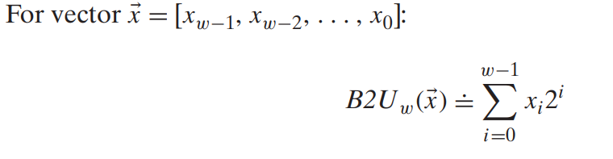
The function B2Uw maps strings of zeros and ones
of length w to nonnegative integers

**B2Uw is a bijection, meaning The function B2Uw
maps each bit vector of length w to a unique number between 0 and 2w − 1**

> Two’s-Complement Encodings


**Function B2Tw is a bijection too**

`The file <limits.h> in the C library defines a set of constants delimiting the ranges of the different integer data types for the particular machine on which the compiler is running.`

> Conversions between Signed and Unsigned

**the effect of casting is to keep the bit values identical but change how these bits are interpreted**


---------


-----------


> Signed versus Unsigned in C

**Generally, most numbers are signed by default Adding character ‘U’ or ‘u’ as a suffix creates an unsigned constant; for example, 12345U or 0x1A2Bu.**

**When an operation is performed where one operand is signed and the other is unsigned, Cimplicitly casts the signed argument to unsigned and performs the operations assuming the numbers are nonnegative**

> Expanding the Bit Representation of a Number

`In limits.h `
```c
/* Minimum and maximum values a ‘signed int’ can hold. */
#define INT_MAX 2147483647
#define INT_MIN (-INT_MAX - 1)
```
**zero extension**(Unsigned):
```
To convert an unsigned number to a larger data type, we can simply add leading zeros to the representation
```

**sign extension**(Two's-complement):
```
For converting a two’s-complement number to a larger data type, the rule is adding copies of the most significant bit to the representation
```

**Conversion problem**:
```c
short sx = -12345; /* -12345 */
unsigned uy = sx; /* Mystery! */
printf("uy = %u:\t", uy);
show_bytes((byte_pointer) &uy, sizeof(unsigned));
// ===========result==========
uy = 4294954951: ff ff cf c7
// That is, (unsigned) sx is equivalent to (unsigned) (int) sx
// Indeed, this convention is required by the C standards
```
> Truncating Numbers

In bit-level, you can just cut off the excess bits to truncate numbers.

the discussion below is for decimal.

------
x': result 

x: unsigned number

**unsigned number**: x' = x mod 2^k

**two’s-complement**: x' = U2Tk(x mod 2^k)

> Advice on Signed versus Unsigned

```c
/* Prototype for library function strlen */
size_t strlen(const char *s);
Here is your first attempt at the function:
/* Determine whether string s is longer than string t */
/* WARNING: This function is buggy */
int strlonger(char *s, char *t) {
return strlen(s) - strlen(t) > 0;
}
/* 
answer: return strlen(s) > strlen(t);
we need to pay attention on operation may involved conversion between unsigned and two's-complement
*/
```

## Integer Arithmetic
> Unsigned Addition

**When the sum overflows, we just truncate number by implementing modular arithmetic.**

- Detecting overflow of unsigned addition
    ```
    For x and y in the range 0 ≤ x,y ≤ UMaxw, let s = x + y. Then the computation of s overflowed if and only if s<x (or equivalently, s<y)
    ```
- Unsigned negation

    

> Two’s-Complement Addition

- Two’s-complement addition

    
    

- Detecting overflow in two’s-complement addition
    ```
    let s = x + y. Then the computation of s has had positive overflow if and only if x > 0 and y > 0 but s ≤ 0. The computation has had negative overflow if and only if x < 0 and y < 0 but s ≥ 0.

> Two’s-Complement Negation


------
Bit-level representation of two’s-complement negation:
- -x = ~x +1
    
- Let k be the position of the rightmost 1, so the bit-level representation of x has the
form [xw−1, xw−2,...,xk+1, 1, 0,... 0]. (This is possible as long as x != 0.) The negation is then written in binary form as [~xw−1, ~xw−2,... ~ xk+1, 1, 0,..., 0].
    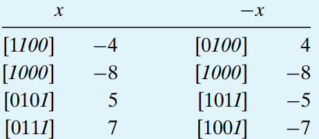

> Unsigned Multiplication

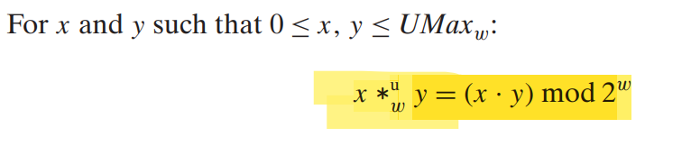

> Two’s-Complement Multiplication

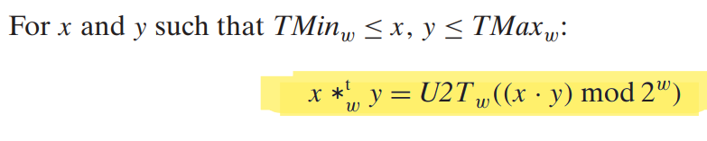

> Multiplying by Constants

Historically, the integer multiply instruction on many machines was fairly slow, requiring 10 or more clock cycles, whereas other integer operations—such as addition, subtraction, bit-level operations, and shifting—required only 1 clock cycle


As a consequence, one important optimization used by compilers is to attempt to replace multiplications by constant factors with combinations of shift and addition operations

- Unsigned multiplication by a power of 2
    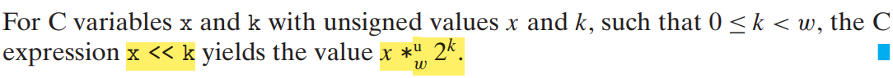
- Two’s-complement multiplication by a power of 2
    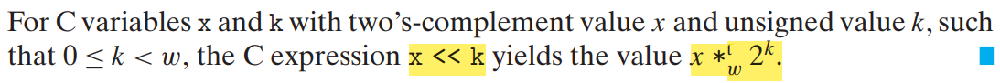
----

consider x * K

K's bit-level representation is 

**[(0 ... 0) (1 ... 1) (0 ... 0) ... (1 ... 1)]**

Consider a run of ones from bit position n down to bit position m (n ≥ m).

then x * K  = 

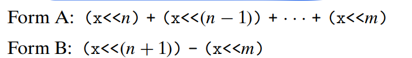

these can be highly machine dependent. Most compilers only perform this optimization when a small number of shifts, adds, and subtractions suffice

Assuming that addition and subtraction have the same performance, the rule is to choose form A when n = m, either form when n = m + 1, and form B when n>m + 1.

>  Dividing by Powers of 2

Integer division on most machines is even slower than integer multiplication— requiring 30 or more clock cycles

**Integer division always rounds toward zero**

**Right shift always rounds down**

-----
By adding a bias before the right shift, the negative result is rounded toward zero
    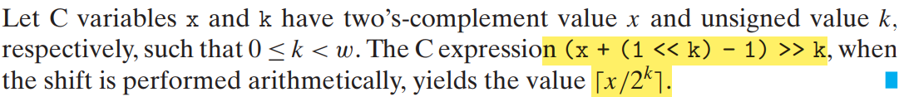
    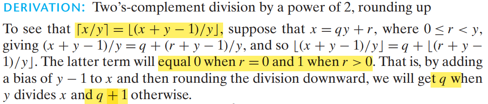

**(x<0 ? x+(1<<k)-1 : x) >> k will compute the value x/2^k**

## Floating Point
A floating-point representation encodes rational numbers of the form **V = x × 2^y**.

`p194 2.46`

> IEEE Floating-Point Representation

The IEEE floating-point standard represents a number in a form **V = (−1)^s × M × 2^E**.
    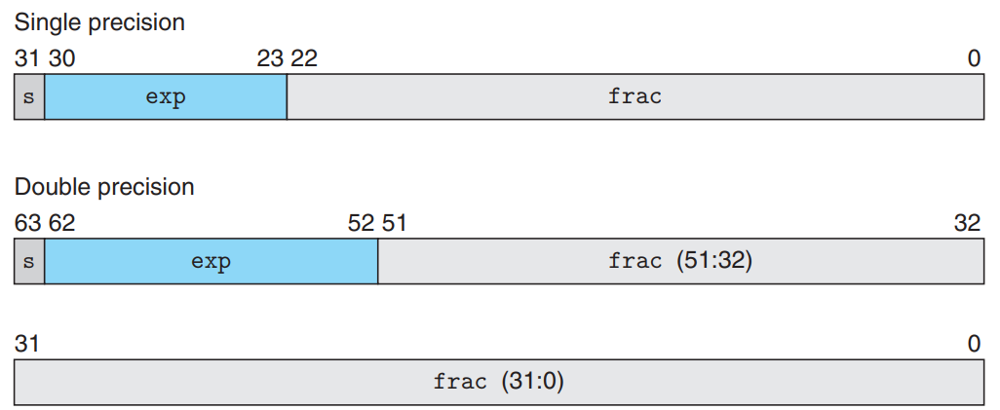

- The single sign bit s directly encodes the sign s
- The k-bit exponent field exp = ek−1 ... e1e0 encodes the exponent E
- The n-bit fraction field frac = fn−1 ... f1f0 encodes the significand M, but the value encoded also depends on whether or not the exponent field equals 0.

----
The value encoded by a given bit representation can be divided into three different cases

1. Denormalized Values
    ```
    When the exponent field is all zeros, the represented number is in denormalized form.

    E = 1 − Bias;
    
    M = f
    
    they provide a way to represent numeric value 0

    represent numbers that are very close to 0.0
    ```
2. Normalized Values
    ```
    It occurs when the bit pattern of exp is neither all zeros (numeric value 0) nor all ones (numeric value 255 for single precision

    E = e − Bias

    e is the unsigned number having bit representation ek−1 ... e1e0 and Bias is a bias value equal to 2^k−1 − 1

    M = 1 + f

    M = 1.fn−1fn−2 ... f0

    This
    representation is a trick for getting an additional bit of precision for free, since we can always adjust the exponent E so that significand M is in the range 1 ≤ M < 2 (   assuming there is no overflow)    
    ```
3. Special Values
    ```
    A final category of values occurs when the exponent field is all ones.
    ```
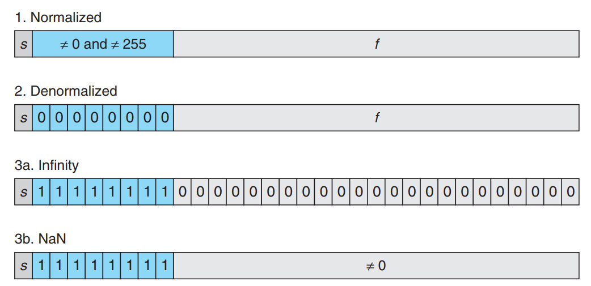

> Rounding

The IEEE floating-point format defines four different rounding modes

**Round-to-even (also called round-to-nearest) is the default mode**
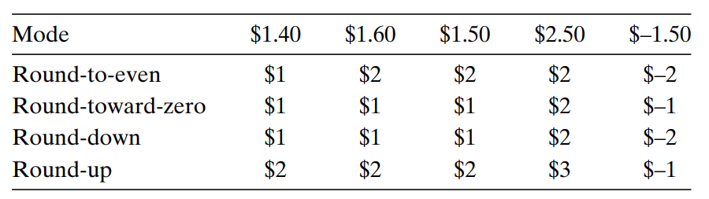
