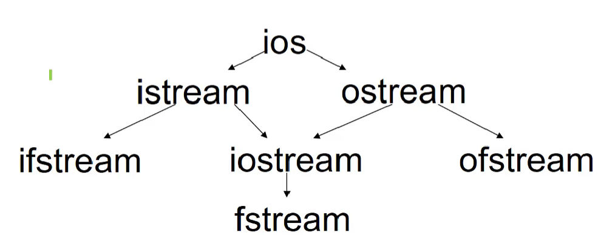

-pedantic-errors 
-Wall -Weffc++ -Wextra -Wsign-conversion

-Werror


# Reference "&"
```cpp
int & r = n;
```
Now, r is considered an alias for n.

**When the initialization of a reference variable is completed, the variable cannot refer to another variable**

Simple example:
```cpp
void swap(int &a, int &b) {
    int tmp;
    tmp = a;
    a = b;
}
int n1, n2;
swap(n1, n2);
```
## Constant references
```cpp
const int &r = n;
```
You cannot modify the content of a constant reference
```cpp
int i;
cont int j;
int &n = i;
const int &r = n; // Ok
int &k = r; // Wrong
int &l = j; // Wrong
```

# Const

```cpp
int n, m;
const int *p = &n;
*p = 5; // Wrong
n = 4; // Ok
p = &m; // Ok
```
-----
```cpp
const int *p1;
int *p2;
p1 = p2; // Ok
p2 = p1; // Wrong
p2 = (int *)p1; // Ok
```

# "new" and "delete"
## new 
```cpp
p = new T;
/*
T: data type
p: point of T
*/
```
```cpp
p = new T[N];
```

## delete
```cpp
delete p;
/*
p must point to dynamically allocated memory and you can delete the same memory twice
*/
```
```cpp
delete []p;
```


# Function
## inline function
when you call a function, you need to do some preparations like pushing local variables into stack, jumping to the function code address... And when function finish, you need to pop the data out of the stack, ret...

This is a bit of a waste of time when you have a small amount of function code.

So inline function is just insert function code into the caller. As a result, you save a lot of time. But this may make your code bloated.
```cpp
inline int function(int p){
    // do something
    return p;
}
```
## function overloading

functions have the same name, but the different parameters

```cpp
int Max(double f1, double f2){}
int Max(int n1, int n2) {}
int Max(int n1, int n2, int n3) {}
```

## default parameters

```cpp
void func(int x1, int x2 = 2, int x3 = 3) {}
//==========
func(10); // Ok
func(10, 8); // Ok
func(10, ,8); // Wrong
```

default parameters can improve your program's expandability

# Class and Object
```cpp
class CRectangle {
    public:
        int w, h;
        int Area() {
            return w * h;
        }
        int Perimeter() {
            return 2 * (w + h);
        }
        void Init(int w_, int h_) {
            w = w_;
            h = h_;
        }
};
```
the size of a object is the sum of its member variables. Where is the member functions? The functions is belonged to class, and is sharing by all object.

-----
you can write the defination of memeber functions elsewhere
```cpp
class CRectangle {
    public:
        int w, h;
        int Area();
        int Perimeter();
        void Init(int w_, int h_);
};
int CRectangle::Area() {
    return w * h;    
}
int CRectangle::Perimeter() {
    return 2 * (w + h);
}
void CRectangle::Init(int w_, int h_) {
    w = w_;
    h = h_;
}
```
## access scope

"private" is the default scope of class members

In member functions, you can access any member datas and memeber functions of this object, and the member of other objects in the same class

# Constructor

> Standard
- don't have return value
- same name as class
- only initialize the member datas, not allocate memory to object
- there is a default constructor do nothing, as if you don't define one. 

```cpp
class CSample {
    int x;
    public:
        CSample() {
            cout << "C1" << endl;
        }
        CSample(int n) {
            x = n;
            cout << "C2" << endl;
        }
        CSample(int i, int j) {
            cout << "C3" << endl;
        }
};
int main() {
    CSample array1[2]; // print: "C1 C1"
    CSample array2[2] = {4, 5}; // print: "C2 C2"
    CSample array3[2] = {3}; // print: "C2 C1"
    CSample array4[2] = {CSample(1, 2), CSample(1, 2)};
    CSample *array5[2] = {new CSample(1, 2), new CSample(1, 2)};
}
```

# Copy constructor
1. look like **X::X(X &)** or **X::X(const X &)**
2. class always has one copy constructor
3. Features: copy a object to another which have the same class of the former
4. The three situations where it works
    - assign
        ```cpp
        Object o2(o1);
        Object o2 = o1;
        ```
    - calling function
        ```cpp
        class A {
            public 
                A(){};
                A(A &a) {
                    cout << "Copy constructor called" << endl; 
                }
        };
        void func(A a1) {}
        int main() {
            A a2;
            func(a2); // calling copy constructor
            return 0;
        }
        ```
    - function return
        ```cpp
        class A {
            public:
                int v;
                A(int n) {v = n;}
                A(const A &a) {
                    v = a.v;
                    cout << "Copy constructor called" << endl; 
                }
        };
        A func() {
            A b(4);
            return b;
        }
        int main() {
            cout << func().v << endl; // calling copy constructor
            return 0;
        }
        ```
5. problem
    ```cpp
    void func(Object obj) { // there create a parameter by copy constructor. this may cost a lot of time. instead, you can use "Object &obj"
        cout << "func calling" << endl;
    }

# Type conversion constructor
automatic type conversion
```cpp
class Complex {
    public:
        double real, imag;
        Complex(int i){ // type conversion constructor
            cout << "IntConstructor called" << endl;
            real = i;
            imag = 0;
        }
        Complex(double r, double i) {
            real = r;
            imag = i;
        }
};
int main() {
    Complex c1(7, 8);
    c1 = 9; // 9 is converted to Complex object by type conversion, and then assign to c1
    return 0;
}
```

# destructors
```cpp
Object::~Object(){}
// don't have parameters and return values
```
destuctors don't release memory, they just do something before the memory be released.

confusion:
```cpp
class A {
    public:
        int x;
        A(int x_):x(x_) {
            cout << x << "constructor called" << endl;
        }
        A(const A &a) {
            x = 2 + a.x;
            cout << "copy called" << endl;
        }
        ~A() {
            cout << x << "destructor called" << endl;
        }
};
A f() { 
    A b(10);
    return b;
}
int main() {
    A a(1);
    a = f();
    return 0;
}
```

# This
```cpp
class Complex {
    public:
        double real, imag;
        Complex(double real, double imag) {
            this->real = real;
            this->imag = imag;
        }
};
```
confusion:
```cpp
class A {
    int t;
    public:
        void Hello() {
            cout << "hello" << endl;
        }
};
int main() {
    A *p = NULL;
    p->Hello();
}
//=========complie to c
struct A {
    int t;
};
void Hello(A *this) {
    cout << "hello" << endl;
}
int main() {
    A *p = NULL;
    Hello(p);
}
```
# Static

```cpp
class CRectangle {
    private:
        int w, h;
        static int nTotalArea;
        static int nTotalNumber;
    public:
        CRectangle(int w_, int h_);
        ~CRectangle();
        CRectangle(CRectangle &r);
        static void PrintToal();
};
CRectangle::CRectangle(int w_, int h_) {
    w = w_;
    h = h_;
    nTotalNumber++;
    nTotalArea += w * h;
}
CRectangle::~CRectangle() {
    nTotalNumber--;
    nTotalArea -= w * h;
}
CRectangle::CRectangle(CRectangle &r) {
    w = r.w;
    h = r.h;
    nTotalNumber++;
    nTotalArea += w * h;
}
void CRectangle::PrintTotal() {
    cout << nTotalNumber << " " << nTotalArea << endl;
}

int CRectangle::nTotalArea = 0;
int CRectangle::nTotalNumber= 0;
```
static member datas belong to class, so "sizeof" doesn't count them on.

access:
```cpp
CRectangle::PrintTotal();
CRectangle r; r.PrintTotal();
CRectangle *p = &r; p->PrintTotal();
CRectangle &ref = r; int n = ref.nTotalNumber; 
```
# Enclosing Class

a class whose member data is other class object;
```cpp 
class CTyre {
    private:
        int radius;
        int width;
    public:
        CTyre(int r, int w):radius(r), width(w) { }
};
class CEngine {

};
class CCar { // enclosing class
    private:
        int price;
        CTyre tyre;
        CEngine engine;
    public:
        CCar(int p, int tr, int tw);
};
CCar::CCar(int p, int tr, int w):price(p), tyre(tr, w){ }
int main(void) {
    CCar car; // wrong, complier doesn't know how to init car.tyre.
    return 0;
}
```

constructor execution order:
1. member object's constructor(The order of member objects is the same as the order defined in the enclosing class)
2. enclosing class object's constructor

destructor execution order:
1. enclosing class object's 
2. member object's

# Const Plus 
## const object 
```cpp
const object obj;
```
## const member function
you can't modify member datas(except static member datas) and call other non-const member function(except static) within const member function
```cpp
class Sample {
    public:
        int value;
        void GetValue() const;
        void GetValue(); // Ok, this is overload 
        void func() { }
};
void Sample::GetValue() {}
void Sample::GetValue() const {
    value = 0; // wrong
    func(); // wrong
}
```

# Friends

## friend function
```cpp
class CCar;
class CDriver {
    public:
        void ModifyCar(CCar *pCar);
};
class CCar {
    private:
        int price;
    friend int MostExpensiveCar(CCar cars[], int total); // Not member function of this class, but the function can use any member of this class.
    friend void CDriver::ModifyCar(CCar *pCar);
};
void CDriver::ModifyCar(CCar *pCar) {
    pCar->price += 1000;
}
int MostExpensiveCar(CCar cars[], int total) {
    int tmpMax = -1;
    for (int i = 0; i < total; i++) {
        if (cars[i].price > tmpMax) {
            tmpMax = cars[i].price;
        }
    }
    return tmpMax;
}
```
## friend class
```cpp
class CCar {
    private:
        int price;
    friend class CDriver; //  
};
class CDriver {
    CCar myCar;
    public:    
        void ModifyCar() {
            myCar.price += 1000;
        }
};
```
friend class can't be passed and extended

# Operator Overload 
```cpp
class Complex {
    public:
    double real, imag;
    Complex(double r = 0.0, double i = 0.0):real(r), imag(i) {}
    Complex operator -(const Complex &c);
    Complex operator +(double r); // c + 5
    friend Complex operator +(double r, const Complex &c);
};
Complex operator +(const Complex &a, const Complex &b) {
    return Complex(a.real+b.real, a.imag+b.imag);
}
Complex Complex::operator -(const Complex &c) {
    return Complex(real - c.real, imag - c.imag);
}
Complex operator +(double r, const Complex &c) {
    return Complex(c.real + r, c.imag);
}
Complex Complex::operator +(double r) {
    return Complex(this.real + r, this.imag);
}
```
# Assignment operator overload

**=** can only be overloaded to member function
```cpp
class String {
    private:
        char *str;
    public:
        String():str(new char[1]) {str[0] = 0;}
        const char *c_str() {return str;}
        String & operator =(const char *s); //1
        String(String &s) {
            str = new char[strlen(s.str) + 1];
            strcpy(str, s.str);
        }
        ~String() {delete[] str;}
};
String &String::operator =(const char *s) {
    if (this == s) 
        return *this;    
    delete[] str;
    str = new char[strlen(s) + 1];
    strcpy(str, s);
    return *this;
}
int main() {
    String s;
    s = "Good Luck"; // Ok
    String s2 = "hello"; // Wrong, this is init not assignment
    return 0;
}
```
confusion:
```cpp
String S1, S2;
S1 = "this";
S2 = "that";
S1 = S2; // terrible operation if without overloading. 3 reasons.
s = s; // will be wrong without overloading
a = b = c;
(a = b) = c;

# Combination
```cpp
class CArray {
    int *ptr;
    int size;
    int length;
    public:
        CArray(int s = 0);
        CArray(CArray &a);
        ~CArray();
        int & operator [](int i);
        CArray & operator =(const CArray &a);
        void push_back(int i);
        int length();
};
CArray::CArray(int s):size(s) {
    if (!s) {
        ptr = NULL;
        length = 0;
    } else {
        ptr = new int[s];
        length = 0;
    }
}
CArray::CArray(CArray &a) {
    if (!a.size) {
        ptr = NULL;
        size = 0;
        lenght = 0;
        return ;
    }
    ptr = new int[a.size];
    memcpy(ptr, a.ptr, a.size * sizeof(int));
    size = a.size;
    length = a.length;
}
CArray::~CArray() {
    if (ptr) {
        delete[] ptr;
    }
}
int &CArray::operator [](int i) {
    if (i >= 0 && i < length && ptr) {
        return ptr[i];
    } else {
        cout << "ERROR" << endl;
        return NULL;
    }
}
CArray &CArray::operator =(CArray &a) {
    if (ptr == a.ptr) 
        return *this;
    if (!a.size) {
        if (ptr)
            delete[] ptr;    
        ptr = NULL;
        size = 0;
        length = 0;
        return *this;
    }
    if (size < a.size) {
        if (ptr)
            delete[] ptr;
        ptr = new int[a.size];
        memcpy(ptr, a.ptr, a.size * sizeof(int));
        size = a.size;
        length = a.length;
        return *this;
    }
}
void CArray::push_back(int i) {
    if (i >= 0 && ptr) {
        if (length++ > size) {
            int nsize = size + size / 2;
            int *nptr = new int(nsize);
            memcpy(nptr, ptr, size);
            delete[] ptr;
            ptr = nptr;
            size = nsize;
        } else {
            ptr[length] = i;
        }
    } else {
        ptr = new int[1];
        ptr[size++] = i;
    }
}

int CArray::length() {
    return length;
}
```
# Input and Output operator overloading
```cpp
class Complex {
    double real, imag;
    public:
        Complex(double r = 0, double i = 0):real(r), imag(i){}
        friend ostream & operator <<(ostream &os, const Complex &c);
        friend istream & operator >>(istream &is, Complex &c);
};
ostream & operator <<(ostream &os, const Complex &c) {
    os << c.real << "+" << c.imag << "i";
    return os;
}
istream & operator >>(istream &is, Complex &c) {
    string s;
    is >> s;
    int pos = s.find("+", 0);
    string sTmp = s.substr(0, pos);
    c.real = atof(sTmp.c_str());
    sTmp = s.substr(pos+1, s.length()-pos-2);
    c.imag = atof(sTmp.c_str());
    return is;
}
```

# Type conversion operator overloading
```cpp
class Complex {
    double real, imag;
    public:
        Complex(double r = 0, double i = 0):real(r), imag(i) {}
        operator double() {
            return real;
        }
};
int main() {
    Complex c(1.2, 3.4);
    cout << (double)c << endl; // 1.2
    double n = 2 + c;
    cout << n; // 3.2
}
```
# Overloading of the self-increment operator self-subtraction operator
```cpp
class CDemo {
    int n;
    public:
        CDemo(int i = 0):n(i){}
        CDemo & operator ++();//prefix
        CDemo operator ++(int);// suffix, suffix need an extra parameter, but it doesn't do anything
        operator int() {
            return n;
        }
        friend CDemo & operator --(CDemo &);
        friend CDemo operator -- (CDemo &, int);
};
CDemo & CDemo::operator ++ () {
    ++n;
    return *this; // (++i) = 3; is ok
}
CDemo CDemo::operator ++ (int i) {
    CDemo tmp(*this);
    n++;
    return tmp; // (i++) = 3; is wrong
}
CDemo & operator -- (CDemo &d) {
    d.n--;
    return d;
}
CDemo operator -- (CDemo &d, int i) {
    CDemo tmp(d);
    d.n--;
    return tmp;
}
```

note:

1. No new operators are allowed to be defined
2. Operator overloading cannot change operator precedence
3. ".", ".*", "::", "?:", "sizeof" cannot be overloaded
4. "()", "[]", "->" and "=" must be overloaded as member function.

# Extend
```cpp
class CStudent {
    string sName;
    int nAge;
    public:
        bool isExcellent() {}
        void setName(const string &name) {
            sName = name;
        }
};
class CUndergraduateStudent:public CStudent {
    private:
        int nDepartment;
    public:
        bool isExcellent() {...} // override
}
```

# Inherited relationships and Compound relationship
```cpp
// ========bad
class CDog;
class CMaster {
    CDog dogs[10];
};
class CDog {
    CMaster m;
}; // Loop Definition
// ========bad
class CDog;
class CMaster {
    CDog *dogs[10];
};
class CDog {
    CMaster m;
};
// ========bad
class CMaster;
class CDog {
    CMaster *pm;
};
class CMaster {
    CDog dogs[10];
};
// ========good
class CMaster;
class CDog {
    CMaster *pm;
};
class CMaster {
    CDog *dogs[10];
};
``` 

# Access base class 
```cpp
class base {
    int j;
    public:
        int i;
        void func();    
};
class derived:public base {
    public:
        void access();
        void func();    
}
void derived::access() {
    j = 5; // subclass can't access the private data of base class
    func(); // subclass
    base::func(); // base class
}
```

# constructor of subclass
```cpp
class Bug { 
    int nLegs;
    int nColor;
    public:
        int nType;
        Bug(int legs, int color):nLegs(legs), nColor(color){}
        void printBug() {}
};
class Skill {
    public:
        Skill(int n) {}
}
class FlyBug:public Bug {
    int nWings;
    Skill sk1, sk2;
    public:
        FlyBug(int legs, int color, int wings);
};
FlyBug::FlyBug(int legs, int color, int wings):Bug(legs, color), sk1(5), sk2(color) {
    nWings = wings;
} // If the base class constructor is not explicitly called, the base class's parameterless constructor is used by default

/* 
constructor call order:
1. Bug
2. Skill
3. FlyBug
*/
```
# Public extend rules
```cpp
class base {};
class derived:public base {};
base b;
derived d;
// operations below is allowed
b = d;
base &br = d;
base *pb = &d;
```
# Virtual function and Polymorphic

Polymorphic representation:

1. 
    ```cpp
    class CBase {
        public:
            virtual void SomeVirtualFunction() {
                cout << "base class" << endl;
            }    
    };
    class CDerived:public CBase {
        public:
            virtual void SomeVirtualFunction() {
                cout << "subclass" << endl;
            }
    };
    int main() {
        CDerived ODerived;
        CBase *p = &ODerived;
        p->SomeVirtualFunction(); // print "base class" or "subclass" depends on which class the pointer points to. it has been decided during compiling.
    } 
    ```

2.
    ```cpp
    class CBase {
        public:
            virtual void SomeVirtualFunction() {
                cout << "base class" << endl;
            }    
    };
    class CDerived:public CBase {
        public:
            virtual void SomeVirtualFunction() {
                cout << "subclass" << endl;
            }
    };
    int main() {
        CDerived ODerived;
        CBase &r = ODerived;
        r.SomeVirtualFunction(); // Same as the example above 
    }
    ```
**Polymorphic can improve program expandability**

# Polymorphic Plus
```cpp
class Base {
    public:
        void fun1() {fun2();}
        virtual void fun2() {
            cout << "Base" << endl;
        }
};
class Derived:public Base {
    public:
        virtual void fun2() {
            cout << "Derived" << endl;
        }
};
int main() {
    Derived d;
    Base *pBase = &d;
    pBase->fun1(); // print "Derived"
    return 0;
}
```

**Calling virtual functions in constructors and destructors is not polymorphism**
```cpp
class myClass {
    public:
        virtual void hello() {
            cout << "hello from myclass" << endl;
        }
        virtual void bye() {
            cout << "bye from myclass" << endl;
        }
};
class son:public myClass {
    public:
        void hello() {
            cout << "hello from son" << endl;
        }    
        son() {hello();}
        ~son() {bye();}
};
class grandson:public son {
    public:
        virtual void hello() {
            cout << "hello from grandson" << endl;
        }
        virtual void bye() {
            cout << "bye from grandson" << endl;
        }
        grandson() {
            cout << "grandson" << endl;
        }
        ~grandson() {
            cout << "destructing grandson" << endl;
        }
};
int main() {
    grandson gson;
    son *pson;
    pson = &gson;
    pson->hello();
    return 0;
}

/*
print:
hello from son
grandson
hello from grandson
destructing grandson
bye from myclass
*/
```

# Virtual destructor

deleting  base class pointer will only call the base class destructor without virtual destructor
```cpp
class son {
    public:
        virtual ~son() {
            cout << "bye from son" << endl;
        }    
};
class grandson:public son {
    public:
        ~grandson() {
            cout << "bye from grandson" << endl;
        }    
};
int main() {
    son *pson;
    pson = new grandson();
    delete pson;
    return 0;
}

/*
output:
bye from grandson
bye from son
*/
```
when base class's member function is virtual, automatically, the subclass's member function is virtual too.

**note: you can't make constructor virtual**

# Pure virtual functions  
```cpp
virtual void func() = 0;
```
# Abstract class
A class that contains pure virtual functions is called an abstract class

```cpp
// given A is virtual class
A a; // wrong
A *pa; // ok
pa = new A; // wrong
```

you can call pure virtual functions in member functions of abstract class, except constructor and destructor

if a subclass extended from abstract class, it is also abstract unless all pure virtual functions is implemented.

# IO


several objects:
- cin
    ```cpp
    freopen("text.txt", "r", stdin);
    ```
- cout
    ```cpp
    freopen("text.txt", "w", stdout);
    ```
- cerr
- clog
----
Determine if the input stream is finished:
```cpp
while(cin>>i) {
    // ...
}
```

istream:
- istream & getline(char *buf, int bufSize);
- istream & getline(char *buf, int bufSize, char delim);

    `two of these functions will add '\0' in the end`
- bool eof(); // determine whether the input stream is finished
- int peek(); // return the next character, but don't delete it from the input stream
- istream & putback(char c);
- istream & ignore(int nCount = 1, int delim = EOF); // delete nCount characters from input stream. finish when encounter EOF.


# Output format
```cpp
#include <iostream>
#include <iomanip>
using namespace std;
int main() {
        int n = 141;
        cout << hex << n << " " << dec << n << " " << oct << n << endl;

        double x = 1234567.89, y = 12.34567;
        cout << setprecision(5) << x << " " << y << " " << endl;

        cout << fixed << setprecision(5) << x << " " << y << endl;

        cout << scientific << setprecision(5) << x << " " << y << endl;

        cout << showpos << fixed << setw(12) << setfill('*') << 12.1 << endl;

        cout << noshowpos << setw(12) << left << 12.1 << endl;

        cout << setw(12) << right << 12.1 << endl;

        cout << setw(12) << internal << -12.1 << endl;

        cout << 12.1 << endl;
        return 0;
}
/* 
output:
8d 141 215
1.2346e+06 12.346 
1234567.89000 12.34567
1.23457e+06 1.23457e+01
***+12.10000
12.10000****
****12.10000
-***12.10000
12.10000
*/
```
 
Customization:
```cpp
ostream & tab(ostream &output) {
    return output << '\t';
}
cout << "aa" << tab << "bb" << endl;
/*
output:
aa  bb
*/

/* 
function prototype:
ostream & operator <<(ostream & (*p) (ostream &));
and *this as parameter in iostream
*/
```

# File
## creat a file
```cpp
#include <fstream>
ofstream outFile("clients.dat", ios::out|ios::binary);
ofstream outfile2;
outfile2.open("test.out", ios::out|ios::binary);
if (!outfile2) {
    cout << "File open error" << endl;
}
```
## file read and write pointers
write pointer:
```cpp
ofstream fout("a1.out", ios::app);
long location = fout.tellp(); // obtain the position of pointer
location = 10;
fout.seekp(location); // move the pointer for next 10 bytes 
fout.seekp(location, ios::beg); // move from the file head
fout.seekp(location, ios::cur); // move from the current place
fout.seekp(location, ios::end);
```

read pointer:
```cpp
ifstream fin("a1.in", ios::ate); // open a file whose point in the end
long location = fin.tellg(); // obtain the gosition of gointer
location = 10L;
fin.seekg(location); // move the gointer for next 10 bytes 
fin.seekg(location, ios::beg); // move from the file head
fin.seekg(location, ios::cur); // move from the current place
fin.seekg(location, ios::end);
```


# Binary files
## write and read
```cpp
istream & read(char *s, long n);
istream & write(const char *s, long n);
```
## the difference between a binary file and a text file
Line break symbols:
- unix, linux: '\n'
- windows: '\r\n'
- mac os: '\r'

In Unix/Linux, It makes no difference if you use ios::binary.

but in windows without ios::binary, when reading, all '\r\n' will be processed into a '\n', on the other side, when writing, a single '\n' will be processed into a '\r\n'.

# Template
## function
define:
```cpp
template <class T>
void Swap(T &x, T &y) {
    T tmp = x;
    x = y;
    y = tmp;
}
// ===============
T Inc(T n) {
    return 1 + n;
}
int main() {
    cout << Inc<double>(4) / 2; // print 2.5
    return 0;
}
```
overload:
```cpp
template<class T1, class T2>
void print(T1 arg1, T2 arg2) {
    // ...
}
template<class T>
void print(T1 arg1, T2 arg2) {
    // ...
}
template<class T1, class T2>
void print(T1 arg1, T1 arg2) {
    // ...
}
```
Function templates and function call order:
1. Common functions with matching parameters
2. Template functions with exactly matching parameters
3. Common functions that can match after automatic type conversion of real parameters

```cpp
#include <iostream>
using namespace std;
template <class T>
T Max(T a, T b) {
        cout << "TemplateMax" << endl;
        return 0;
}
template <class T1, class T2>
T1 Max(T1 a, T2 b) {
        cout << "TemplateMax2" << endl;
        return 0;
}
double Max(double a, double b) {
        cout << "MyMax" << endl;
        return 0;
}
int main() {
        int i = 4, j = 5;
        Max(1.2, 3.4);
        Max(i, j);
        Max(1.2, 3);
        return 0;
}

/*
output:
MyMax
TemplateMax
TemplateMax2
*/
```

No automatic type conversion when matching template functions
```cpp
myFunction(5, 8.4); // error
```
