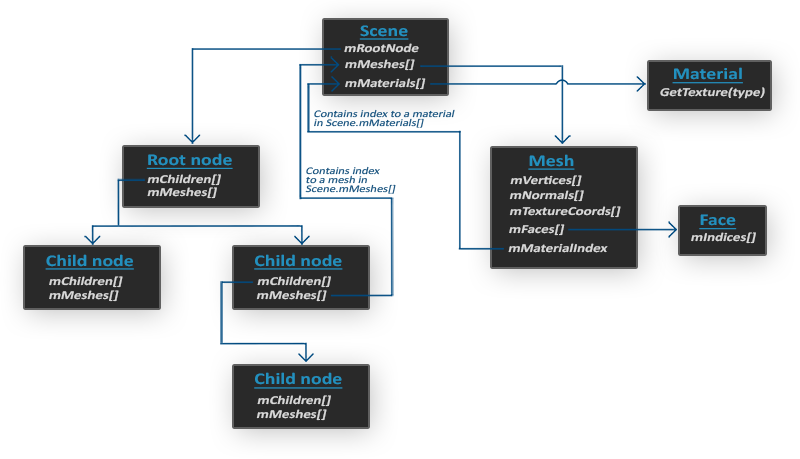

# Assimp

我们想要的是将这些模型(Model)导入(Import)到程序当中。模型通常都由3D艺术家在Blender、3DS Max或者Maya这样的工具中精心制作。

**这些所谓的3D建模工具(3D Modeling Tool)可以让艺术家创建复杂的形状，并使用一种叫做UV映射(uv-mapping)的手段来应用贴图。这些工具将会在导出到模型文件的时候自动生成所有的顶点坐标、顶点法线以及纹理坐标。**

http://en.wikipedia.org/wiki/Wavefront_.obj_file
去Wavefront的wiki页面上看看文件格式的信息是如何封装的。这应该能让你认识到模型文件的基本结构。

不同种类的文件格式有很多，它们之间通常并没有一个通用的结构。所以如果我们想从这些文件格式中导入模型的话，我们必须要去自己对每一种需要导入的文件格式写一个导入器。很幸运的是，正好有一个库专门处理这个问题。

## 模型加载库

**一个非常流行的模型导入库是Assimp，它是Open Asset Import Library（开放的资产导入库）的缩写**

Assimp能够导入很多种不同的模型文件格式（并也能够导出部分的格式），它会将所有的模型数据加载至Assimp的通用数据结构中。当Assimp加载完模型之后，我们就能够从Assimp的数据结构中提取我们所需的所有数据了。由于Assimp的数据结构保持不变，不论导入的是什么种类的文件格式，它都能够将我们从这些不同的文件格式中抽象出来，用同一种方式访问我们需要的数据。


当使用Assimp导入一个模型的时候，它通常会将整个模型加载进一个**场景(Scene)** 对象，它会包含导入的模型/场景中的所有数据。Assimp会将场景载入为一系列的节点(Node)，**每个节点包含了场景对象中所储存数据的索引**， **每个节点都可以有任意数量的子节点。**



- 和材质和网格(Mesh)一样，**所有的场景/模型数据都包含在Scene对象中**。**Scene对象也包含了场景根节点的引用**。
- 场景的Root node（根节点）可能包含子节点（和其它的节点一样），**它会有一系列指向场景对象中mMeshes数组中储存的网格数据的索引**。**Scene下的mMeshes数组储存了真正的Mesh对象**，**节点中的mMeshes数组保存的只是场景中网格数组的索引**。
- **一个Mesh对象本身包含了渲染所需要的所有相关数据**，像是顶点位置、法向量、纹理坐标、面(Face)和物体的材质。
- **一个网格包含了多个面。Face代表的是物体的渲染图元(Primitive)**（三角形、方形、点）。**一个面包含了组成图元的顶点的索引**。由于顶点和索引是分开的，使用一个索引缓冲来渲染是非常简单的（见你好，三角形）。
- **最后，一个网格也包含了一个Material对象，它包含了一些函数能让我们获取物体的材质属性**，比如说颜色和纹理贴图（比如漫反射和镜面光贴图）。

<font color="blue">
网格(Mesh)

当使用建模工具对物体建模的时候，艺术家通常不会用单个形状创建出整个模型。通常每个模型都由几个子模型/形状组合而成。组合模型的每个单独的形状就叫做一个网格(Mesh)。比如说有一个人形的角色：艺术家通常会将头部、四肢、衣服、武器建模为分开的组件，并将这些网格组合而成的结果表现为最终的模型。一个网格是我们在OpenGL中绘制物体所需的最小单位（顶点数据、索引和材质属性）。一个模型（通常）会包括多个网格。
</font>

## 构建Assimp

`如果你想让Assimp使用多线程来获得更高的性能，你可以使用Boost库来编译Assimp。你可以在它们的安装页面找到完整的安装介绍。`


# 网格

**一个网格应该至少需要一系列的顶点，每个顶点包含一个位置向量、一个法向量和一个纹理坐标向量**。一个网格还应该包含用于索引绘制的索引以及纹理形式的材质数据（漫反射/镜面光贴图）。

顶点:
```cpp
struct Vertex {
    glm::vec3 Position;
    glm::vec3 Normal;
    glm::vec2 TexCoords;
};
```

纹理:
```cpp
struct Texture {
    unsigned int id;
    string type;
};
```

网格类:
```cpp
class Mesh {
    public:
        /*  网格数据  */
        vector<Vertex> vertices;
        vector<unsigned int> indices;
        vector<Texture> textures;
        /*  函数  */
        Mesh(vector<Vertex> vertices, vector<unsigned int> indices, vector<Texture> textures);
        void Draw(Shader shader);
    private:
        /*  渲染数据  */
        unsigned int VAO, VBO, EBO;
        /*  函数  */
        void setupMesh();
        // 初始化缓冲
};  
```

```cpp
Mesh(vector<Vertex> vertices, vector<unsigned int> indices, vector<Texture> textures)
{
    this->vertices = vertices;
    this->indices = indices;
    this->textures = textures;

    setupMesh();
}
```
## 初始化
**由于有了构造器，我们现在有一大列的网格数据用于渲染。在此之前我们还必须配置正确的缓冲，并通过顶点属性指针定义顶点着色器的布局**

```cpp
void setupMesh()
{
    glGenVertexArrays(1, &VAO);
    glGenBuffers(1, &VBO);
    glGenBuffers(1, &EBO);

    glBindVertexArray(VAO);
    glBindBuffer(GL_ARRAY_BUFFER, VBO);

    glBufferData(GL_ARRAY_BUFFER, vertices.size() * sizeof(Vertex), &vertices[0], GL_STATIC_DRAW);  

    glBindBuffer(GL_ELEMENT_ARRAY_BUFFER, EBO);
    glBufferData(GL_ELEMENT_ARRAY_BUFFER, indices.size() * sizeof(unsigned int), 
                 &indices[0], GL_STATIC_DRAW);

    // 顶点位置
    glEnableVertexAttribArray(0);   
    glVertexAttribPointer(0, 3, GL_FLOAT, GL_FALSE, sizeof(Vertex), (void*)0);
    // 顶点法线
    glEnableVertexAttribArray(1);   
    glVertexAttribPointer(1, 3, GL_FLOAT, GL_FALSE, sizeof(Vertex), (void*)offsetof(Vertex, Normal));
    // 顶点纹理坐标
    glEnableVertexAttribArray(2);   
    glVertexAttribPointer(2, 2, GL_FLOAT, GL_FALSE, sizeof(Vertex), (void*)offsetof(Vertex, TexCoords));

    glBindVertexArray(0);
}  
```

**C++结构体有一个很棒的特性，它们的内存布局是连续的(Sequential)。**
```cpp
Vertex vertex;
vertex.Position  = glm::vec3(0.2f, 0.4f, 0.6f);
vertex.Normal    = glm::vec3(0.0f, 1.0f, 0.0f);
vertex.TexCoords = glm::vec2(1.0f, 0.0f);
// = [0.2f, 0.4f, 0.6f, 0.0f, 1.0f, 0.0f, 1.0f, 0.0f];
```

**结构体的另外一个很好的用途是它的预处理指令offsetof(s, m)，它的第一个参数是一个结构体，第二个参数是这个结构体中变量的名字。这个宏会返回那个变量距结构体头部的字节偏移量(Byte Offset)。这正好可以用在定义glVertexAttribPointer函数中的偏移参数：**
```cpp
glVertexAttribPointer(1, 3, GL_FLOAT, GL_FALSE, sizeof(Vertex), (void*)offsetof(Vertex, Normal)); 
```

使用这样的一个结构体不仅能够提供可读性更高的代码，也允许我们很容易地拓展这个结构。如果我们希望添加另一个顶点属性，我们只需要将它添加到结构体中就可以了。由于它的灵活性，渲染的代码不会被破坏。

## 渲染

设定一个命名标准：每个漫反射纹理被命名为texture_diffuseN，每个镜面光纹理应该被命名为texture_specularN，其中N的范围是1到纹理采样器最大允许的数字。
```cpp
uniform sampler2D texture_diffuse1;
uniform sampler2D texture_diffuse2;
uniform sampler2D texture_diffuse3;
uniform sampler2D texture_specular1;
uniform sampler2D texture_specular2;
```
```cpp
void Draw(Shader shader) 
{
    unsigned int diffuseNr = 1;
    unsigned int specularNr = 1;
    for(unsigned int i = 0; i < textures.size(); i++)
    {
        glActiveTexture(GL_TEXTURE0 + i); // 在绑定之前激活相应的纹理单元
        // 获取纹理序号（diffuse_textureN 中的 N）
        string number;
        string name = textures[i].type;
        if(name == "texture_diffuse")
            number = std::to_string(diffuseNr++);
        else if(name == "texture_specular")
            number = std::to_string(specularNr++);

        shader.setFloat(("material." + name + number).c_str(), i);
        glBindTexture(GL_TEXTURE_2D, textures[i].id);
    }
    glActiveTexture(GL_TEXTURE0);

    // 绘制网格
    glBindVertexArray(VAO);
    glDrawElements(GL_TRIANGLES, indices.size(), GL_UNSIGNED_INT, 0);
    glBindVertexArray(0);
}
```