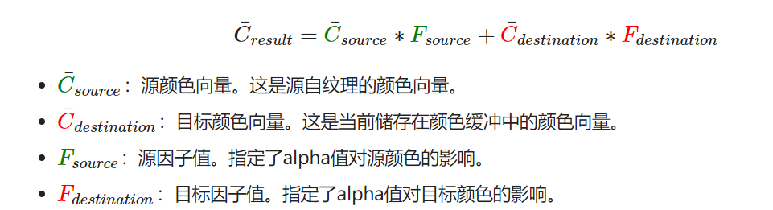
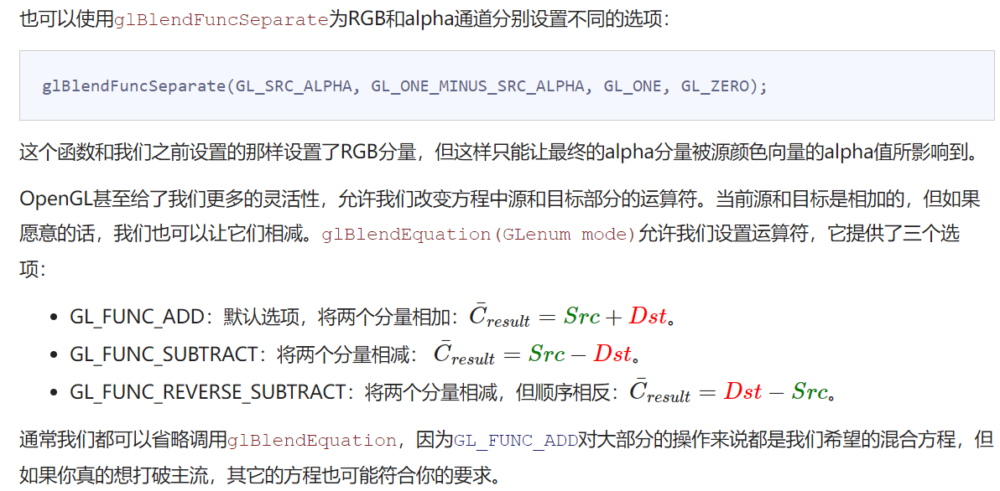
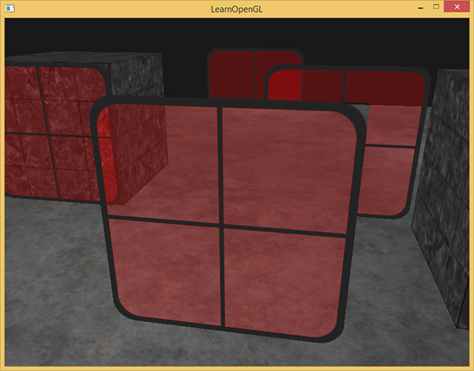

# 混合
**OpenGL中，混合(Blending)通常是实现物体透明度(Transparency)的一种技术。透明就是说一个物体（或者其中的一部分）不是纯色(Solid Color)的，它的颜色是物体本身的颜色和它背后其它物体的颜色的不同强度结合。**

一个有色玻璃窗是一个透明的物体，玻璃有它自己的颜色，但它最终的颜色还包含了玻璃之后所有物体的颜色。这也是混合这一名字的出处，我们混合(Blend)（不同物体的）多种颜色为一种颜色。所以透明度能让我们看穿物体

**一个物体的透明度是通过它颜色的alpha值来决定的。**

但一些材质会有一个内嵌的alpha通道，对每个纹素(Texel)都包含了一个alpha值。这个alpha值精确地告诉我们纹理各个部分的透明度。

它在一般情况下是完全的红色，但由于它有75%的透明度，能让很大一部分的网站背景颜色穿过，让它看起来不那么红了

## 丢弃片段

有些图片并不需要半透明，只需要根据纹理颜色值，显示一部分，或者不显示一部分，没有中间情况。

丢弃(Discard)显示纹理中透明部分的片段，不将这些片段存储到颜色缓冲中

要想加载有alpha值的纹理，我们并不需要改很多东西，stb_image在纹理有alpha通道的时候会自动加载，但我们仍要在纹理生成过程中告诉OpenGL，我们的纹理现在使用alpha通道了：
```cpp
glTexImage2D(GL_TEXTURE_2D, 0, GL_RGBA, width, height, 0, GL_RGBA, GL_UNSIGNED_BYTE, data);
```
同样，保证你在片段着色器中获取了纹理的全部4个颜色分量，而不仅仅是RGB分量：
```glsl
void main()
{
    // FragColor = vec4(vec3(texture(texture1, TexCoords)), 1.0);
    FragColor = texture(texture1, TexCoords);
}
```


OpenGL默认是不知道怎么处理alpha值的，更不知道什么时候应该丢弃片段。我们需要自己手动来弄
```glsl
#version 330 core
out vec4 FragColor;

in vec2 TexCoords;

uniform sampler2D texture1;

void main()
{             
    vec4 texColor = texture(texture1, TexCoords);
    if(texColor.a < 0.1)
        discard;
    FragColor = texColor;
}
```

```cpp
/* 注意，当采样纹理的边缘的时候，OpenGL会对边缘的值和纹理下一个重复的值进行插值（因为我们将它的环绕方式设置为了GL_REPEAT。这通常是没问题的，但是由于我们使用了透明值，纹理图像的顶部将会与底部边缘的纯色值进行插值。这样的结果是一个半透明的有色边框，你可能会看见它环绕着你的纹理四边形。要想避免这个，每当你alpha纹理的时候，请将纹理的环绕方式设置为GL_CLAMP_TO_EDGE：
*/ 
glTexParameteri( GL_TEXTURE_2D, GL_TEXTURE_WRAP_S, GL_CLAMP_TO_EDGE);
glTexParameteri( GL_TEXTURE_2D, GL_TEXTURE_WRAP_T, GL_CLAMP_TO_EDGE);
```

## 混合

启用混合:
```cpp
glEnable(GL_BLEND);
```

启用了混合之后，我们需要告诉OpenGL它该如何混合。



**片段着色器运行完成后，并且所有的测试都通过之后，这个混合方程(Blend Equation)才会应用到片段颜色输出与当前颜色缓冲中的值（当前片段之前储存的之前片段的颜色）上**。源颜色和目标颜色将会由OpenGL自动设定，但源因子和目标因子的值可以由我们来决定。

**glBlendFunc(GLenum sfactor, GLenum dfactor)函数接受两个参数，来设置源和目标因子**。


选项	|值
-----|-----
GL_ZERO	|因子等于0
GL_ONE	|因子等于1
GL_SRC_COLOR	|因子等于源颜色向量C¯source
GL_ONE_MINUS_SRC_COLOR	|因子等于1−C¯source
GL_DST_COLOR	|因子等于目标颜色向量C¯destination
GL_ONE_MINUS_DST_COLOR	|因子等于1−C¯destination
GL_SRC_ALPHA	|因子等于C¯source的alpha分量
GL_ONE_MINUS_SRC_ALPHA	|因子等于1− C¯source的alpha分量
GL_DST_ALPHA	|因子等于C¯destination的alpha分量
GL_ONE_MINUS_DST_ALPHA	|因子等于1− C¯destination的alpha分量
GL_CONSTANT_COLOR	|因子等于常数颜色向量C¯constant
GL_ONE_MINUS_CONSTANT_COLOR	|因子等于1−C¯constant
GL_CONSTANT_ALPHA	|因子等于C¯constant的alpha分量
GL_ONE_MINUS_CONSTANT_ALPHA	|因子等于1− C¯constant的alpha分量



## 渲染半透明纹理



最前面窗户的透明部分遮蔽了背后的窗户？这为什么会发生呢？

**发生这一现象的原因是，深度测试和混合一起使用的话会产生一些麻烦。当写入深度缓冲时，深度缓冲不会检查片段是否是透明的，所以透明的部分会和其它值一样写入到深度缓冲中。结果就是窗户的整个四边形不论透明度都会进行深度测试。即使透明的部分应该显示背后的窗户，深度测试仍然丢弃了它们。**

所以我们不能随意地决定如何渲染窗户，让深度缓冲解决所有的问题了。这也是混合变得有些麻烦的部分。要想保证窗户中能够显示它们背后的窗户，我们需要首先绘制背后的这部分窗户。


## 不要打乱顺序
要想让混合在多个物体上工作，我们需要最先绘制最远的物体，最后绘制最近的物体。普通不需要混合的物体仍然可以使用深度缓冲正常绘制，所以它们不需要排序。但我们仍要保证它们在绘制（排序的）透明物体之前已经绘制完毕了。当绘制一个有不透明和透明物体的场景的时候，大体的原则如下：
- 先绘制所有不透明的物体。
- 对所有透明的物体排序。
- 按顺序绘制所有透明的物体。

```cpp
std::map<float, glm::vec3> sorted;
for (unsigned int i = 0; i < windows.size(); i++)
{
    float distance = glm::length(camera.Position - windows[i]);
    sorted[distance] = windows[i];
}
```

```cpp
for(std::map<float,glm::vec3>::reverse_iterator it = sorted.rbegin(); it != sorted.rend(); ++it) 
{
    model = glm::mat4();
    model = glm::translate(model, it->second);              
    shader.setMat4("model", model);
    glDrawArrays(GL_TRIANGLES, 0, 6);
}
```

虽然按照距离排序物体这种方法对我们这个场景能够正常工作，但它并没有考虑旋转、缩放或者其它的变换，奇怪形状的物体需要一个不同的计量，而不是仅仅一个位置向量。

更高级的技术还有次序无关透明度(Order Independent Transparency, OIT)