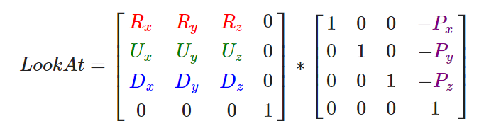

# 摄像机


## 摄像机/观察空间

### 摄像机位置
```cpp
glm::vec3 cameraPos = glm::vec3(0.0f, 0.0f, 3.0f);
```

### 摄像机方向
现在我们让摄像机指向场景原点：(0, 0, 0)。还记得如果将两个矢量相减，我们就能得到这两个矢量的差吗？用场景原点向量减去摄像机位置向量的结果就是摄像机的指向向量。由于我们知道摄像机指向z轴负方向，但我们希望方向向量(Direction Vector)指向摄像机的z轴正方向。如果我们交换相减的顺序，我们就会获得一个指向摄像机正z轴方向的向量：
```cpp
glm::vec3 cameraTarget = glm::vec3(0.0f, 0.0f, 0.0f);
glm::vec3 cameraDirection = glm::normalize(cameraPos - cameraTarget);
```


### 右轴

我们需要的另一个向量是一个**右向量(Right Vector)**，它代表摄像机空间的x轴的正方向。为获取右向量我们需要先使用一个小技巧：先定义一个**上向量(Up Vector)**。接下来把上向量和第二步得到的方向向量进行叉乘。两个向量叉乘的结果会同时垂直于两向量，因此我们会得到指向x轴正方向的那个向量（如果我们交换两个向量叉乘的顺序就会得到相反的指向x轴负方向的向量）：
```cpp
glm::vec3 up = glm::vec3(0.0f, 1.0f, 0.0f); 
glm::vec3 cameraRight = glm::normalize(glm::cross(up, cameraDirection));
```


### 上轴
```cpp
glm::vec3 cameraUp = glm::cross(cameraDirection, cameraRight);
```

## Look At

使用矩阵的好处之一是如果你使用3个相互垂直（或非线性）的轴定义了一个坐标空间，你可以用这3个轴外加一个平移向量来创建一个矩阵，并且你可以用这个矩阵乘以任何向量来将其变换到那个坐标空间




```cpp
glm::mat4 view;
view = glm::lookAt(glm::vec3(0.0f, 0.0f, 3.0f), 
           glm::vec3(0.0f, 0.0f, 0.0f), 
           glm::vec3(0.0f, 1.0f, 0.0f));
// glm::LookAt函数需要一个位置、目标和上向量。
```


## 自由移动


```cpp
glm::vec3 cameraPos   = glm::vec3(0.0f, 0.0f,  3.0f);
glm::vec3 cameraFront = glm::vec3(0.0f, 0.0f, -1.0f);
glm::vec3 cameraUp    = glm::vec3(0.0f, 1.0f,  0.0f);
view = glm::lookAt(cameraPos, cameraPos + cameraFront, cameraUp);
// 方向是当前的位置加上我们刚刚定义的方向向量。
```
```cpp
void processInput(GLFWwindow *window)
{
    ...
    float cameraSpeed = 0.05f; // adjust accordingly
    if (glfwGetKey(window, GLFW_KEY_W) == GLFW_PRESS)
        cameraPos += cameraSpeed * cameraFront;
    if (glfwGetKey(window, GLFW_KEY_S) == GLFW_PRESS)
        cameraPos -= cameraSpeed * cameraFront;
    if (glfwGetKey(window, GLFW_KEY_A) == GLFW_PRESS)
        cameraPos -= glm::normalize(glm::cross(cameraFront, cameraUp)) * cameraSpeed;
    if (glfwGetKey(window, GLFW_KEY_D) == GLFW_PRESS)
        cameraPos += glm::normalize(glm::cross(cameraFront, cameraUp)) * cameraSpeed;
}
```
`注意，我们对右向量进行了标准化。如果我们没对这个向量进行标准化，最后的叉乘结果会根据cameraFront变量返回大小不同的向量。如果我们不对向量进行标准化，我们就得根据摄像机的朝向不同加速或减速移动了，但如果进行了标准化移动就是匀速的。`


## 移动速度

根据配置的不同，有些人可能移动很快，而有些人会移动很慢。当你发布你的程序的时候，你必须确保它在所有硬件上移动速度都一样。

图形程序和游戏通常会跟踪一个**时间差(Deltatime)**变量，它储存了渲染上一帧所用的时间。


我们跟踪两个全局变量来计算出deltaTime值：
```cpp
float deltaTime = 0.0f; // 当前帧与上一帧的时间差
float lastFrame = 0.0f; // 上一帧的时间

float currentFrame = glfwGetTime();
deltaTime = currentFrame - lastFrame;
lastFrame = currentFrame;
```
```cpp
void processInput(GLFWwindow *window)
{
  float cameraSpeed = 2.5f * deltaTime;
  ...
}
```
我们把所有速度都去乘以deltaTime值。结果就是，如果我们的deltaTime很大，就意味着上一帧的渲染花费了更多时间，所以这一帧的速度需要变得更高来平衡渲染所花去的时间。


## 视角移动

为了能够改变视角，我们需要根据鼠标的输入改变cameraFront向量

### 欧拉角
一共有3种欧拉角：**俯仰角(Pitch)**、**偏航角(Yaw)**和**滚转角(Roll)**


每个欧拉角都有一个值来表示，把三个角结合起来我们就能够计算3D空间中任何的旋转向量了。


对于我们的摄像机系统来说，我们只关心俯仰角和偏航角，所以我们不会讨论滚转角。给定一个俯仰角和偏航角，我们可以把它们转换为一个代表新的方向向量的3D向量。


```cpp
direction.y = sin(glm::radians(pitch)); // 注意我们先把角度转为弧度
```

这里我们只更新了y值，仔细观察x和z分量也被影响了。从三角形中我们可以看到它们的值等于：
```cpp
direction.x = cos(glm::radians(pitch));
direction.z = cos(glm::radians(pitch));
```


偏航角:


会得到基于俯仰角和偏航角的方向向量：
```cpp
direction.x = cos(glm::radians(pitch)) * cos(glm::radians(yaw)); // 译注：direction代表摄像机的前轴(Front)，这个前轴是和本文第一幅图片的第二个摄像机的方向向量是相反的
direction.y = sin(glm::radians(pitch));
direction.z = cos(glm::radians(pitch)) * sin(glm::radians(yaw));
```


### 鼠标输入


首先我们要告诉GLFW，它应该隐藏光标，并捕捉(Capture)它。
```cpp
glfwSetInputMode(window, GLFW_CURSOR, GLFW_CURSOR_DISABLED);
```

在调用这个函数之后，无论我们怎么去移动鼠标，光标都不会显示了，它也不会离开窗口

我们需要让GLFW监听鼠标移动事件。
```cpp
void mouse_callback(GLFWwindow* window, double xpos, double ypos);

glfwSetCursorPosCallback(window, mouse_callback);
```

我们必须在最终获取方向向量之前做下面这几步：

- 计算鼠标距上一帧的偏移量。
    ```cpp
    float lastX = 400, lastY = 300; // init
    // callback
    float xoffset = xpos - lastX;
    float yoffset = lastY - ypos; // 注意这里是相反的，因为y坐标是从底部往顶部依次增大的
    lastX = xpos;
    lastY = ypos;

    float sensitivity = 0.05f;
    xoffset *= sensitivity;
    yoffset *= sensitivity;

    ```    
- 把偏移量添加到摄像机的俯仰角和偏航角中。
    ```cpp
    // 
        yaw   += xoffset;
        pitch += yoffset;
    ```

- 对偏航角和俯仰角进行最大和最小值的限制。
    ```cpp
     if(pitch > 89.0f)
        pitch =  89.0f;
        if(pitch < -89.0f)
        pitch = -89.0f;
- 计算方向向量。
    ```cpp
    glm::vec3 front;
    front.x = cos(glm::radians(pitch)) * cos(glm::radians(yaw));
    front.y = sin(glm::radians(pitch));
    front.z = cos(glm::radians(pitch)) * sin(glm::radians(yaw));
    cameraFront = glm::normalize(front);
    ```


如果你现在运行代码，你会发现在窗口第一次获取焦点的时候摄像机会突然跳一下。这个问题产生的原因是，在你的鼠标移动进窗口的那一刻，鼠标回调函数就会被调用，这时候的xpos和ypos会等于鼠标刚刚进入屏幕的那个位置。这通常是一个距离屏幕中心很远的地方，因而产生一个很大的偏移量，所以就会跳了。我们可以简单的使用一个bool变量检验我们是否是第一次获取鼠标输入，如果是，那么我们先把鼠标的初始位置更新为xpos和ypos值，这样就能解决这个问题；接下来的鼠标移动就会使用刚进入的鼠标位置坐标来计算偏移量了：
```cpp
if(firstMouse) // 这个bool变量初始时是设定为true的
{
    lastX = xpos;
    lastY = ypos;
    firstMouse = false;
}
```


缩放

视野(Field of View)或fov定义了我们可以看到场景中多大的范围。当视野变小时，场景投影出来的空间就会减小，产生放大(Zoom In)了的感觉。我们会使用鼠标的滚轮来放大。与鼠标移动、键盘输入一样，我们需要一个鼠标滚轮的回调函数
```cpp
void scroll_callback(GLFWwindow* window, double xoffset, double yoffset)
{
  if(fov >= 1.0f && fov <= 45.0f)
    fov -= yoffset;
  if(fov <= 1.0f)
    fov = 1.0f;
  if(fov >= 45.0f)
    fov = 45.0f;
}
```
yoffset值代表我们竖直滚动的大小

我们现在在每一帧都必须把透视投影矩阵上传到GPU，但现在使用fov变量作为它的视野：


四元数摄像机: https://github.com/cybercser/OpenGL_3_3_Tutorial_Translation/blob/master/Tutorial%2017%20Rotations.md

## 总结：
- 顶点缓冲对象(Vertex Buffer Object)： 一个调用显存并存储所有顶点数据供显卡使用的缓冲对象。
- 顶点数组对象(Vertex Array Object)： 存储缓冲区和顶点属性状态。
- 索引缓冲对象(Element Buffer Object)： 一个存储索引供索引化绘制使用的缓冲对象。


- 纹理(Texture)： 一种包裹着物体的特殊类型图像，给物体精细的视觉效果。
- 纹理缠绕(Texture Wrapping)： 定义了一种当纹理顶点超出范围(0, 1)时指定OpenGL如何采样纹理的模式。
- 纹理过滤(Texture Filtering)： 定义了一种当有多种纹素选择时指定OpenGL如何采样纹理的模式。这通常在纹理被放大情况下发生。
- 多级渐远纹理(Mipmaps)： 被存储的材质的一些缩小版本，根据距观察者的距离会使用材质的合适大小。
- 纹理单元(Texture Units)： 通过绑定纹理到不同纹理单元从而允许多个纹理在同一对象上渲染。

- LookAt矩阵： 一种特殊类型的观察矩阵，它创建了一个坐标系，其中所有坐标都根据从一个位置正在观察目标的用户旋转或者平移。
- 欧拉角(Euler Angles)： 被定义为偏航角(Yaw)，俯仰角(Pitch)，和滚转角(Roll)从而允许我们通过这三个值构造任何3D方向。