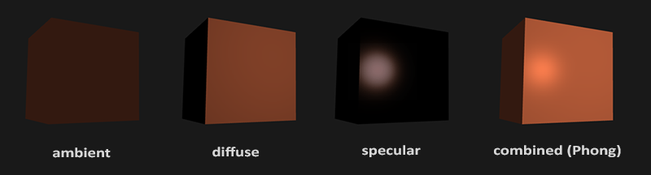

# 颜色

我们在现实生活中看到某一物体的颜色并不是这个物体真正拥有的颜色，而是它所反射的(Reflected)颜色。

那些不能被物体所吸收(Absorb)的颜色（被拒绝的颜色）就是我们能够感知到的物体的颜色


**当我们把光源的颜色与物体的颜色值相乘，所得到的就是这个物体所反射的颜色（也就是我们所感知到的颜色）。** 让我们再次审视我们的玩具（这一次它还是珊瑚红），看看如何在图形学中计算出它的反射颜色。我们将这两个颜色向量作分量相乘，结果就是最终的颜色向量了：
```cpp
glm::vec3 lightColor(1.0f, 1.0f, 1.0f);
glm::vec3 toyColor(1.0f, 0.5f, 0.31f);
glm::vec3 result = lightColor * toyColor; // = (1.0f, 0.5f, 0.31f);
```

由此，我们可以定义物体的颜色为**物体从一个光源反射各个颜色分量的大小**

## 创建一个光照场景


# 基础光照

**冯氏光照模型(Phong Lighting Model)**

冯氏光照模型的主要结构由3个分量组成：**环境(Ambient)**、**漫反射(Diffuse)**和**镜面(Specular)光照。**



- 环境光照(Ambient Lighting): 即使在黑暗的情况下，世界上通常也仍然有一些光亮（月亮、远处的光），所以物体几乎永远不会是完全黑暗的。
- 漫反射光照(Diffuse Lighting)：模拟光源对物体的方向性影响(Directional Impact)。它是冯氏光照模型中视觉上最显著的分量。物体的某一部分越是正对着光源，它就会越亮。
- 镜面光照(Specular Lighting)：模拟有光泽物体上面出现的亮点。镜面光照的颜色相比于物体的颜色会更倾向于光的颜色。

## 环境光照


光通常都不是来自于同一个光源，而是来自于我们周围分散的很多光源，即使它们可能并不是那么显而易见。光的一个属性是，它可以向很多方向发散并反弹，从而能够到达不是非常直接临近的点。所以，光能够在其它的表面上反射，对一个物体产生间接的影响。考虑到这种情况的算法叫做**全局照明(Global Illumination)算法**，但是这种算法既开销高昂又极其复杂。


我们使用一个很小的常量（光照）颜色，添加到物体片段的最终颜色中，这样子的话即便场景中没有直接的光源也能看起来存在有一些发散的光。

```cpp
void main()
{
    float ambientStrength = 0.1;
    vec3 ambient = ambientStrength * lightColor;

    vec3 result = ambient * objectColor;
    FragColor = vec4(result, 1.0);
}
```

## 漫反射光照

**漫反射光照使物体上与光线方向越接近的片段能从光源处获得更多的亮度**


我们知道两个单位向量的夹角越小，它们点乘的结果越倾向于1。当两个向量的夹角为90度的时候，点乘会变为0。这同样适用于θ，θ越大，光对片段颜色的影响就应该越小

`注意，为了（只）得到两个向量夹角的余弦值，我们使用的是单位向量（长度为1的向量），所以我们需要确保所有的向量都是标准化的，否则点乘返回的就不仅仅是余弦值了
`

计算漫反射光照需要:
- 法向量
- 定向的光线: 作为光源的位置与片段的位置之间向量差的方向向量。

### 法向量

`虽然对灯的着色器使用不能完全利用的顶点数据看起来不是那么高效，但这些顶点数据已经从箱子对象载入后开始就储存在GPU的内存里了，所以我们并不需要储存新数据到GPU内存中。这实际上比给灯专门分配一个新的VBO更高效了。`

片段着色器:
```glsl
in vec3 Normal;
```
### 计算漫反射光照


最后，我们还需要片段的位置。**我们会在世界空间中进行所有的光照计算，因此我们需要一个在世界空间中的顶点位置。** 我们可以通过把顶点位置属性乘以模型矩阵（不是观察和投影矩阵）来把它变换到世界空间坐标。这个在顶点着色器中很容易完成，所以我们声明一个输出变量，并计算它的世界空间坐标：
```cpp
out vec3 FragPos;  
out vec3 Normal;

void main()
{
    gl_Position = projection * view * model * vec4(aPos, 1.0);
    FragPos = vec3(model * vec4(aPos, 1.0));
    Normal = aNormal;
}
```
现在，所有需要的变量都设置好了，我们可以在片段着色器中添加光照计算了。

我们需要做的第一件事是计算光源和片段位置之间的方向向量。前面提到，光的方向向量是光源位置向量与片段位置向量之间的向量差。
```cpp
vec3 norm = normalize(Normal);
vec3 lightDir = normalize(lightPos - FragPos);

float diff = max(dot(norm, lightDir), 0.0);
vec3 diffuse = diff * lightColor;
```

`当计算光照时我们通常不关心一个向量的模长或它的位置，我们只关心它们的方向。所以，几乎所有的计算都使用单位向量完成，因为这简化了大部分的计算（比如点乘）。所以当进行光照计算时，确保你总是对相关向量进行标准化，来保证它们是真正地单位向量。忘记对向量进行标准化是一个十分常见的错误。`


### 最后一件事
我们要将法向量也转换成世界空间坐标


**首先，法向量只是一个方向向量，不能表达空间中的特定位置。同时，法向量没有齐次坐标（顶点位置中的w分量）。这意味着，位移不应该影响到法向量。**

**其次，如果模型矩阵执行了不等比缩放，顶点的改变会导致法向量不再垂直于表面了。因此，我们不能用这样的模型矩阵来变换法向量。**

修复这个行为的诀窍是使用一个为法向量专门定制的模型矩阵。这个矩阵称之为法线矩阵(Normal Matrix)http://www.lighthouse3d.com/tutorials/glsl-12-tutorial/the-normal-matrix/

<font color="red">即使是对于着色器来说，逆矩阵也是一个开销比较大的运算，因此，只要可能就应该避免在着色器中进行逆矩阵运算，它们必须为你场景中的每个顶点都进行这样的处理。用作学习目这样做是可以的，但是对于一个对效率有要求的应用来说，在绘制之前你最好用CPU计算出法线矩阵，然后通过uniform把值传递给着色器（像模型矩阵一样）。</font>

```glsl
Normal = mat3(transpose(inverse(model))) * aNormal;
```
## 镜面光照


我们通过反射法向量周围光的方向来计算反射向量。然后我们计算反射向量和视线方向的角度差，如果夹角越小，那么镜面光的影响就会越大。

它的作用效果就是，当我们去看光被物体所反射的那个方向的时候，我们会看到一个高光。


观察向量是镜面光照附加的一个变量，我们可以使用观察者世界空间位置和片段的位置来计算它。之后，我们计算镜面光强度，用它乘以光源的颜色，再将它加上环境光和漫反射分量。

```glsl
uniform vec3 viewPos;
```
```cpp
lightingShader.setVec3("viewPos", camera.Position);
```
```glsl
vec3 viewDir = normalize(viewPos - FragPos);
vec3 reflectDir = reflect(-lightDir, norm);
// reflect函数要求第一个向量是从光源指向片段位置的向量，但是lightDir当前正好相反，是从片段指向光源（由先前我们计算lightDir向量时，减法的顺序决定）。
```

```glsl
float spec = pow(max(dot(viewDir, reflectDir), 0.0), 32); // 这个32是高光的反光度(Shininess)
vec3 specular = specularStrength * spec * lightColor;
```


`我们选择在世界空间进行光照计算，但是大多数人趋向于在观察空间进行光照计算。在观察空间计算的好处是，观察者的位置总是(0, 0, 0)，所以这样你直接就获得了观察者位置。可是我发现在学习的时候在世界空间中计算光照更符合直觉。如果你仍然希望在观察空间计算光照的话，你需要将所有相关的向量都用观察矩阵进行变换（记得也要改变法线矩阵）。`