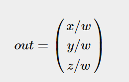
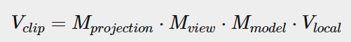

# 坐标系统
OpenGL希望在每次顶点着色器运行后，我们可见的所有顶点都为标准化设备坐标(Normalized Device Coordinate, NDC)。也就是说，每个顶点的x，y，z坐标都应该在 **-1.0到1.0** 之间，超出这个坐标范围的顶点都将不可见。我们通常会自己设定一个坐标的范围，之后再在顶点着色器中将这些坐标变换为标准化设备坐标。然后将这些标准化设备坐标传入光栅器(Rasterizer)，将它们变换为屏幕上的二维坐标或像素。


将坐标变换为标准化设备坐标，接着再转化为屏幕坐标的过程通常是分步进行的，也就是类似于流水线那样子。在流水线中，物体的顶点在最终转化为屏幕坐标之前还会被变换到多个坐标系统(Coordinate System)。将物体的坐标变换到几个**过渡坐标系**(Intermediate Coordinate System)的优点在于，在这些特定的坐标系统中，一些操作或运算更加方便和容易，这一点很快就会变得很明显。对我们来说比较重要的总共有5个不同的坐标系统：
- 局部空间(Local Space，或者称为物体空间(Object Space))
- 世界空间(World Space)
- 观察空间(View Space，或者称为视觉空间(Eye Space))
- 裁剪空间(Clip Space)
- 屏幕空间(Screen Space)


## 概述
为了将坐标从一个坐标系变换到另一个坐标系，我们需要用到几个变换矩阵，最重要的几个分别是**模型(Model)**、**观察(View)**、**投影(Projection)** 三个矩阵。


1. 局部坐标是对象相对于局部原点的坐标，也是物体起始的坐标。
2. 下一步是将局部坐标变换为世界空间坐标，世界空间坐标是处于一个更大的空间范围的。这些坐标相对于世界的全局原点，它们会和其它物体一起相对于世界的原点进行摆放。
3. 接下来我们将世界坐标变换为观察空间坐标，使得每个坐标都是从摄像机或者说观察者的角度进行观察的。
4. **坐标到达观察空间之后，我们需要将其投影到裁剪坐标。裁剪坐标会被处理至-1.0到1.0的范围内，并判断哪些顶点将会出现在屏幕上。**
5. 最后，我们将裁剪坐标变换为屏幕坐标，我们将使用一个叫做视口变换(Viewport Transform)的过程。视口变换将位于-1.0到1.0范围的坐标变换到由glViewport函数所定义的坐标范围内。最后变换出来的坐标将会送到光栅器，将其转化为片段。

## 局部空间

局部空间是指物体所在的坐标空间，即对象最开始所在的地方。

你的模型的所有顶点都是在局部空间中：它们相对于你的物体来说都是局部的。

## 世界空间

**模型矩阵是一种变换矩阵，它能通过对物体进行位移、缩放、旋转来将它置于它本应该在的位置或朝向。**

## 观察空间

观察空间经常被人们称之OpenGL的摄像机(Camera)（所以有时也称为摄像机空间(Camera Space)或视觉空间(Eye Space)）。

**观察空间是将世界空间坐标转化为用户视野前方的坐标而产生的结果。**

因此观察空间就是从摄像机的视角所观察到的空间。而这通常是由一系列的位移和旋转的组合来完成，**平移/旋转场景从而使得特定的对象被变换到摄像机的前方。** 这些组合在一起的变换通常存储在一个观察矩阵(View Matrix)里，

## 裁剪空间

在一个顶点着色器运行的最后，OpenGL期望所有的坐标都能落在一个特定的范围内，且任何在这个范围之外的点都应该被裁剪掉(Clipped)。被裁剪掉的坐标就会被忽略，所以剩下的坐标就将变为屏幕上可见的片段。

**为了将顶点坐标从观察变换到裁剪空间，我们需要定义一个投影矩阵(Projection Matrix)，它指定了一个范围的坐标，比如在每个维度上的-1000到1000。投影矩阵接着会将在这个指定的范围内的坐标变换为标准化设备坐标的范围(-1.0, 1.0)。**

由投影矩阵创建的**观察箱**(Viewing Box)被称为**平截头体(Frustum)**，**每个出现在平截头体范围内的坐标都会最终出现在用户的屏幕上**。**将特定范围内的坐标转化到标准化设备坐标系的过程（而且它很容易被映射到2D观察空间坐标）被称之为投影(Projection)，因为使用投影矩阵能将3D坐标投影(Project)到很容易映射到2D的标准化设备坐标系中**。


**一旦所有顶点被变换到裁剪空间，最终的操作——透视除法(Perspective Division)将会执行**，在这个过程中我们将位置向量的x，y，z分量分别除以向量的齐次w分量；透视除法是将4D裁剪空间坐标变换为3D标准化设备坐标的过程。这一步会在每一个顶点着色器运行的最后被自动执行。

**在这一阶段之后，最终的坐标将会被映射到屏幕空间中（使用glViewport中的设定），并被变换成片段。**

将观察坐标变换为裁剪坐标的投影矩阵可以为两种不同的形式，每种形式都定义了不同的平截头体。我们可以选择创建一个**正射投影矩阵(Orthographic Projection Matrix)**或**一个透视投影矩阵(Perspective Projection Matrix)**。


### 正射投影
正射投影矩阵定义了一个类似立方体的平截头箱，它定义了一个裁剪空间，在这空间之外的顶点都会被裁剪掉。

**正射平截头体直接将平截头体内部的所有坐标映射为标准化设备坐标，因为每个向量的w分量都没有进行改变；如果w分量等于1.0，透视除法则不会改变这个坐标。**


```cpp
glm::ortho(0.0f, 800.0f, 0.0f, 600.0f, 0.1f, 100.0f); // 左 右坐标 底部 顶部 近平面和远平面的距离
```

### 透视投影
如果你曾经体验过实际生活给你带来的景象，你就会注意到离你越远的东西看起来更小。这个奇怪的效果称之为透视(Perspective)。


**使用透视投影矩阵来完成的。这个投影矩阵将给定的平截头体范围映射到裁剪空间，除此之外还修改了每个顶点坐标的w值，从而使得离观察者越远的顶点坐标w分量越大。**

被变换到裁剪空间的坐标都会在-w到w的范围之间（任何大于这个范围的坐标都会被裁剪掉）。


正射投影矩阵和透视投影矩阵:
http://www.songho.ca/opengl/gl_projectionmatrix.html

在GLM中可以这样创建一个透视投影矩阵：
```cpp
glm::mat4 proj = glm::perspective(glm::radians(45.0f), (float)width/(float)height, 0.1f, 100.0f);
```

同样，glm::perspective所做的其实就是创建了一个定义了可视空间的大**平截头体**


在这个箱子内部的每个坐标都会被映射到裁剪空间上的一个点


它的第一个参数定义了**fov的值，它表示的是视野(Field of View)**，并且设置了观察空间的大小。如果想要一个真实的观察效果，它的值通常设置为45.0f，但想要一个末日风格的结果你可以将其设置一个更大的值。**第二个参数设置了宽高比**，由视口的宽除以高所得。**第三和第四个参数设置了平截头体的近和远平面**。我们通常设置近距离为0.1f，而远距离设为100.0f。所有在近平面和远平面内且处于平截头体内的顶点都会被渲染。


`当你把透视矩阵的 near 值设置太大时（如10.0f），OpenGL会将靠近摄像机的坐标（在0.0f和10.0f之间）都裁剪掉，这会导致一个你在游戏中很熟悉的视觉效果：在太过靠近一个物体的时候你的视线会直接穿过去。`


正射投影主要用于二维渲染以及一些建筑或工程的程序，在这些场景中我们更希望顶点不会被透视所干扰

## 把它们都组合到一起



最后的顶点应该被赋值到顶点着色器中的gl_Position，OpenGL将会自动进行透视除法和裁剪。

`然后呢？
顶点着色器的输出要求所有的顶点都在裁剪空间内，这正是我们刚才使用变换矩阵所做的。OpenGL然后对裁剪坐标执行透视除法从而将它们变换到标准化设备坐标。OpenGL会使用glViewPort内部的参数来将标准化设备坐标映射到屏幕坐标，每个坐标都关联了一个屏幕上的点（在我们的例子中是一个800x600的屏幕）。这个过程称为视口变换。`

## 进入3D

让我们变换一下我们的平面，将其绕着x轴旋转，使它看起来像放在地上一样。这个模型矩阵看起来是这样的：
```cpp
glm::mat4 model;
model = glm::rotate(model, glm::radians(-55.0f), glm::vec3(1.0f, 0.0f, 0.0f));
```

OpenGL是一个右手坐标系


如果你用左臂来做这些动作，你会发现z轴的方向是相反的。这个叫做左手坐标系，它被DirectX广泛地使用。**注意在标准化设备坐标系中OpenGL实际上使用的是左手坐标系（投影矩阵交换了左右手）。**

观察矩阵:
```
glm::mat4 view;
// 注意，我们将矩阵向我们要进行移动场景的反方向移动。
view = glm::translate(view, glm::vec3(0.0f, 0.0f, -3.0f));
```

透视投影矩阵:
```cpp
glm::mat4 projection;
projection = glm::perspective(glm::radians(45.0f), screenWidth / screenHeight, 0.1f, 100.0f);
```

顶点着色器:
```cpp
#version 330 core
layout (location = 0) in vec3 aPos;
...
uniform mat4 model;
uniform mat4 view;
uniform mat4 projection;

void main()
{
    // 注意乘法要从右向左读
    gl_Position = projection * view * model * vec4(aPos, 1.0);
    ...
}
```

```cpp
int modelLoc = glGetUniformLocation(ourShader.ID, "model"));
glUniformMatrix4fv(modelLoc, 1, GL_FALSE, glm::value_ptr(model));
... // 观察矩阵和投影矩阵与之类似
```


## 更加 3D


这的确有点像是一个立方体，但又有种说不出的奇怪。立方体的某些本应被遮挡住的面被绘制在了这个立方体其他面之上。之所以这样是因为OpenGL是一个三角形一个三角形地来绘制你的立方体的，所以即便之前那里有东西它也会覆盖之前的像素。因为这个原因，有些三角形会被绘制在其它三角形上面，虽然它们本不应该是被覆盖的。

幸运的是，**OpenGL存储深度信息在一个叫做Z缓冲(Z-buffer)的缓冲中，它允许OpenGL决定何时覆盖一个像素而何时不覆盖**。通过使用Z缓冲，我们可以配置OpenGL来进行深度测试。

## Z缓冲

现在我们想启用深度测试，需要开启GL_DEPTH_TEST：
```cpp
glEnable(GL_DEPTH_TEST);
```
**因为我们使用了深度测试，我们也想要在每次渲染迭代之前清除深度缓冲（否则前一帧的深度信息仍然保存在缓冲中）。** 就像清除颜色缓冲一样，我们可以通过在glClear函数中指定DEPTH_BUFFER_BIT位来清除深度缓冲：
```cpp
glClear(GL_COLOR_BUFFER_BIT | GL_DEPTH_BUFFER_BIT);
```

## 更多的立方体！
现在我们想在屏幕上显示10个立方体。每个立方体看起来都是一样的，区别在于它们在世界的位置及旋转角度不同。立方体的图形布局已经定义好了，所以当渲染更多物体的时候我们不需要改变我们的缓冲数组和属性数组，我们唯一需要做的只是改变每个对象的模型矩阵来将立方体变换到世界坐标系中。

```cpp
glm::vec3 cubePositions[] = {
  glm::vec3( 0.0f,  0.0f,  0.0f), 
  glm::vec3( 2.0f,  5.0f, -15.0f), 
  glm::vec3(-1.5f, -2.2f, -2.5f),  
  glm::vec3(-3.8f, -2.0f, -12.3f),  
  glm::vec3( 2.4f, -0.4f, -3.5f),  
  glm::vec3(-1.7f,  3.0f, -7.5f),  
  glm::vec3( 1.3f, -2.0f, -2.5f),  
  glm::vec3( 1.5f,  2.0f, -2.5f), 
  glm::vec3( 1.5f,  0.2f, -1.5f), 
  glm::vec3(-1.3f,  1.0f, -1.5f)  
};

glBindVertexArray(VAO);
for(unsigned int i = 0; i < 10; i++)
{
  glm::mat4 model;
  model = glm::translate(model, cubePositions[i]);
  float angle = 20.0f * i; 
  model = glm::rotate(model, glm::radians(angle), glm::vec3(1.0f, 0.3f, 0.5f));
  ourShader.setMat4("model", model);

  glDrawArrays(GL_TRIANGLES, 0, 36);
}
