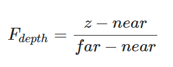
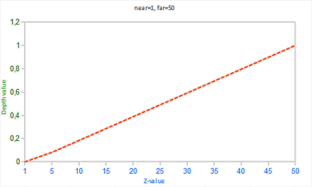
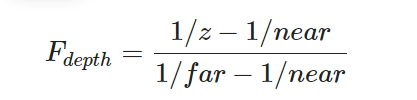
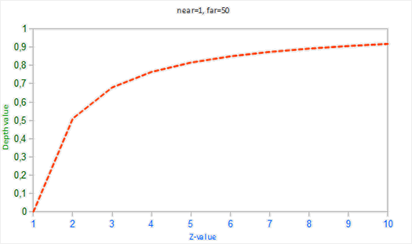

# 深度测试
深度缓冲就像颜色缓冲(Color Buffer)（储存所有的片段颜色：视觉输出）一样，在每个片段中储存了信息，并且（通常）和颜色缓冲有着一样的宽度和高度。**深度缓冲是由窗口系统自动创建的，它会以16、24或32位float的形式储存它的深度值**。在大部分的系统中，深度缓冲的精度都是24位的。

**当深度测试(Depth Testing)被启用的时候，OpenGL会将一个片段的深度值与深度缓冲的内容进行对比**。OpenGL会执行一个深度测试，如果这个测试通过了的话，深度缓冲将会更新为新的深度值。如果深度测试失败了，片段将会被丢弃。

**深度缓冲是在片段着色器运行之后在屏幕空间中运行的**。屏幕空间坐标与通过OpenGL的glViewport所定义的视口密切相关，并且可以直接使用GLSL内建变量gl_FragCoord从片段着色器中直接访问。gl_FragCoord的x和y分量代表了片段的屏幕空间坐标（其中(0, 0)位于左下角）。**gl_FragCoord中也包含了一个z分量，它包含了片段真正的深度值。z值就是需要与深度缓冲内容所对比的那个值。**

`现在大部分的GPU都提供一个叫做提前深度测试(Early Depth Testing)的硬件特性。提前深度测试允许深度测试在片段着色器之前运行。只要我们清楚一个片段永远不会是可见的（它在其他物体之后），我们就能提前丢弃这个片段。 片段着色器通常开销都是很大的，所以我们应该尽可能避免运行它们。当使用提前深度测试时，片段着色器的一个限制是你不能写入片段的深度值。如果一个片段着色器对它的深度值进行了写入，提前深度测试是不可能的。OpenGL不能提前知道深度值。`


启用深度测试:
```cpp
glEnable(GL_DEPTH_TEST);
```
在每个渲染迭代之前使用GL_DEPTH_BUFFER_BIT来清除深度缓冲:
```cpp
glClear(GL_COLOR_BUFFER_BIT | GL_DEPTH_BUFFER_BIT);
```

不更新深度缓冲 禁用深度缓冲的写入，只需要设置它的深度掩码(Depth Mask)设置为GL_FALSE就可以了：
```cpp
glDepthMask(GL_FALSE);
```

## 深度测试函数
OpenGL允许我们修改深度测试中使用的比较运算符。这允许我们来控制OpenGL什么时候该通过或丢弃一个片段，什么时候去更新深度缓冲。
```cpp
glDepthFunc(GL_LESS);
```

函数|	描述
-----|------
GL_ALWAYS	|永远通过深度测试
GL_NEVER	|永远不通过深度测试
GL_LESS	|在片段深度值小于缓冲的深度值时通过测试
GL_EQUAL	|在片段深度值等于缓冲区的深度值时通过测试
GL_LEQUAL	|在片段深度值小于等于缓冲区的深度值时通过测试
GL_GREATER	|在片段深度值大于缓冲区的深度值时通过测试
GL_NOTEQUAL	|在片段深度值不等于缓冲区的深度值时通过测试
GL_GEQUAL	|在片段深度值大于等于缓冲区的深度值时通过测试

## 深度值精度

**深度缓冲包含了一个介于0.0和1.0之间的深度值，它将会与观察者视角所看见的场景中所有物体的z值进行比较。  观察空间的z值可能是投影平截头体的近平面(Near)和远平面(Far)之间的任何值。**


**我们需要一种方式来将这些观察空间的z值变换到[0, 1]范围之间，其中的一种方式就是将它们线性变换到[0, 1]范围之间**



在观察空间中摄像机位置在z = 0处, 然后向外延伸


更适合的精度方程:





funny

**要想有正确的投影性质，需要使用一个非线性的深度方程，它是与 1/z 成正比的。它做的就是在z值很小的时候提供非常高的精度，而在z值很远的时候提供更少的精度**。花时间想想这个：我们真的需要对1000单位远的深度值和只有1单位远的充满细节的物体使用相同的精度吗？线性方程并不会考虑这一点。


## 深度缓冲的可视化

然而，我们也可以让片段非线性的深度值变换为线性的。要实现这个，我们需要仅仅反转深度值的投影变换。这也就意味着我们需要首先将深度值从[0, 1]范围重新变换到[-1, 1]范围的标准化设备坐标（裁剪空间）接下来我们需要像投影矩阵那样反转这个非线性方程（方程2），并将这个反转的方程应用到最终的深度值上。最终的结果就是一个线性的深度值了

```glsl
#version 330 core
out vec4 FragColor;

float near = 0.1; 
float far  = 100.0; 

float LinearizeDepth(float depth) 
{
    float z = depth * 2.0 - 1.0; // back to NDC 
    return (2.0 * near * far) / (far + near - z * (far - near));    
}

void main()
{             
    float depth = LinearizeDepth(gl_FragCoord.z) / far; // 为了演示除以 far
    FragColor = vec4(vec3(depth), 1.0);
}
```

因为深度值的范围是0.1的近平面到100的远平面，它离我们还是非常远的。结果就是，我们相对靠近近平面，所以会得到更低的（更暗的）深度值。

## 深度冲突

一个很常见的视觉错误会在两个平面或者三角形非常紧密地平行排列在一起时会发生，**深度缓冲没有足够的精度来决定两个形状哪个在前面**。结果就是这两个形状不断地在切换前后顺序，这会导致很奇怪的花纹。


**当物体在远处时效果会更明显（因为深度缓冲在z值比较大的时候有着更小的精度）**


### 防止深度冲突

- **第一个也是最重要的技巧是永远不要把多个物体摆得太靠近，以至于它们的一些三角形会重叠。**

- **第二个技巧是尽可能将近平面设置远一些。在前面我们提到了精度在靠近近平面时是非常高的，所以如果我们将近平面远离观察者，我们将会对整个平截头体有着更大的精度。**
- **另外一个很好的技巧是牺牲一些性能，使用更高精度的深度缓冲**。大部分深度缓冲的精度都是24位的，但现在大部分的显卡都支持32位的深度缓冲，这将会极大地提高精度。


# 模板测试

**当片段着色器处理完一个片段之后，模板测试(Stencil Test)会开始执行**，和深度测试一样，它也可能会丢弃片段。**接下来，被保留的片段会进入深度测试**，它可能会丢弃更多的片段。模板测试是根据又一个缓冲来进行的，它叫做**模板缓冲(Stencil Buffer)**，我们可以在渲染的时候更新它来获得一些很有意思的效果。


**一个模板缓冲中，（通常）每个模板值(Stencil Value)是8位的。所以每个像素/片段一共能有256种不同的模板值**我。们可以将这些模板值设置为我们想要的值，然后当某一个片段有某一个模板值的时候，我们就可以选择丢弃或是保留这个片段了。


`每个窗口库都需要为你配置一个模板缓冲。GLFW自动做了这件事，所以我们不需要告诉GLFW来创建一个，但其它的窗口库可能不会默认给你创建一个模板库，所以记得要查看库的文档。`


**模板缓冲操作允许我们在渲染片段时将模板缓冲设定为一个特定的值。通过在渲染时修改模板缓冲的内容，我们写入了模板缓冲。在同一个（或者接下来的）渲染迭代中，我们可以读取这些值，来决定丢弃还是保留某个片段**。

使用模板缓冲:
- 启用模板缓冲的写入。
每次迭代之前清除模板缓冲
- 渲染物体，更新模板缓冲的内容。
- 禁用模板缓冲的写入。
- 渲染（其它）物体，这次根据模板缓冲的内容丢弃特定的片段。


**通过使用模板缓冲，我们可以根据场景中已绘制的其它物体的片段，来决定是否丢弃特定的片段**

```cpp
glEnable(GL_STENCIL_TEST);

glClear(GL_COLOR_BUFFER_BIT | GL_DEPTH_BUFFER_BIT | GL_STENCIL_BUFFER_BIT);
```

**glStencilMask允许我们设置一个位掩码(Bitmask)，它会与将要写入缓冲的模板值进行与(AND)运算**。默认情况下设置的位掩码所有位都为1，不影响输出，但如果我们将它设置为0x00，写入缓冲的所有模板值最后都会变成0.这与深度测试中的glDepthMask(GL_FALSE)是等价的。
```cpp
glStencilMask(0xFF); // 每一位写入模板缓冲时都保持原样
glStencilMask(0x00); // 每一位在写入模板缓冲时都会变成0（禁用写入）
```

## 模板函数
一共有两个函数能够用来配置模板测试：**glStencilFunc**和**glStencilOp**。
- glStencilFunc(GLenum func, GLint ref, GLuint mask) **仅仅描述了OpenGL应该对模板缓冲内容做什么**
    - func：**设置模板测试函数(Stencil Test Function)。这个测试函数将会应用到已储存的模板值上和glStencilFunc函数的ref值上**。可用的选项有：GL_NEVER、GL_LESS、GL_LEQUAL、GL_GREATER、GL_GEQUAL、GL_EQUAL、GL_NOTEQUAL和GL_ALWAYS。它们的语义和深度缓冲的函数类似。
    - ref：**设置了模板测试的参考值(Reference Value)**。模板缓冲的内容将会与这个值进行比较。
    - mask：**设置一个掩码，它将会与参考值和储存的模板值在测试比较它们之前进行与(AND)运算**。初始情况下所有位都为1。

- glStencilOp(GLenum sfail, GLenum dpfail, GLenum dppass) **应该如何更新缓冲**
    - sfail：模板测试失败时采取的行为。
    - dpfail：模板测试通过，但深度测试失败时采取的行为。
    - dppass：模板测试和深度测试都通过时采取的行为。


    行为|	描述
    -----|-----
    GL_KEEP	|保持当前储存的模板值
    GL_ZERO	|将模板值设置为0
    GL_REPLACE|	将模板值设置为glStencilFunc函数设置的ref值
    GL_INCR	|如果模板值小于最大值则将模板值加1
    GL_INCR_WRAP	|与GL_INCR一样，但如果模板值超过了最大值则归零
    GL_DECR	|如果模板值大于最小值则将模板值减1
    GL_DECR_WRAP|	与GL_DECR一样，但如果模板值小于0则将其设置为最大值
    GL_INVERT	|按位翻转当前的模板缓冲值

    **默认情况下glStencilOp是设置为(GL_KEEP, GL_KEEP, GL_KEEP)的，所以不论任何测试的结果是如何，模板缓冲都会保留它的值**。默认的行为不会更新模板缓冲，所以如果你想写入模板缓冲的话，你需要至少对其中一个选项设置不同的值。
## 物体轮廓

模板测试的应用

**这个过程将每个物体的片段的模板缓冲设置为1，当我们想要绘制边框的时候，我们主要绘制放大版本的物体中模板测试通过的部分，也就是物体的边框的位置。我们主要使用模板缓冲丢弃了放大版本中属于原物体片段的部分。**

```glsl
void main()
{
    FragColor = vec4(0.04, 0.28, 0.26, 1.0);
}
```

```cpp
glEnable(GL_STENCIL_TEST);
glStencilOp(GL_KEEP, GL_KEEP, GL_REPLACE);
```
```cpp
glStencilFunc(GL_ALWAYS, 1, 0xFF); // 所有的片段都应该更新模板缓冲
glStencilMask(0xFF); // 启用模板缓冲写入
normalShader.use();
DrawTwoContainers();
```

```cpp
glStencilFunc(GL_NOTEQUAL, 1, 0xFF);
glStencilMask(0x00); // 禁止模板缓冲的写入
glDisable(GL_DEPTH_TEST);
shaderSingleColor.use(); 
DrawTwoScaledUpContainers();
```

除了物体轮廓之外，模板测试还有很多用途，比如在一个后视镜中绘制纹理，让它能够绘制到镜子形状中，或者使用一个叫做阴影体积(Shadow Volume)的模板缓冲技术渲染实时阴影。模板缓冲为我们已经很丰富的OpenGL工具箱又提供了一个很好的工具。