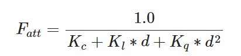
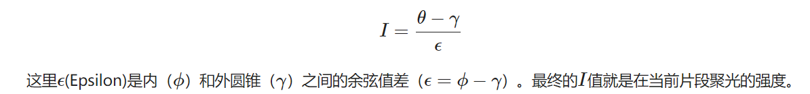

# 投光物

将光投射(Cast)到物体的光源叫做投光物(Light Caster)。

定向光(Directional Light), 点光源(Point Light), 聚光(Spotlight)

## 平行光
当一个光源处于很远的地方时，来自光源的每条光线就会近似于互相平行。不论物体和/或者观察者的位置，看起来好像所有的光都来自于同一个方向。当我们使用一个假设光源处于无限远处的模型时，它就被称为**定向光**,因为它的所有光线都有着相同的方向，它与光源的位置是没有关系的。


```glsl
struct Light {
    // vec3 position; // 使用定向光就不再需要了
    vec3 direction; // 一个从光源出发

    vec3 ambient;
    vec3 diffuse;
    vec3 specular;
};
...
void main()
{
  vec3 lightDir = normalize(-light.direction); // 一个从片段至光源的光线方向
  ...
}
```

```cpp
lightingShader.setVec3("light.direction", -0.2f, -1.0f, -0.3f);
```

## 点光源

点光源是处于世界中某一个位置的光源，它会朝着所有方向发光，但光线会随着距离逐渐衰减。想象作为投光物的灯泡和火把，它们都是点光源。


### 衰减

**随着光线传播距离的增长逐渐削减光的强度通常叫做衰减(Attenuation)。**



光的衰减公式, 之后我们会将它乘以光的强度向量

在这里d代表了片段距光源的距离。接下来为了计算衰减值，我们定义3个（可配置的）项：常数项Kc、一次项Kl和二次项Kq。
- 常数项通常保持为1.0，它的主要作用是保证分母永远不会比1小，否则的话在某些距离上它反而会增加强度，这肯定不是我们想要的效果。
- 一次项会与距离值相乘，以线性的方式减少强度。
- 二次项会与距离的平方相乘，让光源以二次递减的方式减少强度。二次项在距离比较小的时候影响会比一次项小很多，但当距离值比较大的时候它就会比一次项更大了。

> 选择正确的值

**正确地设定常数值**它们的值取决于很多因素：环境、希望光覆盖的距离、光的类型等。


距离|	常数项	|一次项|	二次项
----|----|----|----|
7	|1.0	|0.7	|1.8
13	|1.0	|0.35	|0.44
20	|1.0	|0.22	|0.20
32	|1.0	|0.14	|0.07
50	|1.0	|0.09	|0.032
65	|1.0	|0.07	|0.017
100	|1.0	|0.045	|0.0075
160	|1.0	|0.027	|0.0028
200	|1.0	|0.022	|0.0019
325	|1.0	|0.014	|0.0007
600	|1.0	|0.007	|0.0002
3250	|1.0	|0.0014	|0.000007


### 实现衰减
```glsl
struct Light {
    vec3 position;  

    vec3 ambient;
    vec3 diffuse;
    vec3 specular;

    float constant;
    float linear;
    float quadratic;
};
```
```cpp
lightingShader.setFloat("light.constant",  1.0f);
lightingShader.setFloat("light.linear",    0.09f);
lightingShader.setFloat("light.quadratic", 0.032f);
```

```glsl
float distance    = length(light.position - FragPos);
float attenuation = 1.0 / (light.constant + light.linear * distance + 
                light.quadratic * (distance * distance));
```

```glsl
ambient  *= attenuation; 
diffuse  *= attenuation;
specular *= attenuation;
```


## 聚光

聚光是位于环境中某个位置的光源，它只朝一个特定方向而不是所有方向照射光线。这样的结果就是只有在聚光方向的特定半径内的物体才会被照亮，其它的物体都会保持黑暗。聚光很好的例子就是路灯或手电筒


OpenGL中聚光是用**一个世界空间位置**、**一个方向**和**一个切光角(Cutoff Angle)** 来表示的，切光角指定了聚光的半径（译注：是圆锥的半径不是距光源距离那个半径）。对于每个片段，我们会计算片段是否位于聚光的切光方向之间（也就是在锥形内），如果是的话，我们就会相应地照亮片段。下面这张图会让你明白聚光是如何工作的：


- LightDir：从片段指向光源的向量。
- SpotDir：聚光所指向的方向。
- Phiϕ：指定了聚光半径的切光角。落在这个角度之外的物体都不会被这个聚光所照亮。
- Thetaθ：LightDir向量和SpotDir向量之间的夹角。在聚光内部的话θ值应该比ϕ值小。


### 手电筒

手电筒(Flashlight)是一个位于观察者位置的聚光，通常它都会瞄准玩家视角的正前方。**基本上说，手电筒就是普通的聚光，但它的位置和方向会随着玩家的位置和朝向不断更新。**


```glsl
struct Light {
    vec3  position;
    vec3  direction;
    float cutOff;
    ...
};
```
```cpp
lightingShader.setVec3("light.position",  camera.Position);
lightingShader.setVec3("light.direction", camera.Front);
lightingShader.setFloat("light.cutOff",   glm::cos(glm::radians(12.5f)));
```


```glsl
float theta = dot(lightDir, normalize(-light.direction));

if(theta > light.cutOff)  // cos
{       
  // 执行光照计算
}
else  // 否则，使用环境光，让场景在聚光之外时不至于完全黑暗
  color = vec4(light.ambient * vec3(texture(material.diffuse, TexCoords)), 1.0);
```

### 平滑/软化边缘

为了创建一种看起来边缘平滑的聚光，我们需要模拟聚光有一个**内圆锥(Inner Cone)**和**一个外圆锥(Outer Cone)**。我们可以将内圆锥设置为上一部分中的那个圆锥，但我们也需要一个外圆锥，来让光从内圆锥逐渐减暗，直到外圆锥的边界。


为了创建一个外圆锥，我们只需要再定义一个余弦值来代表聚光方向向量和外圆锥向量（等于它的半径）的夹角。然后，如果一个片段处于内外圆锥之间，将会给它计算出一个0.0到1.0之间的强度值。如果片段在内圆锥之内，它的强度就是1.0，如果在外圆锥之外强度值就是0.0。



```glsl
float theta     = dot(lightDir, normalize(-light.direction));
float epsilon   = light.cutOff - light.outerCutOff;
float intensity = clamp((theta - light.outerCutOff) / epsilon, 0.0, 1.0);    // 约束
...
// 将不对环境光做出影响，让它总是能有一点光
diffuse  *= intensity;
specular *= intensity;
...
```