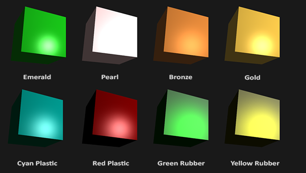

# 材质

在现实世界里，每个物体会对光产生不同的反应。

如果我们想要在OpenGL中模拟多种类型的物体，我们必须为每个物体分别定义一个材质(Material)属性。

**我们可以用这三个分量来定义一个材质颜色(Material Color)：环境光照(Ambient Lighting)、漫反射光照(Diffuse Lighting)和镜面光照(Specular Lighting)。**

材质颜色(Material Color):
```glsl
#version 330 core
struct Material {
    vec3 ambient;
    vec3 diffuse;
    vec3 specular;
    float shininess; // 反光度
}; 

uniform Material material;
```

我们首先定义结构体的布局(Layout)，然后使用刚创建的结构体为类型，简单地声明一个uniform变量。
- ambient材质向量定义了在环境光照下这个物体反射得是什么颜色，通常这是和物体颜色相同的颜色。
- diffuse材质向量定义了在漫反射光照下物体的颜色。（和环境光照一样）漫反射颜色也要设置为我们需要的物体颜色。
- specular材质向量设置的是镜面光照对物体的颜色影响（或者甚至可能反射一个物体特定的镜面高光颜色）。
- 最后，shininess影响镜面高光的散射/半径。




## 设置材质
```glsl
void main()
{    
    // 环境光
    vec3 ambient = lightColor * material.ambient;

    // 漫反射 
    vec3 norm = normalize(Normal);
    vec3 lightDir = normalize(lightPos - FragPos);
    float diff = max(dot(norm, lightDir), 0.0);
    vec3 diffuse = lightColor * (diff * material.diffuse);

    // 镜面光
    vec3 viewDir = normalize(viewPos - FragPos);
    vec3 reflectDir = reflect(-lightDir, norm);  
    float spec = pow(max(dot(viewDir, reflectDir), 0.0), material.shininess);
    vec3 specular = lightColor * (spec * material.specular);  

    vec3 result = ambient + diffuse + specular;
    FragColor = vec4(result, 1.0);
}
```

```cpp
lightingShader.setVec3("material.ambient",  1.0f, 0.5f, 0.31f);
lightingShader.setVec3("material.diffuse",  1.0f, 0.5f, 0.31f);
lightingShader.setVec3("material.specular", 0.5f, 0.5f, 0.5f);
lightingShader.setFloat("material.shininess", 32.0f);
```


## 光的属性
这个物体太亮了。物体过亮的原因是环境光、漫反射和镜面光这三个颜色对任何一个光源都会去全力反射。**光源对环境光、漫反射和镜面光分量也具有着不同的强度**。前面的教程，我们通过使用一个强度值改变环境光和镜面光强度的方式解决了这个问题。

```glsl
struct Light {
    vec3 position;

    vec3 ambient;
    vec3 diffuse;
    vec3 specular;
};

uniform Light light;
```
```glsl
vec3 ambient  = light.ambient * material.ambient;
vec3 diffuse  = light.diffuse * (diff * material.diffuse);
vec3 specular = light.specular * (spec * material.specular);
```

```glsl
lightingShader.setVec3("light.ambient",  0.2f, 0.2f, 0.2f);
lightingShader.setVec3("light.diffuse",  0.5f, 0.5f, 0.5f); // 将光照调暗了一些以搭配场景
lightingShader.setVec3("light.specular", 1.0f, 1.0f, 1.0f); 
```
一个光源对它的ambient、diffuse和specular光照有着不同的强度。
- **环境光照通常会设置为一个比较低的强度，因为我们不希望环境光颜色太过显眼。**
- 光源的漫反射分量通常设置为光所具有的颜色，通常是一个比较明亮的白色。
- 镜面光分量通常会保持为vec3(1.0)，以最大强度发光。


## 不同的光源颜色
```glsl
glm::vec3 lightColor;
lightColor.x = sin(glfwGetTime() * 2.0f);
lightColor.y = sin(glfwGetTime() * 0.7f);
lightColor.z = sin(glfwGetTime() * 1.3f);

glm::vec3 diffuseColor = lightColor   * glm::vec3(0.5f); // 降低影响
glm::vec3 ambientColor = diffuseColor * glm::vec3(0.2f); // 很低的影响

lightingShader.setVec3("light.ambient", ambientColor);
lightingShader.setVec3("light.diffuse", diffuseColor);
```

# 光照贴图
现实世界中的物体通常并不只包含有一种材质，而是由多种材质所组成。

引入**漫反射和镜面光贴图(Map)**。这允许我们对物体的漫反射分量（以及**间接地对环境光分量**，它们几乎总是一样的）和镜面光分量有着更精确的控制。

## 漫反射贴图

我们希望通过某种方式对物体的每个片段单独设置漫反射颜色。纹理能够让我们根据片段在物体上的位置来获取颜色值

**漫反射贴图(Diffuse Map)** 它是一个表现了物体所有的漫反射颜色的纹理图像


我们将之前定义的vec3漫反射颜色向量替换为漫反射贴图

<font color="red">注意sampler2D是所谓的不透明类型(Opaque Type)，也就是说我们不能将它实例化，只能通过uniform来定义它。如果我们使用除uniform以外的方法（比如函数的参数）实例化这个结构体，GLSL会抛出一些奇怪的错误。这同样也适用于任何封装了不透明类型的结构体。</font>


我们也移除了环境光材质颜色向量，**因为环境光颜色在几乎所有情况下都等于漫反射颜色**，所以我们不需要将它们分开储存：
```glsl
struct Material {
    sampler2D diffuse;
    vec3      specular;
    float     shininess;
}; 
...
in vec2 TexCoords;
```
`如果你非常固执，仍想将环境光颜色设置为一个（漫反射值之外）不同的值，你也可以保留这个环境光的vec3，但整个物体仍只能拥有一个环境光颜色。如果想要对不同片段有不同的环境光值，你需要对环境光值单独使用另外一个纹理。`

```glsl
vec3 diffuse = light.diffuse * diff * vec3(texture(material.diffuse, TexCoords));

vec3 ambient = light.ambient * vec3(texture(material.diffuse, TexCoords));
```

```cpp
lightingShader.setInt("material.diffuse", 0);
...
glActiveTexture(GL_TEXTURE0);
glBindTexture(GL_TEXTURE_2D, diffuseMap);
```

## 镜面光贴图


**我们想要让物体的某些部分以不同的强度显示镜面高光。**

我们同样可以使用一个专门用于镜面高光的纹理贴图。这也就意味着我们需要生成一个黑白的（如果你想得话也可以是彩色的）纹理，来定义物体每部分的镜面光强度。


镜面高光的强度可以通过图像每个像素的亮度来获取。镜面光贴图上的每个像素都可以由一个颜色向量来表示，**比如说黑色代表颜色向量vec3(0.0)，灰色代表颜色向量vec3(0.5)**。在片段着色器中，我们接下来会取样对应的颜色值并将它乘以光源的镜面强度。一个像素越「白」，乘积就会越大，物体的镜面光分量就会越亮。

`从实际角度来说，木头其实也有镜面高光，尽管它的反光度(Shininess)很小（更多的光被散射），影响也比较小，`
## 采样镜面光贴图
```cpp
lightingShader.setInt("material.specular", 1);
...
glActiveTexture(GL_TEXTURE1);
glBindTexture(GL_TEXTURE_2D, specularMap);
```
```glsl
struct Material {
    sampler2D diffuse;
    sampler2D specular;
    float     shininess;
};
```

```glsl
vec3 ambient  = light.ambient  * vec3(texture(material.diffuse, TexCoords));
vec3 diffuse  = light.diffuse  * diff * vec3(texture(material.diffuse, TexCoords));  
vec3 specular = light.specular * spec * vec3(texture(material.specular, TexCoords));
FragColor = vec4(ambient + diffuse + specular, 1.0);
```
`
如果你想另辟蹊径，你也可以在镜面光贴图中使用真正的颜色，不仅设置每个片段的镜面光强度，还设置了镜面高光的颜色。从现实角度来说，镜面高光的颜色大部分（甚至全部）都是由光源本身所决定的，所以这样并不能生成非常真实的视觉效果（这也是为什么图像通常是黑白的，我们只关心强度）。`

`放射光贴图(Emission Map):
它是一个储存了每个片段的发光值(Emission Value)的贴图。发光值是一个包含（假设）光源的物体发光(Emit)时可能显现的颜色，这样的话物体就能够忽略光照条件进行发光(Glow)。
`