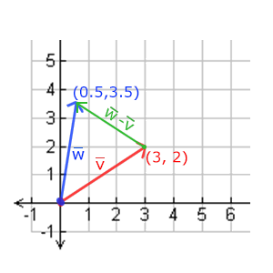
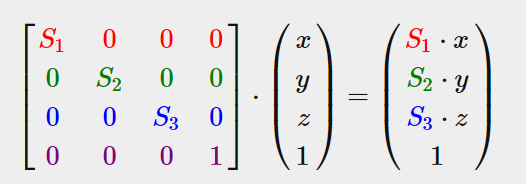
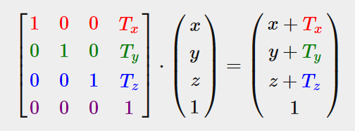
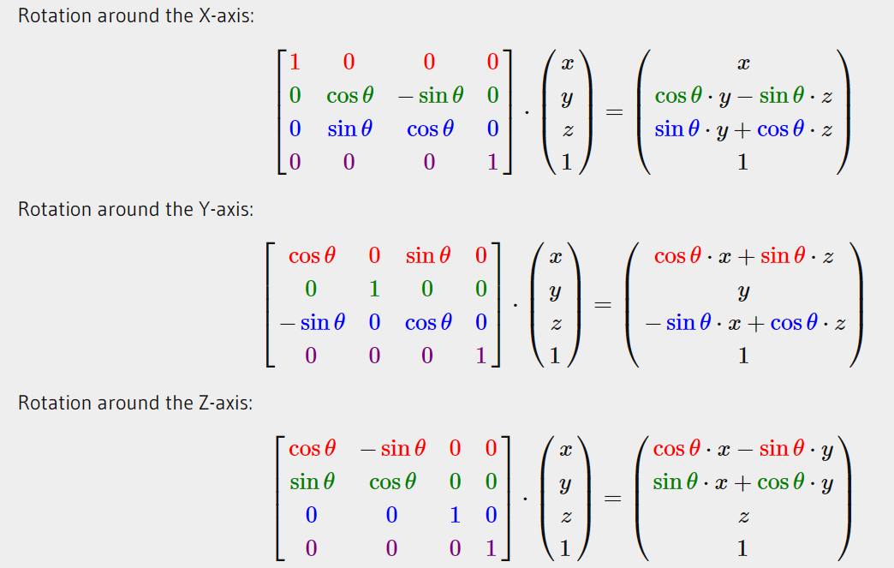
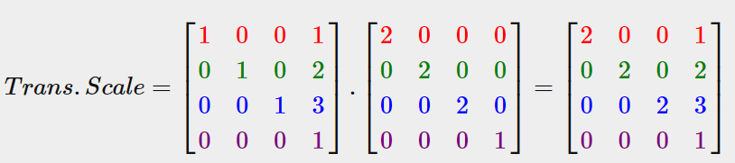

# 变换

使用（多个）矩阵(Matrix)对象可以更好的变换(Transform)一个物体。

## 向量

向量最基本的定义就是一个方向。或者更正式的说，向量有一个方向(Direction)和大小(Magnitude，也叫做强度或长度)


位置向量(Position Vector)

### 向量与标量运算
标量(Scalar)只是一个数字（或者说是仅有一个分量的向量）。当把一个向量加/减/乘/除一个标量，我们可以简单的把向量的每个分量分别进行该运算

### 向量取反

对一个向量取反(Negate)会将其方向逆转

### 向量加减



### 长度
有一个特殊类型的向量叫做单位向量(Unit Vector)。单位向量有一个特别的性质——它的长度是1。我们可以用任意向量的每个分量除以向量的长度得到它的单位向量;

我们把这种方法叫做一个向量的标准化(Normalizing)。单位向量头上有一个^样子的记号。通常单位向量会变得很有用，特别是在我们只关心方向不关心长度的时候（如果改变向量的长度，它的方向并不会改变）

### 向量相乘

> 点乘
两个向量的点乘等于它们的数乘结果乘以两个向量之间夹角的余弦值。

结果是一个值

### 叉乘


结果是一个向量

## 矩阵
矩阵可以通过(i, j)进行索引，i是行，j是列，

这与你在索引2D图像时的(x, y)相反，获取4的索引是(2, 1)（第二行，第一列）（译注：如果是图像索引应该是(1, 2)，先算列，再算行）

### 矩阵的加减
标量值要加到矩阵的每一个元素上。矩阵与标量的减法也相似

矩阵与矩阵之间的加减就是两个矩阵对应元素的加减运算，所以总体的规则和与标量运算是差不多的，只不过在相同索引下的元素才能进行运算。

### 矩阵的数乘
和矩阵与标量的加减一样，矩阵与标量之间的乘法也是矩阵的每一个元素分别乘以该标量。

现在我们也就能明白为什么这些单独的数字要叫做标量(Scalar)了。简单来说，标量就是用它的值缩放(Scale)矩阵的所有元素（译注：注意Scalar是由Scale + -ar演变过来的）。前面那个例子中，所有的元素都被放大了2倍。

### 矩阵相乘

## 矩阵与向量相乘

我们用向量来表示位置，表示颜色，甚至是纹理坐标。让我们更深入了解一下向量，它其实就是一个N×1矩阵，N表示向量分量的个数（也叫N维(N-dimensional)向量）。

很多有趣的2D/3D变换都可以放在一个矩阵中，用这个矩阵乘以我们的向量将变换(Transform)这个向量

### 单位矩阵
单位矩阵是一个除了对角线以外都是0的N×N矩阵

### 缩放
我们可以分别定义一个有2或3个缩放变量的向量，每个变量缩放一个轴(x、y或z)。

不均匀(Non-uniform)缩放, 因为每个轴的缩放因子(Scaling Factor)都不一样。如果每个轴的缩放因子都一样那么就叫均匀缩放(Uniform Scale)。

我们下面会构造一个变换矩阵来为我们提供缩放功能。我们从单位矩阵了解到，每个对角线元素会分别与向量的对应元素相乘。如果我们把1变为3会怎样？这样子的话，我们就把向量的每个元素乘以3了，这事实上就把向量缩放3倍。如果我们把缩放变量表示为我们可以为任意向量定义一个缩放矩阵：

注意，第四个缩放向量仍然是1，因为在3D空间中缩放w分量是无意义的。w分量另有其他用途，在后面我们会看到。



### 位移

位移(Translation)是在原始向量的基础上加上另一个向量从而获得一个在不同位置的新向量的过程，从而在位移向量基础上移动了原始向量。



```
齐次坐标(Homogeneous Coordinates)

向量的w分量也叫齐次坐标。想要从齐次向量得到3D向量，我们可以把x、y和z坐标分别除以w坐标。我们通常不会注意这个问题，因为w分量通常是1.0。使用齐次坐标有几点好处：它允许我们在3D向量上进行位移（如果没有w分量我们是不能位移向量的），而且下一章我们会用w值创建3D视觉效果。

如果一个向量的齐次坐标是0，这个坐标就是方向向量(Direction Vector)，因为w坐标是0，这个向量就不能位移（译注：这也就是我们说的不能位移一个方向）。
```

### 旋转
```
大多数旋转函数需要用弧度制的角，但幸运的是角度制的角也可以很容易地转化为弧度制的：

弧度转角度：角度 = 弧度 * (180.0f / PI)
角度转弧度：弧度 = 角度 * (PI / 180.0f)
PI约等于3.14159265359。
```

在3D空间中旋转需要定义一个角和一个旋转轴(Rotation Axis)。

使用三角学，给定一个角度，可以把一个向量变换为一个经过旋转的新向量。这通常是使用一系列正弦和余弦函数（一般简称sin和cos）各种巧妙的组合得到的。



Gimbal Lock
https://www.youtube.com/watch?v=d4EgbgTm0Bg


### 矩阵的组合


## 实践

OpenGL没有自带任何的矩阵和向量知识，所以我们必须定义自己的数学类和函数。在教程中我们更希望抽象所有的数学细节，使用已经做好了的数学库。幸运的是，有个易于使用，专门为OpenGL量身定做的数学库，那就是GLM

### GLM

OpenGL Mathematics的缩写，它是一个只有头文件的库

GLM库从0.9.9版本起，默认会将矩阵类型初始化为一个零矩阵（所有元素均为0），而不是单位矩阵（对角元素为1，其它元素为0）。如果你使用的是0.9.9或0.9.9以上的版本，你需要将所有的矩阵初始化改为 glm::mat4 mat = glm::mat4(1.0f)。

```cpp
#include <glm/glm.hpp>
#include <glm/gtc/matrix_transform.hpp>
#include <glm/gtc/type_ptr.hpp>
```
```cpp
glm::vec4 vec(1.0f, 0.0f, 0.0f, 1.0f);
// 译注：下面就是矩阵初始化的一个例子，如果使用的是0.9.9及以上版本
// 下面这行代码就需要改为:
// glm::mat4 trans = glm::mat4(1.0f)
// 之后将不再进行提示
glm::mat4 trans;
trans = glm::translate(trans, glm::vec3(1.0f, 1.0f, 0.0f));
vec = trans * vec;
std::cout << vec.x << vec.y << vec.z << std::endl;
```


首先我们把箱子逆时针旋转90度。然后缩放0.5倍，使它变成原来的一半大。我们先来创建变换矩阵：
```cpp
glm::mat4 trans;
trans = glm::rotate(trans, glm::radians(90.0f), glm::vec3(0.0, 0.0, 1.0));
trans = glm::scale(trans, glm::vec3(0.5, 0.5, 0.5));
```

修改顶点着色器让其接收一个mat4的uniform变量，然后再用矩阵uniform乘以位置向量
```glsl
#version 330 core
layout (location = 0) in vec3 aPos;
layout (location = 1) in vec2 aTexCoord;

out vec2 TexCoord;

uniform mat4 transform;

void main()
{
    gl_Position = transform * vec4(aPos, 1.0f);
    TexCoord = vec2(aTexCoord.x, 1.0 - aTexCoord.y);
}
```

GLSL也有mat2和mat3类型从而允许了像向量一样的混合运算。

```cpp
unsigned int transformLoc = glGetUniformLocation(ourShader.ID, "transform");
glUniformMatrix4fv(transformLoc, 1, GL_FALSE, glm::value_ptr(trans));
/*
我们首先查询uniform变量的地址，然后用有Matrix4fv后缀的glUniform函数把矩阵数据发送给着色器。第一个参数你现在应该很熟悉了，它是uniform的位置值。第二个参数告诉OpenGL我们将要发送多少个矩阵，这里是1。第三个参数询问我们是否希望对我们的矩阵进行转置(Transpose)，也就是说交换我们矩阵的行和列。OpenGL开发者通常使用一种内部矩阵布局，叫做列主序(Column-major Ordering)布局。GLM的默认布局就是列主序，所以并不需要转置矩阵，我们填GL_FALSE。最后一个参数是真正的矩阵数据，但是GLM并不是把它们的矩阵储存为OpenGL所希望接受的那种，因此我们要先用GLM的自带的函数value_ptr来变换这些数据。

```

我们使用GLFW的时间函数来获取不同时间的角度：
```cpp
glm::mat4 trans;
trans = glm::translate(trans, glm::vec3(0.5f, -0.5f, 0.0f));
trans = glm::rotate(trans, (float)glfwGetTime(), glm::vec3(0.0f, 0.0f, 1.0f));
```

记住，实际的变换顺序应该与阅读顺序相反：尽管在代码中我们先位移再旋转，实际的变换却是先应用旋转再是位移的。


线性代数的本质
https://www.youtube.com/playlist?list=PLZHQObOWTQDPD3MizzM2xVFitgF8hE_ab


```
/* Why does our container now spin around our screen?:
== ===================================================
Remember that matrix multiplication is applied in reverse. This time a translation is thus
applied first to the container positioning it in the bottom-right corner of the screen.
After the translation the rotation is applied to the translated container.

A rotation transformation is also known as a change-of-basis transformation
for when we dig a bit deeper into linear algebra. Since we're changing the
basis of the container, the next resulting translations will translate the container
based on the new basis vectors. Once the vector is slightly rotated, the vertical
translations would also be slightly translated for example.

If we would first apply rotations then they'd resolve around the rotation origin (0,0,0), but 
since the container is first translated, its rotation origin is no longer (0,0,0) making it
looks as if its circling around the origin of the scene.

If you had trouble visualizing this or figuring it out, don't worry. If you
experiment with transformations you'll soon get the grasp of it; all it takes
is practice and experience.
*/
```