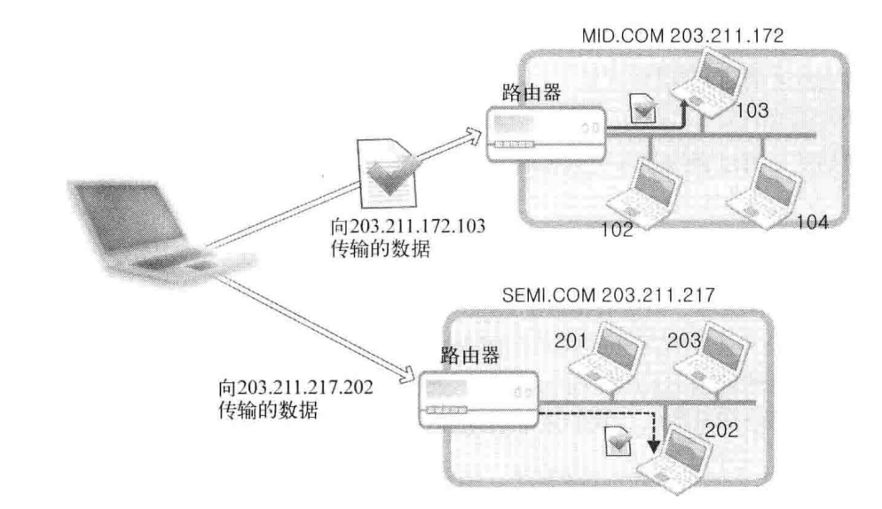
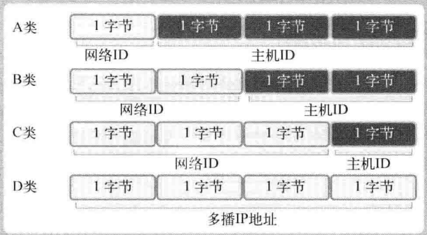
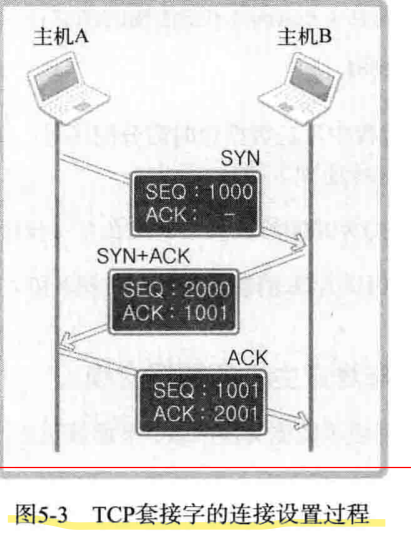
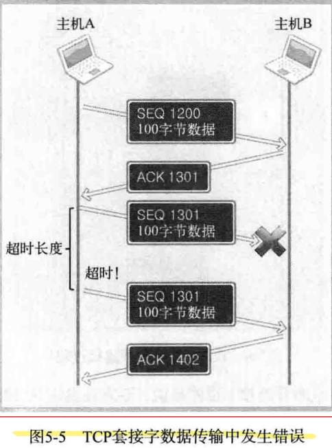
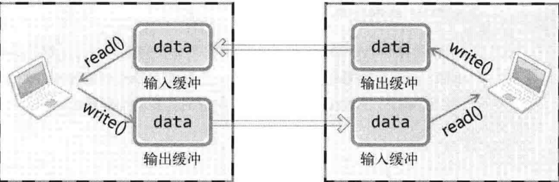
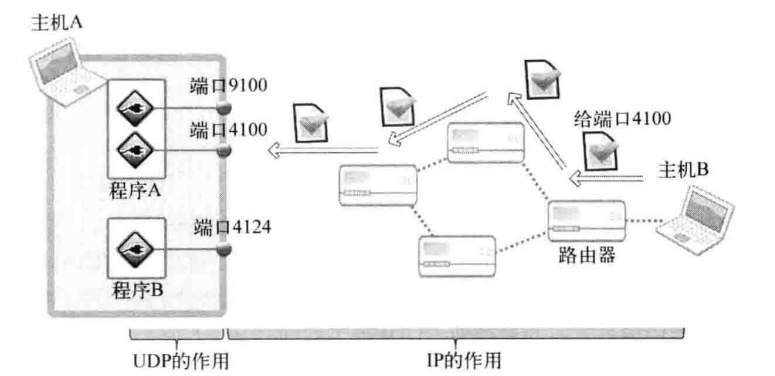
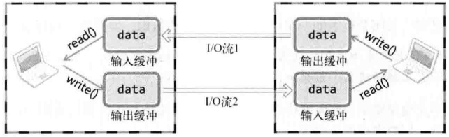
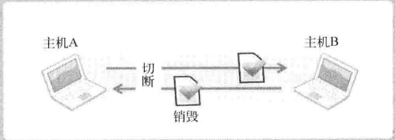
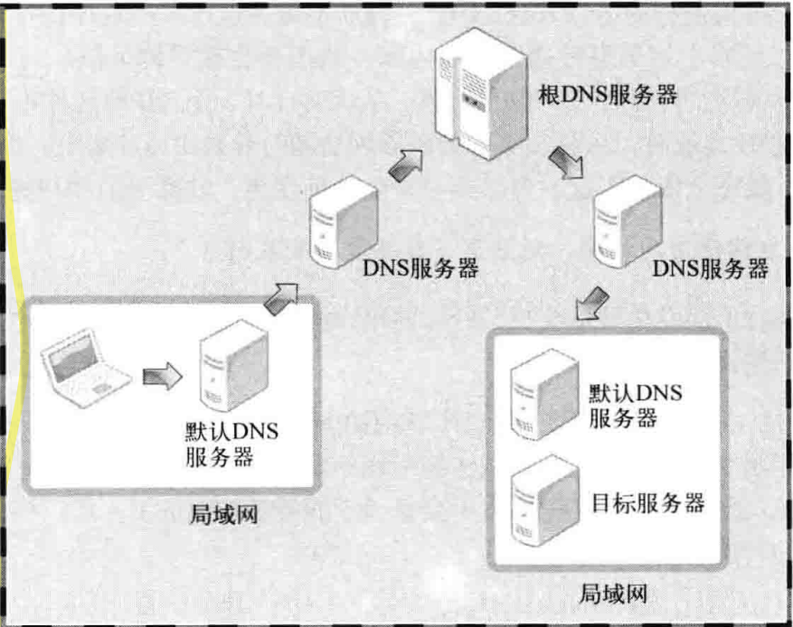

- struct in_addr 32位IP地址
- inet_addr
- inet_aton
- inet_ntoa
- size_t fread(void *ptr, size_t size, size_t nmemb, FILE *stream)
- FILE *fopen(const char *filename, const char *mode)

# Understand Network Programming and Socket

1. socket在网络编程中的作用是什么? 为何称为socket?
```
socket是网络数据传输用的软件设备

我们把插头插到插座上就能从电网获得电力供给, 同样的, 为了与远程计算机进行数据传输, 需要连接到Internet, 而socket就是用来连接该网络的工具
```
2. 在服务器端创建socket后, 会依次调用listen函数和accept函数. 比较并说明两者作用.
```
listen函数将socket转为可接受连接状态

accept函数受理连接请求
```

3. Linux中, 对socket数据进行I/O时可以直接使用文件I/O相关函数; 而在Windows中则不可以. 原因为何?
```
在Linux世界里, socket也被认为是文件的一种, 因此在网络数据传输过程中可以使用文件I/O的相关函数

而在Windows中, 是要区分socket和文件的.
```

4. 创建socket后一般会给它分配地址, 为什么? 为了完成地址分配需要调用哪个函数?
```
套接字被创建之后，只有为其分配了IP地址和端口号后，客户端才能够通过IP地址及端口号与服务器端建立连接，需要调用 bind 函数来完成地址分配
```
5. Linux中的文件描述符与Windows的句柄实际上非常类似. 请以socket为对象说明它们的含义
```
Linux的文件描述符是为了区分指定文件而赋予文件的整数值（相当于编号）。Windows的句柄其实也是套接字的整数值，其目的也是区分指定套接字。
```

6. 底层文件I/O函数与ANSI标准定义的文件I/O函数之间有何区别
```
ANSI标准定义的输入、输出函数是与操作系统（内核）无关的以C标准写成的函数。相反，底层文件I/O函数是直接提供的。理论上ANSI标准I/O提供了某些机制，性能上优于底层I/O
```
7. 文件I/O和标准I/O
```
https://blog.csdn.net/zqixiao_09/article/details/50444465?spm=1001.2101.3001.6650.1&utm_medium=distribute.pc_relevant.none-task-blog-2%7Edefault%7ECTRLIST%7ERate-1.pc_relevant_paycolumn_v3&depth_1-utm_source=distribute.pc_relevant.none-task-blog-2%7Edefault%7ECTRLIST%7ERate-1.pc_relevant_paycolumn_v3&utm_relevant_index=2
```


# socket类型与协议设置

1. 什么是协议? 在收发数据中定义协议有何意义?
```
协议是对话中使用的通信规则, 在计算机领域可整理为"计算机间对话必备通信规则"

在收发数据中定义协议可以提高数据传输有效性, 保证传输数据一致
```
2. 面向连接的TCPsocket传输特性有3点, 请分别说明?
```
加工厂
传输过程中数据不会消失
按序传输数据
传输的数据不存在数据边界即接收数据的次数不需要和传输数据的次数相同
```
3. 面向消息的socket特性?
```
外卖服务
强调快速传输而非传输顺序
传输的数据可能丢失也可能损毁
传输的数据有数据边界
限制每次传输的数据大小
不存在连接的概念
```
4. 何种类型的socket不存在数据边界? 这类socket接收数据时需要注意什么?
```
面向连接的socket不存在数据边界

该socket内部有缓冲, 故read函数和write函数的调用次数并无太大意义
```
# 地址族与数据序列

1. IP地址族IPv4和IPv6有何区别? 在何种背景下诞生了IPv6?
```
IPv4为4字节地址族
IPv6为16字节地址族

IPv6是为了应对2010年前后IP地址耗尽的问题而提出的标准
```

2. 提供IPv4网络ID、主机ID及路由器的关系说明向公司局域网中的计算机传输数据的过程
```
网络ID是为了区分网络而设置的一部分IP地址

主机ID区分网络中的主机而设置的一部分IP地址

路由器根据主机ID将数据传输给相应的主机
```


3. 套接字地址分为IP地址和端口号. 为什么需要IP地址和端口号? 或者说通过IP可以区分哪些对象? 通过端口号可以区分哪些对象?
```
IP用于区分计算机, 只要有IP地址就能向目标主机传输数据, 但我们还需要端口号来将数据传输给最终的应用程序
```

4. IP地址的分类方法
```
IPv4标准的四字节IP地址有A、B、C、D、E等类型

A类地址的首位以0开始
B类地址的前2位以10开始
C类地址的前3位以110开始
```


5. 计算机通过路由器或交换机连接到互联网。请说出路由器和交换机的作用
```
互联网向构成网络的路由器或交换机传递数据, 由接收数据的路由器根据数据的主机地址向目标主机传递数据

完成外网与本网主机之间的数据交换
```
6. 什么是知名端口? 其范围是多少? 知名端口中具有代表性的HTTP和FTP端口号各是多少?
```
知名端口号（well-known port numbers）就是那些由互联网名称与数字地址分配机构（ICANN）预留给传输控制协议（TCP）和用户数据包协议（UDP）使用的端口号

知名端口号为0－1023

HTTP: 80
FTP: 21
```
7. 使用bind函数时为什么要传入强转为sockaddr类型的sockaddr_in类型变量
```
因为直接向sockaddr结构体填充信息比较麻烦
```
8. 请解释大端序、小端序、网络字节序、并说明为何需要网络字节序?
```
大端序: 高位字节存放到低位地址
小端序: 高位字节存放到高位地址

在通过网络传输数据时约定统一方式, 这种约定称为网络字节序, 统一为大端序

为了保证通过网络传播时数据的统一性
```
9. 数据传输过程中发生的字节变换过程
```
unsigned long htonl(unsigned long);
unsigned long ntohl(unsigned long);
```
10. 怎样表示回送地址? 其含义是什么? 如果向回送地址传输数据将发生什么情况?
```
127.0.0.1是回送地址(loopback address), 指的是计算机自身IP地址

如果向回送地址传输数据将发生什么情况, 数据不会传输到网络的其他设备上而直接返回。
```
# 基于TCP的服务器端/客户端
- TCP(Transmission Control Protocol)
1. 请说明TCP/IP的4层协议栈, 并说明TCP和UDPsocket经过的层级结构差别.
```
链路层->IP层->TCP层->应用层
链路层->IP层->UDP层->应用层
```
2. 请说出TCP/IP协议栈中链路层和IP层的作用, 并给出两者关系.
```
链路层是物理链接领域标准化的结果, 也是最基本的领域, 专门定义LAN、WAN、MAN等网络标准

准备好物理连接后就要传输数据

IP层解决传输路径的问题, 但是无法应对数据错误
```
3. 为何需要把TCP/IP协议栈分为4层或7层? 结合开放式系统回答.
```
开放式系统是以多个标准为依据设计的系统

协议设计更容易
为了通过标准化操作设计开放式系统
```
4. 客户端调用connect函数向服务器端发送连接请求. 服务器端调用哪个函数后, 客户端可以调用connect函数?
```
只有服务器端调用了listen函数, 客户端才能进入可发出连接请求的状态, 才能调用connect函数, 提前调用将发生错误
```
5. 什么时候创建连接请求等待队列? 它有何作用? 与accept有什么关系?
```
服务器端调用listen函数后, 创建连接请求等待队列

允许多个客户端按序连接

accept函数受理连接请求等待队列中待处理的客户端连接请求. 函数调用成功时, accept函数内部将产生用于数据I/O的socket, 并返回其文件描述符
```
6. 客户端中为何不需要调用bind函数分配地址, 如果不调用bind函数, 那何时、如何向套接字分配IP地址和端口号?
```
客户端的IP地址和端口在调用connect函数时由操作系统内核使用计算机的IP和随机端口自动分配
```

# 基于TCP的服务器端/客户端2
1. 请说明TCPsocket连接设置的三次握手过程。尤其是3次数据交换过程每次收发的数据内容
```
Three-way handshaking
```


```
SEQ 1000: 现传递的数据包序号为1000，如果接收无误，请通知我向你传递1001号数据包

ACK 1001: 刚才传输的SEQ为1000的数据包接收无误，现在请传递SEQ为1001的数据包
```
2. TCP是可靠的数据传输协议, 但在通过网络通信的过程中可能丢失数据。请通过ACK和SEQ说明TCP通过何种机制保证丢失数据的可靠传输
```
主机A传输的数据包带有SEQ号，当主机B确认接收到数据后会给主机A发送ACK消息，ACK消息的序列号为SEQ号+传递的字节数+1， 主机A根据次判断数据是否丢失。当在一定时间内没有接收到ACK消息，主机A将会重新发送数据包，以确保数据传输的稳定性
```


3. TCPsocket中调用write和read函数时数据如何移动？


4. 对方主机的输入缓冲剩余50字节空间时，若本方主机通过write函数请求传输70字节，请问TCP如何处理这种情况？
```
TCP会控制数据流，TCP中有滑动窗口协议

本方主机会根据对方主机的输入缓冲空间大小来传递适量的数据

因此TCP中不会因为缓冲溢出而丢失数据
```
# 基于UDP的服务器端/客户端
1. UDP为什么比TCP速度快？为什么TCP数据传输可靠而UDP数据传输不可靠？
```
TCP比UDP慢的原因：
- 收发数据前后进行的连接设置及清除过程
- 收发数据过程中为保证可靠性而添加的流控制

UDP不会发送类似ACK的应答消息，也不会像SEQ那样给数据包分配序号，因此UDP的性能有时比TCP高出很多

为了提供可靠的数据传输服务，TCP在不可靠的IP层进行流控制，而UDP就缺少这种流控制机制
```
2. UDP数据向对方主机的UDP套接字传递过程中，IP和UDP分别负责哪些部分？


```
IP的作用就是让UDP数据包从主机B准确传递到主机A，但把UDP包最终交给主机A的某一UDPsocket的过程则是由UDP完成的
```
3. UDP一般比TCP快，但根据交换数据的特点，其差异可大可小。请说明何种情况下UDP的性能优于TCP？
```
当收发的数据量小但需要频繁连接时，UDP比TCP更高效
```
4. 客户端TCPsocket调用connect函数时自动分配IP和端口号。UDP中不调用bind函数，那何时分配IP和端口号？
```
如果调用sendto函数时发现尚未分配地址信息，则在首次调用sendto函数时给相应socket自动分配IP和端口。而且此时分配的地址一直保留到程序结束为止
```
5. TCP客户端必需调用connect函数，而UDP中可以选择性调用。请问在UDP中调用connect函数有哪些好处？
```
未连接UDPsocket通过sendto函数传输数据的过程大致可分为以下3个阶段：
- 向UDPsocket注册目标IP和端口号
- 传输数据
- 删除UDPsocket中注册的目标地址信息

将UDPsocket变成已连接socket会省去第一步和第三步的时间，因此大大提高整体性能

并且可以使用write和read函数
```
6. 编写示例使服务器端和客户端轮流收发消息。收发的消息均要输出到控制台窗口。


# 优雅的断开socket连接

1. 解释TCP中流的概念。UDP中能否形成流？请说明原因。
```
两台主机通过socket建立连接后进入可交换数据的状态，又称为“流形成的状态”。也就是把建立socket后可交换数据的状态看作一种流

在socket的流中，数据也只能向一个方向移动

UDP通过数据报传输数据，因为UDP中存在数据边界，其本身可以成为1个完整数据。
```


2. Linux中的close函数或Windows中的closesocket函数属于单方面断开连接的方法，有可能带来一些问题。什么是单方面断开连接？什么情形下会出现问题？
```
单方面断开连接指在通过TCPsocket传输数据过程，通信一方完全断开连接，不仅无法传递数据，而且也不能接收数据。
```


3. 什么是半关闭？针对输出流执行半关闭的主机处于何种状态？半关闭会导致对方主机接收什么消息？
```
半关闭：可以传输数据但无法接收，或可以接收数据但无法传输

可以接收数据但无法传输

半关闭会给对方主机发送EOF信号
``` 

# 域名及网络地址
1. 不懂
2. 在浏览器地址栏输入www.linaki.top，并整理出主页显示过程。假设浏览器访问的默认DNS服务器中并没有关于www.linaki.top的IP地址信息。


# 套接字的多种可选项
1. Time-wait状态可能在服务器或者客户端发生
2. 断开连接的四次握手过程中，先传输FIN消息的socket将进入Time-wait状态
3. Time-wait状态还是很重要的，但在某些情况下可以通过更改socket可选项来防止其发生
4. 何时应考虑禁用Nagle算法？结合收发数据的特性给出说明。
```
根据传输数据的特性，网络流量未受太大影响时，不使用Nagle算法要比使用它时传输速度快。最典型的是“传输大文件数据”。将文件数据传入输出缓冲不会花太多时间，故，即使不用Nagle算法，也会在装满输出缓冲时传输数据包，这不仅不会增加数据包的数量，反而会在无需等待ACK的前提下连续传输，因此可以大大提高传输速度

Nagle算法使用与否在网络流量上差别不大， 使用Nagle算法的传输速度更慢
```

# 多进程服务器端
1. 进程是占用内存空间的正在运行的程序
2. 子进程的内存空间为父进程的内存空间的副本，父子进程拥有完全独立的内存结构
3. 通过fork函数创建的子进程将执行从开始到fork函数调用为止的代码。
```
子进程只是复制一份父进程的内存空间而已并不会把程序重新执行一遍
```

4. 调用fork函数后复制的是socket文件描述符，而不是socket 
5. 请说明进程变成僵尸进程的过程及预防措施。
```
向exit函数传递的参数值和main函数的return语句的返回值都会传递给操作系统。而操作系统不会销毁子进程，直到把这些值传递给产生该子进程的父进程。处在这种状态下的进程就是僵尸进程。

父进程向操作系统注册信号。当子进程结束时，操作系统调用特定的函数销毁子进程
```
6. 

# 进程间通信
1. 什么是进程间通信？分别从概念上和内存的角度进行说明。
```
概念上：进程间通信意味着两个不同进程间可以交换数据，
为了完成这一点，操作系统中应提供两个进程可以同时访问的内存空间
```
2. 进程间通信需要特殊的IPC机制，这是由操作系统提供的。进程间通信为何需要操作系统的帮助？
```
进程具有完全独立的内存结构，而通信需要一个可共享的内存空间，这只能由操作系统来提供
```
3. 如何创建管道？由谁创建？
```
使用pipe函数由操作系统创建管道
```

4. 为了完成进程间通信，2个进程需同时连接管道。那两个进程如何连接到同一管道？
```
通过管道入口和管道出口
```
5. 管道允许进行2个进程间的双向通信。双向通信中需要注意哪些内容？
```
数据进入管道后成为无主数据。也就是通过read函数先读取数据的进程将得到数据，即使该进程将数据传到了管道。
```
6. 编写示例复习IPC技法，使两个进程相互交换3次字符串。当然，这2个进程应具有父子关系，各位可指定任意字符串


# I/O复用
1. 请解释复用技术的通用含义，并说明何为I/O复用。
```
通用含义：为了提高物理设备的效率，用最少的物理要素传递最多数据时使用的技术

I/O复用服务器端是通过一个进程向多个客户端提供服务的方法

I/O复用服务器端的进程需要确认收到数据的套接字，并通过收到数据的套接字接收数据
```
2. 多进程并发服务器的缺点有哪些？如何在I/O复用服务器端中弥补？
```
在创建进程时需要大量的运算和内存空间，并且由于每个进程都具有独立的内存空间，所以互相间的数据交换也要求采用相对复杂的方法（IPC）

而I/O复用服务器只需要一个主进程，也不存在数据交换的问题
```

3. 复用服务器端同一时间可以服务于多个客户端
4. 应该将服务器端套接字包含到readset类监听对象集合中，因为服务器端socket是关注”是否存在待读取数据“的文件描述符。
5. select函数使用的fd_set结构体在Windows和Linux中具有不同的声明。请说明区别，同时解释存在区别的必然性。
```
Linux中的fd_set是位数组
而在Windows中是结构体

必然性：因为linux的文件描述符从0开始递增，因此可以找出当前文件描述符数量和最后生成的文件描述符之间的关系。但Windows的套接字句柄并非从0开始，而且句柄之间的整数值之间并无规律可循，因此需要直接保存句柄的数组和记录句柄数的变量
```


# 多种I/O函数
1.  
    - MSG_OOB：用于传输带外数据（out-of-band data）
    - TCP不存在真正意义上的”带外数据“ 
    - 带外数据：通过完全不同的通信路径传输的数据 
    - MSG_OOB的真正意义在于督促数据接收对象尽快处理数据 
    - 紧急消息的意义在于督促消息处理，而非紧急传输形式受限的消息
2. 利用readv & writev函数收发数据有何优点？分别从函数调用次数和I/O缓冲的角度给出说明？
```
这两个函数在传输位于不同缓冲的数据时和将输入缓冲中的数据读入不同位置时减少了函数调用次数

也减少了数据包的个数
```
3. 通过recv函数验证输入缓冲是否存在数据时（确认后立即返回时），如何设置recv函数最后一个参数中的可选项？分别说明各可选项的含义。
```
MSG_PEEK: 读入了缓冲的数据也不删除
MSG_DONTWAIT: 调用I/O函数时不堵塞，用于使用非堵塞I/O
```
4. 可在Linux平台通过注册事件处理函数接收MSG_OOB数据。那Windows中如何接收？请说明接收方法。
```
使用select函数来接收

将套接字句柄注册在except fd_set中
```
# 多播和广播
1. TTL的含义是什么？请从路由器的角度说明较大的TTL值和较小的TTL值之间的区别及问题。
```
TTL是Time to Live的简写，是决定数据包传递距离的主要因素。

TTL的值设置过大将影响网络流量。设置过小会导致数据包无法传到目标。
```

2. 多播和广播的异同点是什么？请从数据通信的角度进行说明。
```
相同点：
    - 都是基于UDP完成的
    - 都是一次性向多个主机发送数据

不同点：
    - 传输数据的范围有区别。多播即使在跨越不同网络的情况下，只要加入多播组就能接收数据。相反，广播只能向同一网络中的主机传输数据。
```
3. 多播组数可在IP地址范围内任意增加
4. 能加入多播组的主机数并无限制，但只能有一个主机向该组发送数据。
5. 多播也对网络流量有利，请比较TCP数据交换方式解释其原因。
```
向1000名用户发送数据时，如果基于TCP提供服务，则需要维护1000个套接字连接，像这样，向大量客户端发送相同数据时，也会对服务器端和网络流量产生负面影响。

而多播服务器针对特定多播组，只发送一次数据，但该组内的所有客户端都会接收数据，这时由1000台主机构成的网络中的路由器负责复制文件并传递到主机
```
6. 多播方式的数据通信需要MBone虚拟网络。换言之，MBone是用于多播的网络，但它是虚拟网络。请解释此处的虚拟网络。
```
通过网络中的特殊协议工作的软件概念上的网络

MBone并非可以触及的物理网络。它是以物理网络为基础，通过软件方法实现的多播通信必备虚拟网络
```

There is a problem that confuses me
I want to access www.google.com, but the default DNS server used in my school's network is down, so I can't do it. Can I fix it by changing my default DNS server address to another school's DNS server IP address
```c
#include <stdio.h>
#include <stdlib.h>
#include <fcntl.h>
#include <unistd.h>
void error_handling(char* message);
int main(void) {
    int fd;
    char buf[] = "let's go!\n";

    fd = open("data.txt", O_CREAT|O_WRONLY|O_TRUNC);
    if (fd == -1)
        error_handling("open() error!");
    printf("file descriptor: %d\n", fd);

    if (write(fd, buf, sizeof(buf)) == -1)
        error_handling("write() error!");
    close(fd);
    return 0;
}

void error_handling(char* message) {
    fputs(message, stderr);
    fputc('\n', stderr);
    exit(1);
}
// ====================
#include <stdio.h>
#include <stdlib.h>
#include <fcntl.h>
#include <unistd.h>
#define BUF_SIZE 100

void error_handling(char* message);
int main(void) {
    int fd;
    char buf[BUF_SIZE];

    fd = open("data.txt", O_RDONLY);
    if (fd == -1)
        error_handling("open() error!");
    printf("file descriptor: %d\n", fd);

    if (read(fd, buf, sizeof(buf)) == -1)
        error_handling("read() error!");
    printf("file data: %s", buf);
    close(fd);
    return 0;
}

void error_handling(char* message) {
    fputs(message, stderr);
    fputc('\n', stderr);
    exit(1);
}
```
```c
#include <stdio.h>
#include <stdlib.h>
#include <fcntl.h>
#include <unistd.h>
void error_handling(char* message);
int main(void) {
    FILE* fp;
    char buf[] = "let's go!\n";

    fp = fopen("data.txt", "w");
    if (fp == NULL)
        error_handling("fopen() error!");
    int nmemb = sizeof(buf) / sizeof(char);
    if (fwrite(buf, sizeof(char), nmemb, fp) != nmemb)
        error_handling("write() error!");
    fclose(fp);
    return 0;
}

void error_handling(char* message) {
    fputs(message, stderr);
    fputc('\n', stderr);
    exit(1);
}
// =============
#include <stdio.h>
#include <stdlib.h>
#include <fcntl.h>
#include <unistd.h>
#define BUF_SIZE 100

void error_handling(char* message);
int main(void) {
    FILE* fp;
    char buf[BUF_SIZE];
    int i = 0;
    fp = fopen("data.txt", "r");
    if (fp == NULL)
        error_handling("open() error!");
    while ((fread(&buf[i++], sizeof(char), 1) == 1) && i < BUF_SIZE);
    printf("file data: %s", buf);
    fclose(fp);
    return 0;
}

void error_handling(char* message) {
    fputs(message, stderr);
    fputc('\n', stderr);
    exit(1);
}
```