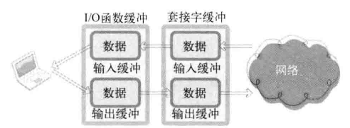
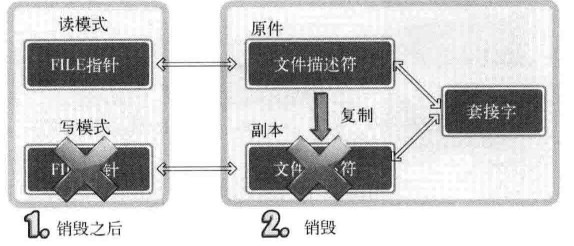
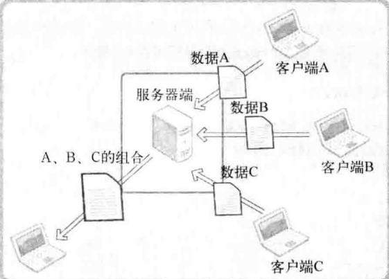

# 套接字与标准I/O
1. 请说明标准I/O函数的2个优点。它为何拥有这2个优点？
```
具有良好的移植性
    为了支持所有操作系统，这些函数都是按照ANSI C标准定义的。
利用缓冲提高性能
    传输的数据量
        发送数据包时含有头信息
    数据向输出缓冲移动的次数
        向套接字输出缓冲移动数据也会消耗不少时间
```


2. 利用标准I/O函数传输数据时，下面的想法是错误的：”调用fputs函数传输数据时，调用后应立即开始发送“ 为何说上述想法是错误的？为了达到这种效果应添加哪些处理过程？
```
标准I/O函数为了提高性能，内部提供额外的缓冲。因此，若不调用fflush函数则无法保证立即将数据传输到客户端
```

# 关于I/O流分离的其他内容
1. 与FILE结构体指针相同，文件描述符也分为输入描述符和输出描述符。
```
open()函数分配的文件描述符是分输入和输出的
但是socket()函数分配的文件描述符是不分的
```
2. FILE结构体指针通过文件描述符对文件进行I/O操作


3. 若文件描述符为读模式，则基于该描述符生成的FILE结构体只能指定为读模式，否则段错误

4. 即使复制文件描述符，也可以通过调用shutdown函数进入半关闭状态并发送EOF。

# 优于select的epoll
1. 利用select函数实现服务器端时，代码层面存在的2个缺点是？
```
调用select函数后常见的针对所有文件描述符的循环语句。

每次调用select函数时都需要向该函数传递监视对象信息。（更大的障碍）
```
2. 无论是select方式还是epoll方式，都需要将监视对象文件描述符信息通过函数调用传递给操作系统。请解释传递该消息的原因。
```
套接字是由操作系统管理的

需要将要监视对象文件描述符消息传递给操作系统，操作系统才会在该套接字发生事件时，通知程序
```
3. select方式和epoll方式的最大差异在于监视对象文件描述符传递给操作系统的方式。请说明具体的差异，并解释为何存在这种差异。
```
差异：每次调用select函数时都要向操作系统传递监视对象信息
      epoll仅向操作系统传递一次监视对象，监视范围或内容发生变化时只通知发生变化的事项

 
```

4. select也有自己的优点。在何种情况下使用select方式更合理？
```
服务器端接入者少
程序应具有兼容性
```

5. epoll以条件触发或边缘触发方式工作。两者有何区别？从输入缓冲的角度说明这2种方式通知事件的时间点差异。
```
条件触发方式中，只要输入缓冲有数据就会一直通知该事件

边缘触发中输入缓冲收到数据时仅注册一次该事件。即使输入缓冲中还有数据，也不会再进行注册
```

6. 采用边缘触发时可以分散数据的接收和处理时间点。说明其原因及优点。


```
即使输入缓冲收到数据（注册相应事件），服务器端也能决定读取和处理这些数据的时间点，这样就给服务器端的实现带来巨大的灵活性
```
7. 实现聊天服务器端
