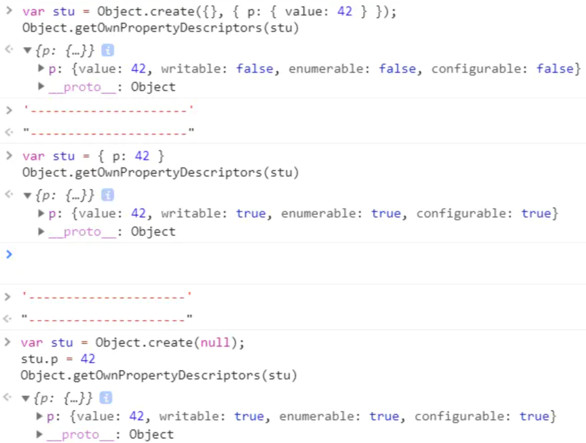

> String

The value of String is immutable, you can't do this:
```js
let myStr = "Bob";
myStr[0] = "J";
```
but you can modify it by assigning it another value, like:
```js
let myStr = "Bob";
myStr = "Job";
```
----
> Array
- Array's elements are mutable and can be freely changed, even if the array is declared with const
- A simple way to add data to the end of an array is the **push()** function.
- Use the **pop()** function to delete the last item of the array
- Use the **shift()** function to delete the first item of the array
- **unshift()** insert a elem in the head
-----
> Scope

- Variables not declared with the let or const keywords are automatically created in the **global** scope
-------
> switch
```js
function test(x) {
    switch (x) {
        case 1: console.log(1);break;
        case '2': console.log(2);break;
        case "3": console.log(3);break; // There is no char in js, so u can use "" in switch.
    }
}
```
----
> undefined

**undefined** is a keyword instead a string

----
> Object

- Object.create(proto, [propertiesObject])
    - another way
        ```js
        // new Object() 
        var a = {  rep : 'apple' }
        var b = new Object(a)
        console.log(b) // {rep: "apple"}
        console.log(b.__proto__) // {}
        console.log(b.rep) // {rep: "apple"}

        // Object.create() 
        var a = { rep: 'apple' }
        var b = Object.create(a)
        console.log(b)  // {}
        console.log(b.__proto__) // {rep: "apple"}
        console.log(b.rep) // {rep: "apple"}
        ```
    - Different property:
        

- The second way to access **object properties** is the square bracket representation **([])**. If the property name you want to access contains spaces, you must use the square bracket representation to get its property value.

- delete Object.property;


- Object.hasOwnProperty()

>  Math
- Math.floor(Math.random() * 20);

> function

- const a = parseInt("007"); String to Int
- const a = parseInt("11", 2); String representing a binary number to Int 


```
let printNumTwo;
for (let i = 0; i < 3; i++) {
  if (i === 2) {
    printNumTwo = function() {
      return i;
    };
  }
}
console.log(printNumTwo());
console.log(i);
```

Object.freeze
任何更改对象的尝试都将被拒绝，如果脚本在严格模式下运行，将抛出错误。

```
function howMany(...args) {
  return "You have passed " + args.length + " arguments.";
}
console.log(howMany(0, 1, 2));
console.log(howMany("string", null, [1, 2, 3], { }));
```

```
const doubler = item => item * 2;
```

```
var arr = [6, 89, 3, 45];
var maximus = Math.max.apply(null, arr);
===
const arr = [6, 89, 3, 45];
const maximus = Math.max(...arr);
===
const spreaded = ...arr;
```
arr2 = [...arr1];


const { name, age } = user;

const { name: userName, age: userAge } = user;

const { johnDoe: { age: userAge, email: userEmail }} = user;

let a = 8, b = 6;
[a, b] = [b, a];
// 只修改这一行下面的代码