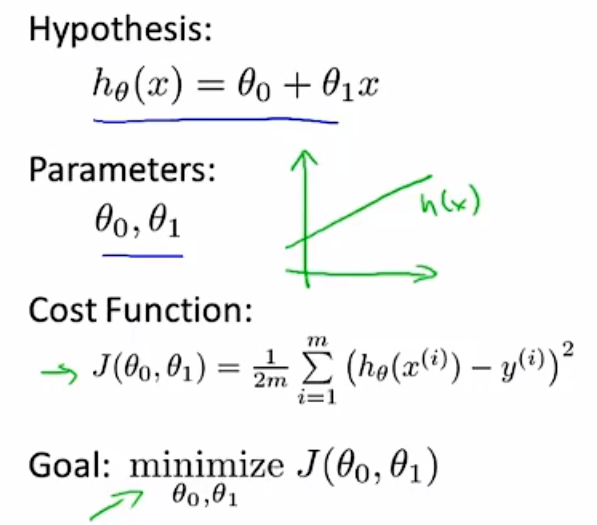

# Prestatement
using Octave programming environment
Matlab
# What is Machine Learning
- Grew out of work in Al
- New capability for computers
> application examples:

    - Database mining
    Large datasets from growth of automation/web
    E.g., Web click data, medical records, biology, engineering
    - Applications can't program by hand.
    E.g., Autonomous helicopter, handwriting recognition, most of
    Natural Language Processing (NLP), Computer Vision.
    - Self-customizing programs
    E.g., Amazon, Netflix product recommendations
    - Understanding human learning (brain, real Al).

# Machine Learning definition
- Arthur Samuel (1959). 
`Machine Learning: Field of study that gives computers the ability to learn without being explicitly programmed.`

- Tom Mitchell (1998).
`Well-posed Learning Problem: A computer program is said to learn from experience E with respect to some task T and some performance measure P, if its performance on T, as measured by P, improves with experience E.`

# Machine Learning algorithms
- Supervised learning
- Unsupervised learning
- Reinforcement learning
- recommender systems

## Supervised learning
right answers given

### Linear regression

predict continuous valued output 

> notation


> process




> diagrams


> gradient descent algorithm


alpha means learning rate
- if a is too small,gradient descent can be slow
- If a is too large,gradient descent can overshoot the minimum.it may fail to converge, or even diverge  

**As we approach a local minimum, gradient descent will automatically take smaller steps.so,no need to decrease a over time**

Gradient descent will scale better to larger data sets than that normal equations method 


"Batch" Gradient Descent: `"Batch": Each step of gradient descent uses all the training examples.`

> linear algebra application

matrices * vector


matrices * matrices


Matrices that don't have an inverse are "singular" or "degenerate"

> Multiple features

n: number of features
x^(i)j = value of feature j in i^th training example.


> feature scaling

make sure features are on a similar scale then gradient descents can converge more quickly


> mean normalization


> choice of features

> Polynomial regression


> Vectorization


```m
    delta = zeros(length(theta), 1);
    delta = 1/m * (X*theta - y)' * X;
    theta = theta - alpha * delta';
```

### Classification algorithm
discrete valued output 

Yes or No

> normal linear regression doesn't work well


> logistic regression


> Decision boundary


> Cost function

cost function of linear regression doesn't work


> really cost function


> Simplified cost function and gradient descent


> Advanced optimization


```m
function [jVal,gradient] = costFunction(theta)
%COSTFUNCTION 此处显示有关此函数的摘要
%   此处显示详细说明
jVal = (theta(1) - 5) ^ 2 + (theta(2) - 5) ^ 2;
gradient = zeros(2,1);
gradient(1) = 2 * (theta(1) - 5);
gradient(2) = 2 * (theta(2) - 5);
end


>> options = optimset('GradObj', 'on', 'MaxIter', 100);
>> initialTheta = zeros(2,1); % initialTheta at least a two-dimensional vector
>> [optTheta, functionVal, exitFlag] = fminunc(@costFunction, initialTheta, options)

Local minimum found.

Optimization completed because the size of the gradient is less than
the value of the optimality tolerance.

<stopping criteria details>

ptTheta =

     5
     5


functionVal =

     0


exitFlag =

     1

```

> Multi-class classification: One-vs-all


> The problem of overfitting


> Regularization Cost function

penalize and make some theta really small


**what if lambda is set to an extremely large value(perhaps for too large for our problem, say lambda = 10^10)** 

<font color="red">under fit</font>


> Regularized linear regression

**gradient descent**


**Normal equation**


**Non-invertibility(optional/advanced)**

regularization also takes care of this for us


> Regularized logistic regression


## Unsupervised learning
doesn't have any label
## clustering algorithm
break data set into some separate clusters
> Application Scene
    - google news
    - Market segmentation

## Cocktail party problem

# Types of Machine Learning
