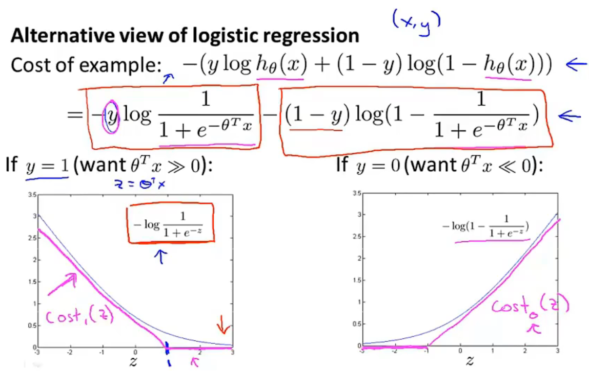

# Machine learning diagnostic

when u test u hypothesis on a new set of houses, you find that it makes unacceptably large errors in its predictions. What should you try next?
- Get more training examples
- try smaller sets of features
- try getting additional features
- try adding polynomial features
- try decreasing lambda 
- try increasing lambda

> Evaluating a hypothesis

split a dataset into two part, training set and test set

> Model selection and training/validation/test sets

decide degree of polynomial, features, regularization parameter lambda

> Diagnosing bias vs. variance

> Regularization and bias/variance

> Learning curves

> Deciding what to try next

choose neural networks' architecture
- small neural network
    - fewer params, more prone to underfitting
    - computationally cheaper
- large neural network
    - more params, more prone to overfitting
    - use regularization to address overfitting 
    - use train set, validation set and test set to decide the hidden layer number
    - computationally more expensive

> Prioritizing what to work on: Spam classification example

> Error analysis

> Error metrics for skewed classes

skewed classes: have a lot more of examples from one class than from the other class. classification error or classification accuracy as evaluation metric might not that good.

------
y = 1 in presence of rare class that we want to detect

**precision**: 

**recall**:

-------

improve threshold, higher precision, lower recall

reduce threshold, higher recall, lower recall

> How to compare precision/recall numbers

> Data for machine learning

**Large data rationale**: high variance is unlikely to overfit

many parameters and many datas

# Support Vector Machine

doesn't output the probability, either 1 or 0

> Large Margin Intuition

> Kernels One

