# Neural Network

多层感知器(Multi-Layer Perceptron，MLP)

Neuron: Thing that holds a number, the number is activation

Every pixel can see as a neuron

pixels -> edges -> patterns -> digits

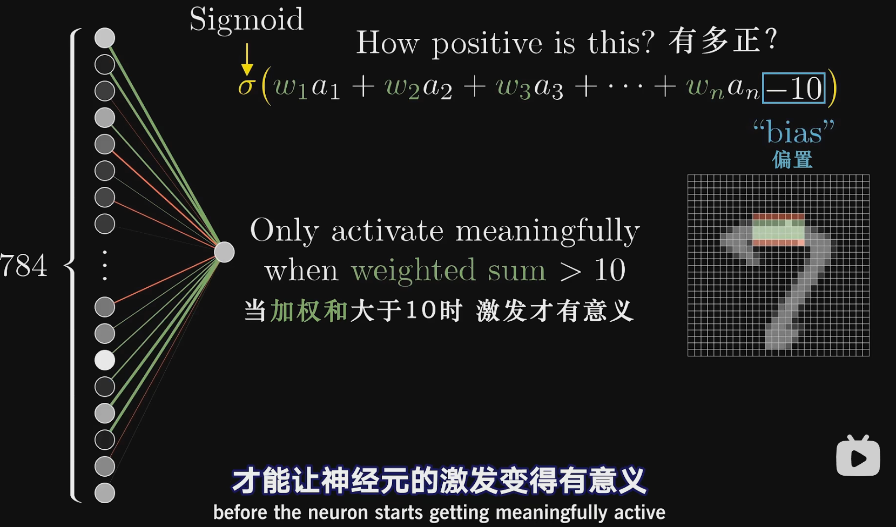

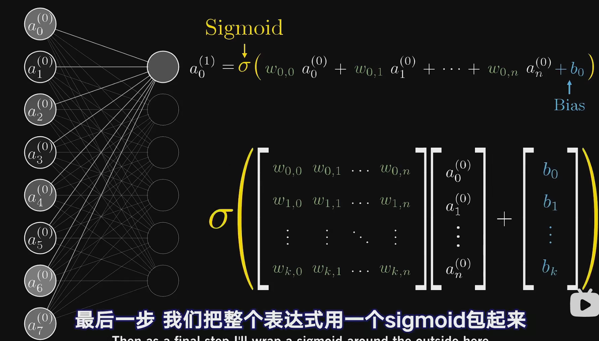

Neuron pro: Function, takes in the outputs of all the neurons in the previous layer.

ReLU

----------

thinking of each neuron as being connected to all of the neurons in the previous layer, and the weights in the weighted sum defining its activation are kind of like the strengths of those connections, and the bias is some indication of whether that neuron tends to be active or inactive.

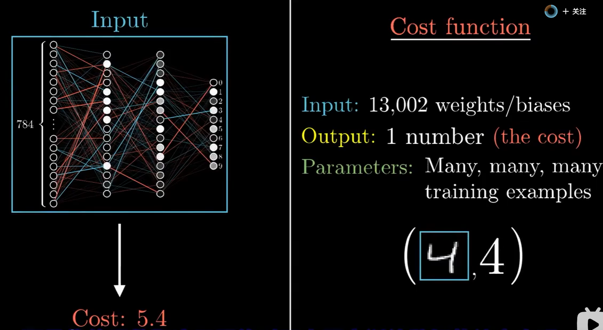

the gradient of a function gives you the direction of steepest ascent.

the length of this gradient vector is actually an indication for just how steep that steepest slope is.

the sign of  course tells us whether the corresponding component of the input vector should be nudged up or down 

the relative magnitudes of all these components kind of tells you which changes matter more

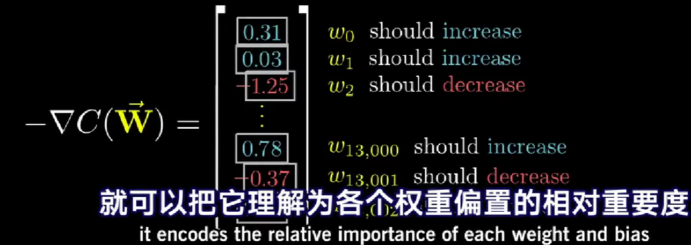

that is which of these changes is going to carry the most bang for your buck

neurons that fire together wire together


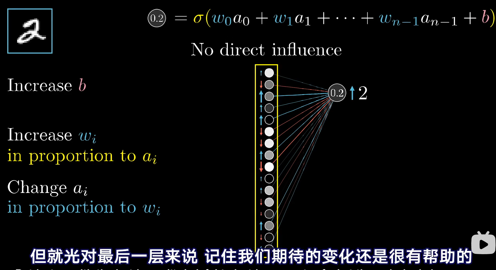

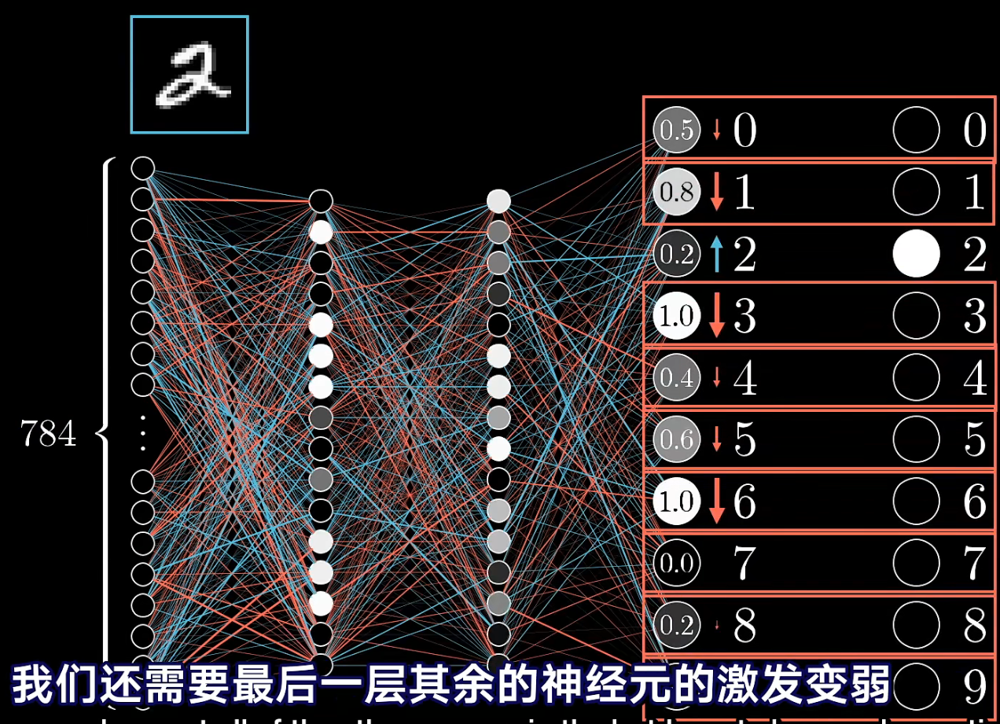

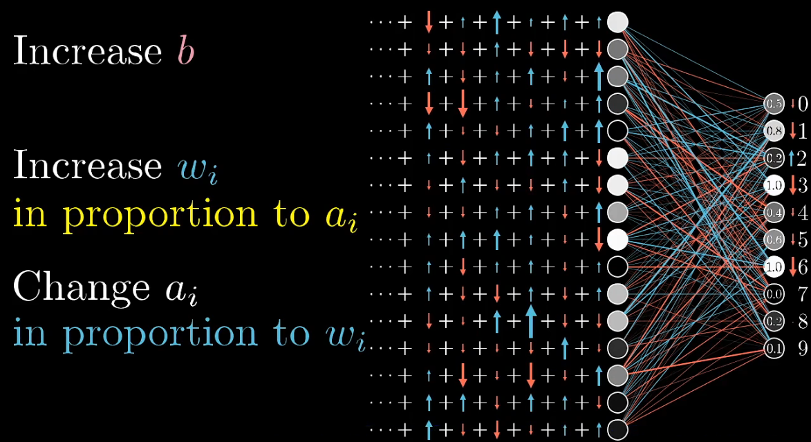

repeat the same process i just walked through and moving backwards through the network.

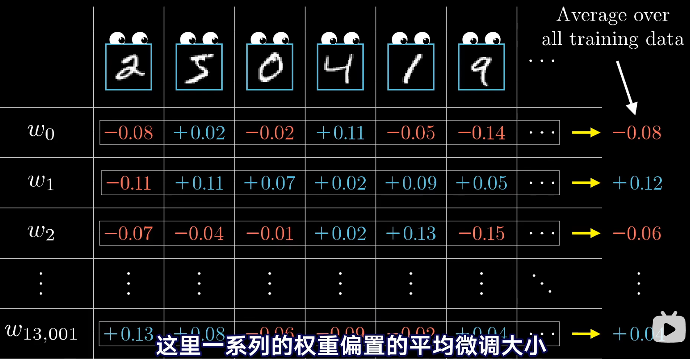

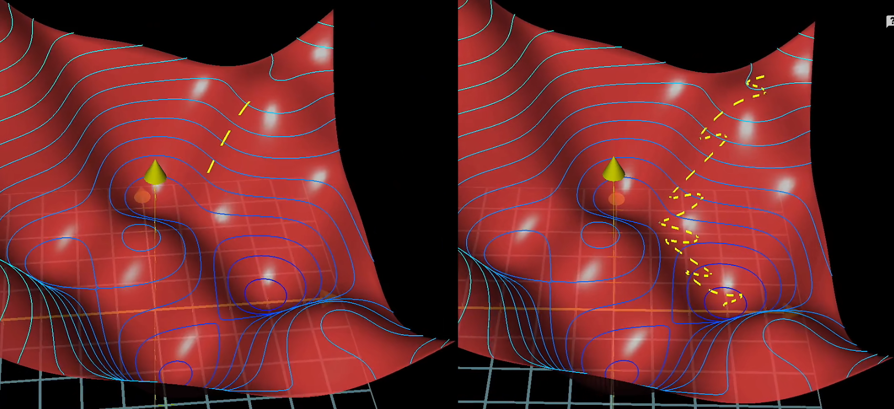

--------
how sensitive the cost function is to there variables

delta w: some tiny nudge to w

delta C: whatever the resulting nudge to the cost is

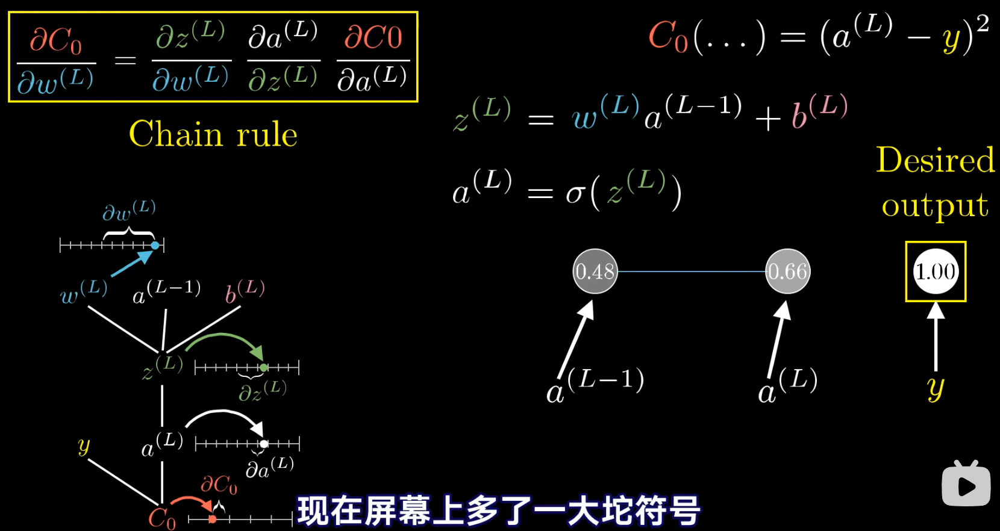

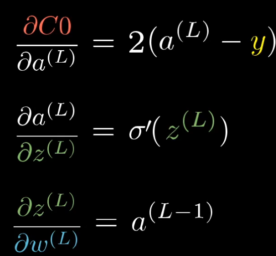
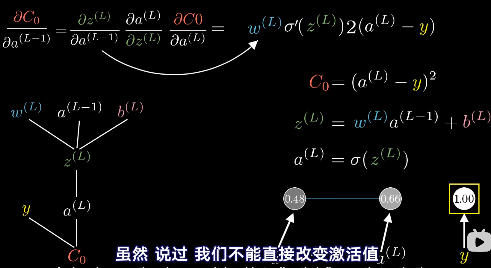

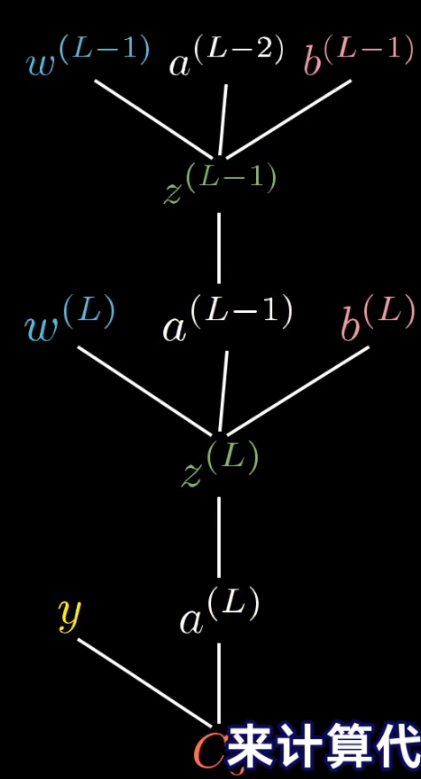

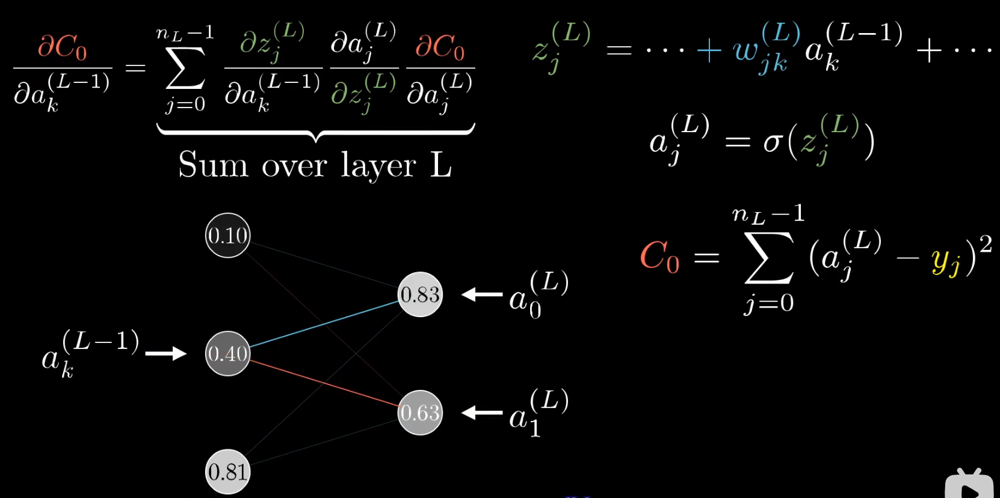

-------
the neural network uses the examples to automatically infer rules for recognizing handwritten digits

He introduced weights, w1, w2, …, real numbers expressing the importance of the respective inputs to the output. 

> perceptron

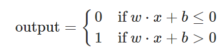

That's the basic mathematical model. A way you can think about the perceptron is that it's a device that makes decisions by weighing up evidence.

By varying the weights and the threshold, we can get different models of decision-making

You can think of the bias as a measure of how easy it is to get the perceptron to output a 1. Or to put it in more biological terms, the bias is a measure of how easy it is to get the perceptron to fire. 

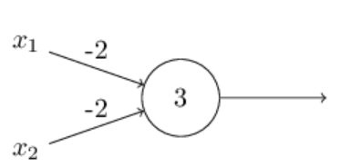

The adder example demonstrates how a network of perceptrons can be used to simulate a circuit containing many NAND gates. And because NAND gates are universal for computation, it follows that perceptrons are also universal for computation.

**The problem is that this isn't what happens when our network contains perceptrons. In fact, a small change in the weights or bias of any single perceptron in the network can sometimes cause the output of that perceptron to completely flip, say from 0 to 1. That flip may then cause the behaviour of the rest of the network to completely change in some very complicated way. So while your "9" might now be classified correctly, the behaviour of the network on all the other images is likely to have completely changed in some hard-to-control way. That makes it difficult to see how to gradually modify the weights and biases so that the network gets closer to the desired behaviour. Perhaps there's some clever way of getting around this problem. But it's not immediately obvious how we can get a network of perceptrons to learn.**

> Sigmoid neurons

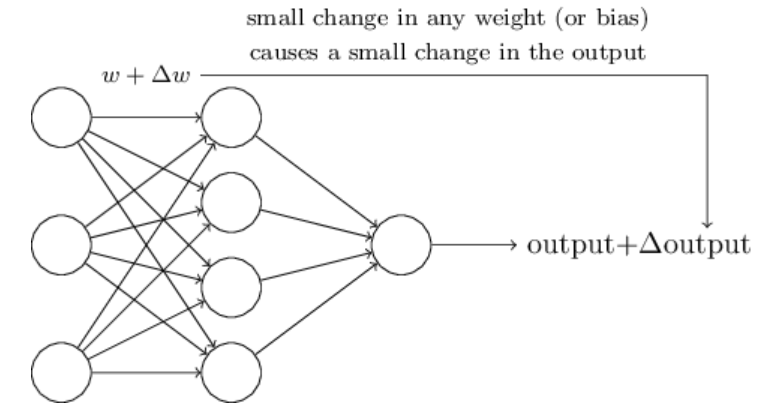

If it were true that a small change in a weight (or bias) causes only a small change in output, then we could use this fact to modify the weights and biases to get our network to behave more in the manner we want.

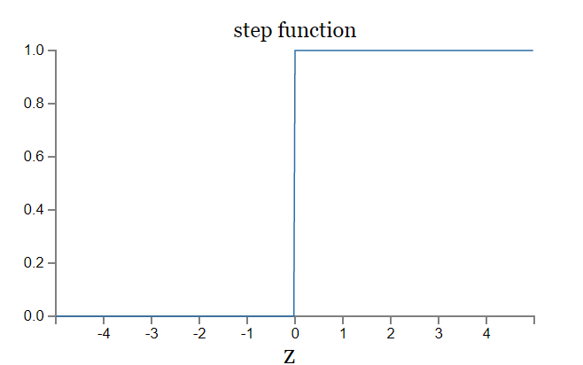

If σ had in fact been a step function, then the sigmoid neuron would be a perceptron

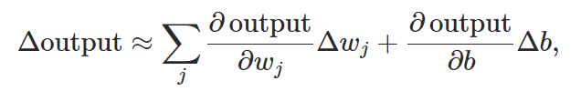

while sigmoid neurons have much of the same qualitative behaviour as perceptrons, they make it much easier to figure out how changing the weights and biases will change the output.

The main thing that changes when we use a different activation function is that the particular values for the partial derivatives in Equation 
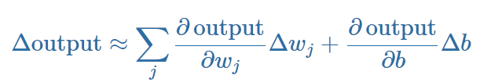
change. It turns out that when we compute those partial derivatives later, using σ will simplify the algebra, simply because exponentials have lovely properties when differentiated.

> The architecture of neural networks
neural networks researchers have developed many design heuristics for the hidden layers, which help people get the behaviour they want out of their nets. For example, such heuristics can be used to help determine how to trade off the number of hidden layers against the time required to train the network.

**recurrent neural networks**: The idea in these models is to have neurons which fire for some limited duration of time, before becoming quiescent. That firing can stimulate other neurons, which may fire a little while later, also for a limited duration. That causes still more neurons to fire, and so over time we get a cascade of neurons firing. Loops don't cause problems in such a model, since a neuron's output only affects its input at some later time, not instantaneously.

> A simple network to classify handwritten digits

**segmentation problem** and **classifying individual digits**

segmentation:  One approach is to trial many different ways of segmenting the image, using the individual digit classifier to score each trial segmentation.

We'll denote the corresponding desired output by y=y(x)

a is the vector of outputs from the network when x is input

we'll call C the quadratic cost function; it's also sometimes known as the mean squared error or just MSE.
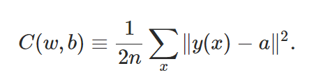

**Why introduce the quadratic cost? After all, aren't we primarily interested in the number of images correctly classified by the network? Why not try to maximize that number directly, rather than minimizing a proxy measure like the quadratic cost? The problem with that is that the number of images correctly classified is not a smooth function of the weights and biases in the network. For the most part, making small changes to the weights and biases won't cause any change at all in the number of training images classified correctly. That makes it difficult to figure out how to change the weights and biases to get improved performance. If we instead use a smooth cost function like the quadratic cost it turns out to be easy to figure out how to make small changes in the weights and biases so as to get an improvement in the cost. That's why we focus first on minimizing the quadratic cost, and only after that will we examine the classification accuracy.**

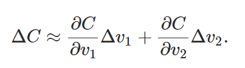

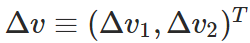


gradient vector:

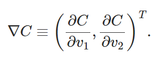

ΔC≈∇C⋅Δv
suppose we choose Δv=−η∇C

then ΔC≈−η∇C⋅∇C=−η∥∇C∥2 .

v→v′=v−η∇C

假设我们试图在位置上走一步Δv，以便尽可能地减少C。这等同于最小化ΔC≈∇C⋅Δv。我们将限制移动的大小，使∥Δv∥=ϵ为某个小的固定的ϵ>0。换句话说，我们想要的移动是一个固定大小的小步，并且我们试图找到尽可能减少C的移动方向。可以证明，使∇C⋅Δv最小化的Δv的选择是Δv=-η∇C，其中η=ϵ/∥∇C∥由大小约束条件∥Δv∥=ϵ决定。所以梯度下降可以被看作是在最能立即减少C的方向上迈出的一小步。

Cauchy-Schwarz inequality:

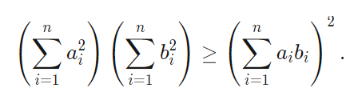
Equality holds if and only if a_i=kb_i for a non-zero constant k∈R.

> stochastic gradient descent

The idea is to estimate the gradient ∇C by computing ∇Cx for a small sample of randomly chosen training inputs.

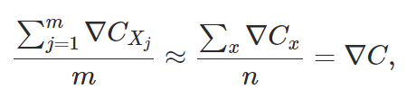

Of course, the estimate won't be perfect - there will be statistical fluctuations - but it doesn't need to be perfect: all we really care about is moving in a general direction that will help decrease C, and that means we don't need an exact computation of the gradient.

> Implementing 

We won't use the **validation data** in this chapter, but later in the book we'll find it useful in figuring out how to set certain hyper-parameters of the neural network - things like the learning rate, and so on, which aren't directly selected by our learning algorithm.

Apart from the MNIST data we also need a Python library called Numpy, for doing fast linear algebra.

```py
np.random.randn # 产生平均数为0、标准差为1的高斯分布
```


可汗学院多元微积分